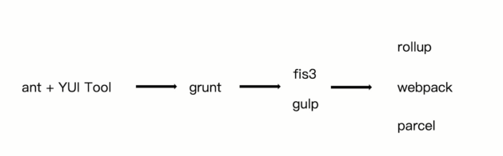
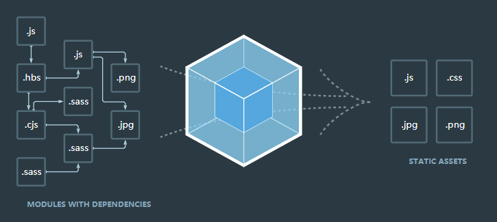
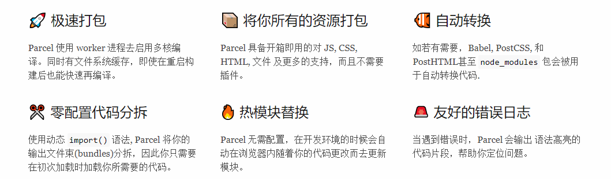

# 前端构建演变之路



## 为什么需要构建

- 代码转换：ES6、TypeScript 编译成 JavaScript、SCSS 编译成 CSS 等。
- 文件优化：压缩 JavaScript、CSS、HTML 代码，压缩合并图片等。
- 代码分割：提取多个页面的公共代码、提取首屏不需要执行部分的代码让其异步加载。
- 模块合并：在采用模块化的项目里会有很多个模块和文件，需要构建功能把模块分类合并成一个文件。
- 自动刷新：监听本地源代码的变化，自动重新构建、刷新浏览器。
- 代码校验：在代码被提交到仓库前需要校验代码是否符合规范，以及单元测试是否通过。
- 自动发布：更新完代码后，自动构建出线上发布代码并传输给发布系统。

构建其实是工程化、自动化思想在前端开发中的体现，把一系列流程用代码去实现，让代码自动化地执行这一系列复杂的流程。 构建给前端开发注入了更大的活力，解放了我们的生产力。

## Npm Script

[Npm Script](https://docs.npmjs.com/misc/scripts) 是一个任务执行者。Npm 是在安装 Node.js 时附带的包管理器，Npm Script 则是 Npm 内置的一个功能，允许在 package.json 文件里面使用 scripts 字段定义任务：

```js
{
  "scripts": {
    "dev": "node dev.js",
  }
}
```

执行 npm run dev 命令等同于执行命令 node dev.js。

Npm Script 的优点是内置，无须安装其他依赖。其缺点是功能太简单，虽然提供了 pre 和 post 两个钩子，但不能方便地管理多个任务之间的依赖。

## Grunt

Grunt 和 Npm Script 类似，也是一个任务执行者。Grunt 有大量现成的插件封装了常见的任务，也能管理任务之间的依赖关系，自动化执行依赖的任务，每个任务的具体执行代码和依赖关系写在配置文件 Gruntfile.js 里，例如：

```js
module.exports = function(grunt) {
  // 所有插件的配置信息
  grunt.initConfig({
    // uglify 插件的配置信息
    uglify: {
      app_task: {
        files: {
          'build/app.min.js': ['lib/index.js', 'lib/test.js']
        }
      }
    },
    // watch 插件的配置信息
    watch: {
      another: {
          files: ['lib/*.js'],
      }
    }
  });

  // 告诉 grunt 我们将使用这些插件
  grunt.loadNpmTasks('grunt-contrib-uglify');
  grunt.loadNpmTasks('grunt-contrib-watch');

  // 告诉 grunt 当我们在终端中启动 grunt 时需要执行哪些任务
  grunt.registerTask('dev', ['uglify','watch']);
};
```

在项目根目录下执行命令 grunt dev 就会启动 JavaScript 文件压缩和自动刷新功能。

Grunt 的优点是：
- 灵活，它只负责执行你定义的任务；
- 大量的可复用插件封装好了常见的构建任务。

Grunt 的缺点是集成度不高，要写很多配置后才可以用，无法做到开箱即用。

## Gulp

Gulp 是一个基于流的自动化构建工具。 除了可以管理和执行任务，还支持监听文件、读写文件。Gulp 被设计得非常简单，只通过下面5个方法就可以胜任几乎所有构建场景：

- 通过 gulp.task 注册一个任务；
- 通过 gulp.run 执行任务；
- 通过 gulp.watch 监听文件变化；
- 通过 gulp.src 读取文件；
- 通过 gulp.dest 写文件。

Gulp 的最大特点是引入了流的概念，同时提供了一系列常用的插件去处理流，流可以在插件之间传递，如：

```js
// 引入 Gulp
var gulp = require('gulp');
// 引入插件
var jshint = require('gulp-jshint');
var sass = require('gulp-sass');
var concat = require('gulp-concat');
var uglify = require('gulp-uglify');

// 编译 SCSS 任务
gulp.task('sass', function() {
  // 读取文件通过管道喂给插件
  gulp.src('./scss/*.scss')
    // SCSS 插件把 scss 文件编译成 CSS 文件
    .pipe(sass())
    // 输出文件
    .pipe(gulp.dest('./css'));
});

// 合并压缩 JS
gulp.task('scripts', function() {
  gulp.src('./js/*.js')
    .pipe(concat('all.js'))
    .pipe(uglify())
    .pipe(gulp.dest('./dist'));
});

// 监听文件变化
gulp.task('watch', function(){
  // 当 scss 文件被编辑时执行 SCSS 任务
  gulp.watch('./scss/*.scss', ['sass']);
  gulp.watch('./js/*.js', ['scripts']);
});
```

Gulp 的优点是好用又不失灵活，既可以单独完成构建也可以和其它工具搭配使用。其缺点是和 Grunt 类似，集成度不高，要写很多配置后才可以用，无法做到开箱即用。

可以将 Gulp 看作 Grunt 的加强版。相对于 Grunt，Gulp 增加了监听文件、读写文件、流式处理的功能

## Fis3

Fis3 是一个来自百度的优秀国产构建工具。相对于 Grunt、Gulp 这些只提供基本功能的工具，Fis3 集成了 Web 开发中的常用构建功能，如下所述。

- 读写文件：通过 fis.match 读文件，release 配置文件输出路径。
- 资源定位：解析文件之间的依赖关系和文件位置。
- 文件指纹：通过 useHash 配置输出文件时给文件 URL 加上 md5 戳来优化浏览器缓存。
- 文件编译：通过 parser 配置文件解析器做文件转换，例如把 ES6 编译成 ES5。
- 压缩资源：通过 optimizer 配置代码压缩方法。
- 图片合并：通过 spriter 配置合并 CSS 里导入的图片到一个文件来减少 HTTP 请求数。

```js
// 加 md5
fis.match('*.{js,css,png}', {
  useHash: true
});

// fis3-parser-typescript 插件把 TypeScript 文件转换成 JavaScript 文件
fis.match('*.ts', {
  parser: fis.plugin('typescript')
});

// 对 CSS 进行雪碧图合并
fis.match('*.css', {
  // 给匹配到的文件分配属性 `useSprite`
  useSprite: true
});

// 压缩 JavaScript
fis.match('*.js', {
  optimizer: fis.plugin('uglify-js')
});

// 压缩 CSS
fis.match('*.css', {
  optimizer: fis.plugin('clean-css')
});

// 压缩图片
fis.match('*.png', {
  optimizer: fis.plugin('png-compressor')
});
```

可以看出 Fis3 很强大，内置了许多功能，无须做太多配置就能完成大量工作。

Fis3 的优点是集成了各种 Web 开发所需的构建功能，配置简单开箱即用。其缺点是目前官方已经不再更新和维护，不支持最新版本的 Node.js。

## Webpack

Webpack 是一个打包模块化 JavaScript 的工具，在 Webpack 里一切文件皆模块，通过 Loader 转换文件，通过 Plugin 注入钩子，最后输出由多个模块组合成的文件。Webpack 专注于构建模块化项目。



一切文件：JavaScript、CSS、SCSS、图片、模板等，在 Webpack 眼中都是一个个模块，这样的好处是能清晰的描述出各个模块之间的依赖关系，以方便 Webpack 对模块进行组合和打包。 经过 Webpack 的处理，最终会输出浏览器能使用的静态资源。

Webpack的优点是：

- 专注于处理模块化的项目，能做到开箱即用一步到位；
- 通过 Plugin 扩展，完整好用又不失灵活；
- 使用场景不仅限于 Web 开发；
- 社区庞大活跃，经常引入紧跟时代发展的新特性，能为大多数场景找到已有的开源扩展；
- 良好的开发体验。

Webpack的缺点是只能用于采用模块化开发的项目。

## Rollup

Rollup 是一个和 Webpack 很类似但专注于 ES6 的模块打包工具。 Rollup 的亮点在于能针对 ES6 源码进行 Tree Shaking 以去除那些已被定义但没被使用的代码，以及 Scope Hoisting 以减小输出文件大小提升运行性能。 然而 Rollup 的这些亮点随后就被 Webpack 模仿和实现。 由于 Rollup 的使用和 Webpack 差不多，这里就不详细介绍如何使用了，而是详细说明它们的差别：

- Rollup 是在 Webpack 流行后出现的替代品；
- Rollup 生态链还不完善，体验不如 Webpack；
- Rollup 功能不如 Webpack 完善，但其配置和使用更加简单；
- Rollup 不支持 Code Spliting，但好处是打包出来的代码中没有 Webpack 那段模块的加载、执行和缓存的代码。

Rollup 在用于打包 JavaScript 库时比 Webpack 更加有优势，因为其打包出来的代码更小更快。 但功能不够完善，很多场景都找不到现成的解决方案。

## parcel

[parcel](https://parceljs.org/)

Parcel 是 Web 应用打包工具，适它利用多核处理提供了极快的速度，并且不需要任何配置。


