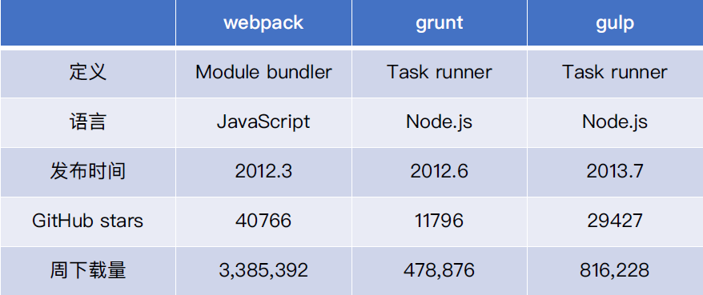

# 认识 webpack

模块打包工具

webpack 是一种前端资源构建工具，一个静动模块打包器(module bundler)。

在 webpack 看来, 前端的所有资源文件(js/json/css/img/less/...)都会作为模块处理。

它将根据模块的依赖关系进行静态分析，打包生成对应的静态资源(bundle)。

## 为什么选择 webpack ?



- 社区生态丰富
- 配置灵活和插件化扩展
- 官⽅更新迭代速度快
- 模块化 + 新语言 + 新框架，一站式的解决方案

## 初识 webpack：配置文件名称

webpack 默认配置⽂文件：webpack.config.js

可以通过 `webpack --config` 指定配置文件

## 初识 webpack：webpack 配置组成

npm i webpack webpack-cli -D

npx webpack -v

```js
'use strict';

const path = require('path');

module.exports = {
  entry: './src/index.js',
  output: {
    path: path.join(__dirname, 'dist'),
    filename: 'bundle.js',
  },
  mode: 'production',
};
```

## 零配置 webpack 包含哪些内容？

```js
module.exports = {
    entry: './src/index.js',
    output: './dist/main.js',
    mode: 'production',
    module: {
    rules: [
        { test: /\.txt$/, use: 'raw-loader' }
    ]
    },
    plugins: [
        new HtmlWebpackPlugin({
            template: './src/index.html’
        })
    ]
};
```

## 核心概念

Webpack 有以下几个核心概念。

- Entry：入口，Webpack 执行构建的第一步将从 Entry 开始，可抽象成输入。
- Module：模块，在 Webpack 里一切皆模块，一个模块对应着一个文件。Webpack 会从配置的 Entry 开始递归找出所有依赖的模块。
- Chunk：代码块，一个 Chunk 由多个模块组合而成，用于代码合并与分割。
- Loader：模块转换器，用于把模块原内容按照需求转换成新内容。
- Plugin：扩展插件，在 Webpack 构建流程中的特定时机注入扩展逻辑来改变构建结果或做你想要的事情。
- Output：输出结果，在 Webpack 经过一系列处理并得出最终想要的代码后输出结果。

Webpack 启动后会从 Entry 里配置的 Module 开始递归解析 Entry 依赖的所有 Module。 每找到一个 Module， 就会根据配置的 Loader 去找出对应的转换规则，对 Module 进行转换后，再解析出当前 Module 依赖的 Module。 这些模块会以 Entry 为单位进行分组，一个 Entry 和其所有依赖的 Module 被分到一个组也就是一个 Chunk。最后 Webpack 会把所有 Chunk 转换成文件输出。 在整个流程中 Webpack 会在恰当的时机执行 Plugin 里定义的逻辑。

## 如何配置

- 想让源文件加入到构建流程中去被 Webpack 控制，配置 entry。
- 想自定义输出文件的位置和名称，配置 output。
- 想自定义寻找依赖模块时的策略，配置 resolve。
- 想自定义解析和转换文件的策略，配置 module，通常是配置 module.rules 里的 Loader。
- 其它的大部分需求可能要通过 Plugin 去实现，配置 plugin。
