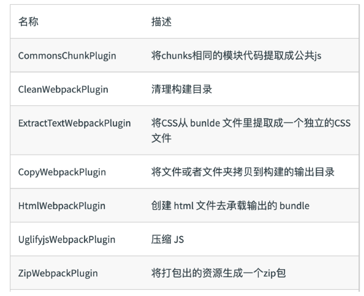

# 核心概念之 Plugins

插件(Plugins)可以用于执行范围更广的任务。插件的范围包括，从打包优化和压缩，一直到重新定义环境中的变量等。

作用于整个构建过程

## 常见的 Plugin 有哪些？



## Plugin 的用法

Plugin 的配置很简单，plugin 配置项接受一个数组，数组里每一项都是一个要使用的 Plugin 的实例，Plugin 需要的参数通过构造函数传入。

npm i html-webpack-plugin -D

```js
const path = require('path');
const HtmlWebpackPlugin = require('html-webpack-plugin');

module.exports = {
  plugins: [
    new HtmlWebpackPlugin({
      template: './src/index.html',
    }),
  ],
};
```
