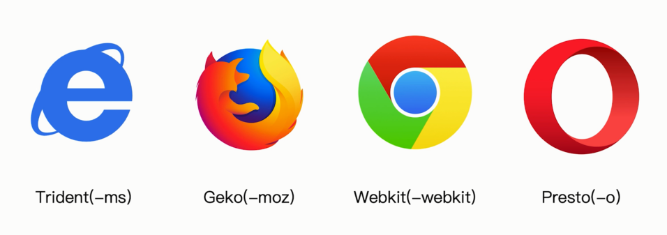

# PostCSS 插件 autoprefixer 自动补齐 CSS3 前缀

PostCSS 是一个 CSS 处理工具，和 SCSS 不同的地方在于它通过插件机制可以灵活的扩展其支持的特性，而不是像 SCSS 那样语法是固定的。 PostCSS 的用处非常多，包括给 CSS 自动加前缀、使用下一代 CSS 语法等。

PostCSS 全部采用 JavaScript 编写，运行在 Node.js 之上，即提供了给 JavaScript 代码调用的模块，也提供了可执行的文件。 在 PostCSS 启动时，会从目录下的 postcss.config.js 文件中读取所需配置。

## CSS3 的属性为什么需要前缀？



- Trident(-ms): IE
- Geko(-moz): Firefox
- Webkit(-webkit): Chrome
- Presto(-o): Opera

举个例子

```js
.box {
    -moz-border-radius: 10px;
    -webkit-border-radius: 10px;
    -o-border-radius: 10px;
    border-radius: 10px;
}
```

## 使用 PostCSS 插件 autoprefixer 自动补齐 CSS3 前缀

使用 autoprefixer 插件

根据 Can I Use 规则（ https://caniuse.com/ ）

npm i postcss-loader autoprefixer -D

```js
{
    test: /.less$/,
    use: [
        'style-loader',
        'css-loader',
        'less-loader',
        {
            loader: 'postcss-loader',
            options: {
                plugins: () => [
                    require('autoprefixer')({
                        overrideBrowserslist: ['last 2 version', '>1%', 'ios 7']
                    })
                ]
            }
        }
    ]
},
```

> autoprefixer 新版本的写法已经有变：browsers 换为 `overrideBrowserslist`

```js
// 设置nodejs环境变量
// process.env.NODE_ENV = 'development';

module.exports = {
  module: {
    rules: [
      {
        test: /\.css$/,
        use: [
          MiniCssExtractPlugin.loader,
          'css-loader',
          /*
            css兼容性处理：postcss --> postcss-loader postcss-preset-env

            帮postcss找到package.json中browserslist里面的配置，通过配置加载指定的css兼容性样式

            "browserslist": {
              // 开发环境 --> 设置node环境变量：process.env.NODE_ENV = development
              "development": [
                "last 1 chrome version",
                "last 1 firefox version",
                "last 1 safari version"
              ],
              // 生产环境：默认是看生产环境
              "production": [
                ">0.2%",
                "not dead",
                "not op_mini all"
              ]
            }
          */
          // 使用loader的默认配置
          // 'postcss-loader',
          // 修改loader的配置
          {
            loader: 'postcss-loader',
            options: {
              ident: 'postcss',
              plugins: () => [
                // postcss的插件
                require('postcss-preset-env')()
              ]
            }
          }
        ]
      }
    ]
  },
  mode: 'development'
};
```

package.json

```js
  "browserslist": {
    "development": [
      "last 1 chrome version",
      "last 1 firefox version",
      "last 1 safari version"
    ],
    "production": [
      ">0.2%",
      "not dead",
      "not op_mini all"
    ]
  },
```

## 使用下一代 CSS 语法

将 options 配置在 `postcss.config.js` 中

postcss.config.js

```js
module.exports = {
  plugins: [
    // 需要使用的插件列表
    require('postcss-cssnext'),
  ],
};
```

postcss-cssnext 插件可以使用下一代 CSS 语法编写代码，再通过 PostCSS 转换成目前的浏览器可识别的 CSS，并且该插件还包含给 CSS 自动加前缀的功能。

cssnext 和 css4 并不是一个东西，cssnext 使用下个版本 css 的草案语法

- https://github.com/MoOx/postcss-cssnext
- https://github.com/csstools/postcss-preset-env
