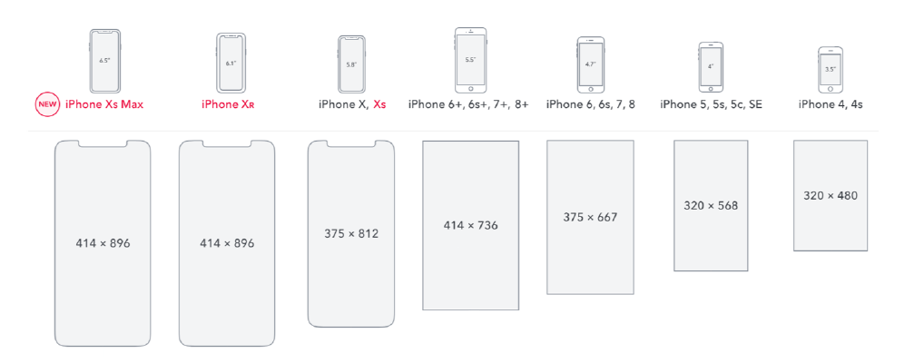

# 移动端 CSS px 自动转换成 rem

## 浏览器的分辨率



## CSS 媒体查询实现响应式布局

缺陷：需要写多套适配样式代码

```js
@media screen and (max-width: 980px) {
    .header {
        width: 900px;
    }
}
@media screen and (max-width: 480px) {
    .header {
        height: 400px;
    }
}
@media screen and (max-width: 350px) {
    .header {
        height: 300px;
    }
}
```

## rem 是什么？

W3C 对 rem 的定义： font-size of the root element

rem 和 px 的对比：

- rem 是相对单位
- px 是绝对单位

## 使用 px2rem-loader 将移动端 CSS px 自动转换成 rem

使用 [px2rem-loader](https://www.npmjs.com/package/px2rem-loader)

页面渲染时计算根元素的 font-size 值

- 可以使用手淘的 lib-flexible 库
- https://github.com/amfe/lib-flexible

px2rem-loader 的 remUnit 选项意思是 1rem=多少像素，结合 lib-flexible 的方案，我们将 px2remLoader 的 options.remUnit 设置成设计稿宽度的 1/10，这里我们假设设计稿宽为 750px。

npm i lib-flexible -D

在项目入口文件 main.js 里 引入 lib-flexible

npm i px2rem-loader -D

```js
{
    test: /.less$/,
    use: [
        'style-loader',
        'css-loader',
        'less-loader',
        {
            loader: 'px2rem-loader',
            options: {
                remUnit: 75,
                remPrecision: 8
            }
        }
    ]
},
```

## postcss-pxtorem

https://www.npmjs.com/package/postcss-pxtorem

npm install postcss-pxtorem -D

```js
{
    rootValue: 16, //你在 html节点设的font-size大小
    unitPrecision: 5, //转 rem 精确到小数点多少位
    propList: ['font', 'font-size', 'line-height', 'letter-spacing'],//指定转换成 rem 的属性，支持 * ！
    selectorBlackList: [],// str/reg 指定不转换的选择器，str时包含字段即匹配
    replace: true,
    mediaQuery: false, //媒体查询内的 px 是否转换
    minPixelValue: 0 //小于指定数值的 px 不转换
}
```

postcss.config.js

```js
module.exports = {
  plugins: {
    'postcss-cssnext': {
      overrideBrowserslist: ['Android >= 4.0', 'iOS >= 7'],
    },
    'postcss-pxtorem': {
      rootValue: 75,
      propList: ['*'],
    },
  },
};
```

在项目入口文件 main.js 里 引入 lib-flexible

## postcss-px-to-viewport

响应式布局下会使用 rem 或者 vw/vh 做为长度大小单位

[postcss-px-to-viewport](https://github.com/evrone/postcss-px-to-viewport)
