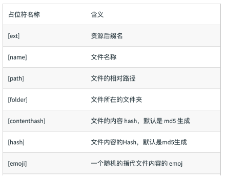

# 文件指纹策略：chunkhash、contenthash 和 hash

## 什么是文件指纹？

打包后输出的文件名的后缀字符

## 文件指纹如何生成

- Hash：和整个项⽬的构建相关，只要项⽬文件有修改，整个项目构建的 hash 值就会更改
- Chunkhash：和 webpack 打包的 chunk 有关，不同的 entry 会⽣成不同的 chunkhash 值
- Contenthash：根据文件内容来定义 hash ，文件内容不变，则 contenthash 不变（让代码上线运行缓存更好使用）

Hash 问题：因为 js 和 css 同时使用一个 hash 值。

- 如果重新打包，会导致所有缓存失效。（可能我却只改动一个文件）

Chunkhash 问题: 如果打包来源于同一个 chunk，那么 hash 值就一样，js 和 css 的 hash 值还是一样的

- 因为 css 是在 js 中被引入的，所以同属于一个 chunk

## JS 的文件指纹设置

设置 output 的 filename，使用 `[chunkhash]`

```js
module.exports = {
  entry: {
    app: './src/app.js',
    search: './src/search.js',
  },
  output: {
    filename: '[name][chunkhash:8].js',
    path: __dirname + '/dist',
  },
};
```

## CSS 的文件指纹设置

设置 MiniCssExtractPlugin 的 filename，使用 `[contenthash]`

```js
module.exports = {
    module: {
        rules: [
            {
                test: /.css$/,
                use: [
                    MiniCssExtractPlugin.loader,
                    'css-loader'
                ]
            },
            {
                test: /.less$/,
                use: [
                    MiniCssExtractPlugin.loader,
                    'css-loader',
                    'less-loader'
                ]
            },
        ]
    },
    plugins: [
        new MiniCssExtractPlugin({
            filename: `[name][contenthash:8].css
        });
    ]
};
```

## 图片的文件指纹设置

设置 file-loader 的 name，使用 `[hash]`

```js
const path = require('path');

module.exports = {
    module: {
        rules: [
            {
                test: /\.(png|svg|jpg|gif)$/,
                use: [{
                    loader: 'file-loader’,
                    options: {
                        name: 'img/[name][hash:8].[ext] '
                    }
                }]
            }
        ]
    }
};
```

## 文件相关占位符含义

| 占位符名称      | 含义                          |
| --------------- | ----------------------------- |
| `[ext]`         | 文件后缀名                    |
| `[name]`        | 文件名                        |
| `[path]`        | 文件相对路径                  |
| `[folder]`      | 文件所在的文件夹              |
| `[contenthash]` | 文件内容 hash， 默认 md5 生成 |
| `[hash]`        | 文件内容 hash， 默认 md5 生成 |

<!--  -->
