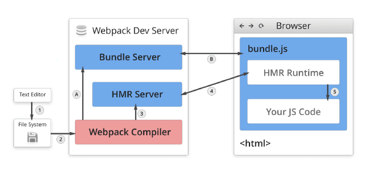

# webpack DevServer 、热更新及原理分析

前面只是让 Webpack 正常运行起来了，但在实际开发中可能会需要：

- 提供 HTTP 服务而不是使用本地文件预览；
- 监听文件的变化并自动刷新网页，做到实时预览；

DevServer 会启动一个 HTTP 服务器用于服务网页请求，同时会帮助启动 Webpack ，并接收 Webpack 发出的文件更变信号，通过 WebSocket 协议自动刷新网页做到实时预览。

## DevServer

npm i -D webpack-dev-server

```js
module.exports = {
  mode: 'development',
  // 开发服务器 devServer：用来自动化（自动编译，自动打开浏览器，自动刷新浏览器~~）
  // 特点：只会在内存中编译打包，不会有任何输出
  // 启动devServer指令为：npx webpack-dev-server
  devServer: {
    // 项目构建后路径
    contentBase: resolve(__dirname, 'build'),
    // 启动gzip压缩
    compress: true,
    // 端口号
    port: 3000,
    // 自动打开浏览器
    open: true
  }
};
```

## historyApiFallback

当使用 HTML5 History API 时，任意的 404 响应都可能需要被替代为 index.html

```js
devServer: {
  historyApiFallback: true;
}
```

## 热更新: 启用 HMR

HMR: hot module replacement 热模块替换 / 模块热替换

作用：一个模块发生变化，只会重新打包这一个模块（而不是打包所有模块） 极大提升构建速度

- 样式文件：可以使用HMR功能：因为style-loader内部实现了~
- js文件：默认不能使用HMR功能 --> 需要修改js代码，添加支持HMR功能的代码
  - 注意：HMR功能对js的处理，只能处理非入口js文件的其他文件。
- html文件: 默认不能使用HMR功能.同时会导致问题：html文件不能热更新了~ （不用做HMR功能）
  解决：修改entry入口，将html文件引入

```js
entry: ['./src/js/index.js', './src/index.html'],
```

## WDS

- WDS 不刷新浏览器
- WDS 不输出⽂件，⽽是放在内存中
- 使用 HotModuleReplacementPlugin 插件

```js
devServer: {
    hot: true, // 启用模块热替换特性
    hotOnly: true
},
plugins: [
    new webpack.HotModuleReplacementPlugin()  // webpack 内置的热更新插件
],
```

HotModuleReplacementPlugin 模块热替换(Hot Module Replacement)插件，用以在运行时更新发生改变的模块，从而无需进行完全刷新。

NamedModulesPlugin：当开启 HMR 的时候使用该插件会显示模块的相对路径，建议用于开发环境。

```js
new webpack.NamedModulesPlugin();
```

main.js

```js
if (module.hot) {
  // 一旦 module.hot 为true，说明开启了HMR功能。 --> 让HMR功能代码生效
  module.hot.accept('./print.js', function() {
    // 方法会监听 print.js 文件的变化，一旦发生变化，其他模块不会重新打包构建。
    // 会执行后面的回调函数
    print();
  });
}
```

### HMR 加载样式

借助于 style-loader，使用模块热替换来加载 CSS 实际上极其简单。此 loader 在幕后使用了 module.hot.accept，在 CSS 依赖模块更新之后，会将其 patch(修补) 到 `<style>` 标签中。

### 其他代码和框架

- [React Hot Loader](https://github.com/gaearon/react-hot-loader)：实时调整 react 组件。
- [Vue Loader](https://github.com/vuejs/vue-loader)：此 loader 支持 vue 组件的 HMR，提供开箱即用体验。
- [Elm Hot webpack Loader](https://github.com/klazuka/elm-hot-webpack-loader)：支持 Elm 编程语言的 HMR。
- [Angular HMR](https://github.com/gdi2290/angular-hmr)：没有必要使用 loader！直接修改 NgModule 主文件就够了，它可以完全控制 HMR API。

## 热更新的原理分析

- Webpack Compile: 将 JS 编译成 Bundle
- HMR Server: 将热更新的文件输出给 HMR Rumtime
- Bundle server: 提供文件在浏览器的访问
- HMR Rumtime: 会被注入到浏览器，更新文件的变化
- bundle.js: 构建输出的文件



## proxy

```js
devServer: {
    proxy: {
      '/api': 'http://localhost:3000'
    }
}

devServer: {
    proxy: {
        '/api': {
            target: 'https://other-server.example.com',
            secure: false
            changeOrigin: true
        }
    }
}

devServer: {
    proxy: {
        '/api': {
            target: 'http://localhost:3000',
            pathRewrite: {'^/api' : ''}
        }
    }
}

proxy: [{
    context: ['/auth', '/api'],
    target: 'http://localhost:3000',
    bypass: function(req, res, proxyOptions) {
        if (req.headers.accept.indexOf('html') !== -1) {
            console.log('Skipping proxy for browser request.');
            return '/index.html';
        }
    }
}]
```

## 使用 webpack-dev-middleware

- WDM 将 webpack 输出的文件传输给服务器
- 适用于灵活的定制场景

```js
const express = require('express');
const webpack = require('webpack');
const webpackDevMiddleware = require('webpack-dev-middleware');
const app = express();
const config = require('./webpack.config.js');
const compiler = webpack(config);
app.use(
  webpackDevMiddleware(compiler, {
    publicPath: config.output.publicPath,
  })
);
app.listen(3000, function () {
  console.log('Example app listening on port 3000!\n');
});
```
