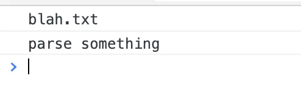

# Shimming 的作用

## Shimming 解决的问题

webpack 编译器(compiler)能够识别遵循 ES2015 模块语法、CommonJS 或 AMD 规范编写的模块。然而，一些第三方的库(library)可能会引用一些全局依赖（例如 jQuery 中的 $）。这些库也可能创建一些需要被导出的全局变量。这些“不符合规范的模块”就是 shimming 发挥作用的地方。

shimming 另外一个使用场景就是，当你希望 polyfill 浏览器功能以支持更多用户时。在这种情况下，你可能只想要将这些 polyfills 提供给到需要修补(patch)的浏览器（也就是实现按需加载）。

## 概念

这个插件就相当于一个垫片

垫片作用：

1. 代码的兼容或者打包过程的兼容
2. @babel/polyfill

## shimming 全局变量

```js
// index.js
import { ui } from './ui';

ui();
```

```js
// ui.js
import $ from 'jquery';

export function ui() {
    $('body').css('background', 'green');
}
```

我们使用一个 ui 库，提供了一个方法 ui，依赖 jquery 实现。

然后去掉对 jquery 的依赖，使用全局变量 jquery；

使用 webpack.ProvidePlugin() 后，能够在通过 webpack 编译的每个模块中，通过访问一个变量来获取到 package 包。如果 webpack 知道这个变量在某个模块中被使用了，那么 webpack 将在最终 bundle 中引入我们给定的 package。

webpack.common.js

```js
const webpack = require('webpack');
// ...

module.exports = {
//   ...
  plugins: [
    ...
    new webpack.ProvidePlugin({
      $: 'jquery',
    })
  ],
}
```

还可以使用 ProvidePlugin 暴露某个模块中单个导出值，只需通过一个“数组路径”进行配置（例如 [module, child, ...children?]）

```js
    plugins: [
        ...
        new webpack.ProvidePlugin({
            $: 'jquery',
            _join: ['lodash', 'join']
        })
    ],
```

告诉我们如果用到_join 的地方，实际上是使用 lodash.join 方法。

```js
export function ui() {
    $('body').css('background', _join(['dark', 'green'], ''));
}
```

## 细粒度 shimming

一些传统的模块依赖的 this 指向的是 window 对象。我们来看一下 webpack 模块中打印 this 指向哪里：

```js
// index.js
console.log(this);
this.alert('hi');
```

本来模块设想运行在 window 下，如果当模块运行在 CommonJS 环境下这将会变成一个问题，也就是说此时的 this 指向的是 module.exports。在这个例子中，可以通过使用 imports-loader 覆写 this：

安装 imports-loader：

```js
rules: [
    // ...
    {
        test: require.resolve('../src/index.js'),
        use: 'imports-loader?this=>window'
    }
]
```

## 全局 exports

让我们假设，某个库(library)创建出一个全局变量，它期望用户使用这个变量。

```js
// index.js
import { file, parse } from './global.js';

console.log(file);
parse();
```

```js
// global.js
const file = 'blah.txt';
const helpers = {
    test: function() { console.log('test something'); },
    parse: function() { console.log('parse something'); }
}
```

你可能从来没有在自己的源码中做过这些事情，但是你也许遇到过一个老旧的库(library)，和上面所展示的代码类似。在这个用例中，我们可以使用 exports-loader，将一个全局变量作为一个普通的模块来导出。例如，为了将 file 导出为 file 以及将 helpers.parse 导出为 parse，做如下调整：

```js
rules: [
    // ...
    {
        test: require.resolve('../src/global.js'),
        use: 'exports-loader?file,parse=helpers.parse'
    }
]
```



## polyfills

除了处理那些遗留的 package 包，shimming 的另一个作用就是处理 polyfills。有很多方法来载入 polyfills。例如，要引入 babel-polyfill 我们只需要如下操作：

npm install --save babel-polyfill

```js
// index.js
import 'babel-polyfill';
```

请注意，我们没有将 import 绑定到变量。这是因为只需在基础代码(code base)之外，再额外执行 polyfills，这样我们就可以假定代码中已经具有某些原生功能。
让我们把 import 放入一个新文件，并加入 whatwg-fetch polyfill：

npm install --save whatwg-fetch

```js
// pollyfills.js
import 'babel-polyfill';
import 'whatwg-fetch';
```

配置修改如下：

```js
    entry: {
        polyfills: './src/polyfills.js',
            index: "./src/index.js"
    },
    output: {
        path: path.resolve(__dirname, '../dist'),
        filename: "[name].bundle.js",
    },
```

## 小结

shimming 说到底视为了解决兼容问题，对旧的库或者浏览器进行兼容。shim 是一个库(library)，它将一个新的 API 引入到一个旧的环境中，而且仅靠旧的环境中已有的手段实现。polyfill 就是一个用在浏览器 API 上的 shim。我们通常的做法是先检查当前浏览器是否支持某个 API，如果不支持的话就加载对应的 polyfill。然后新旧浏览器就都可以使用这个 API 了。

## 链接

- https://www.webpackjs.com/guides/shimming/
- https://webpack.js.org/guides/shimming/
