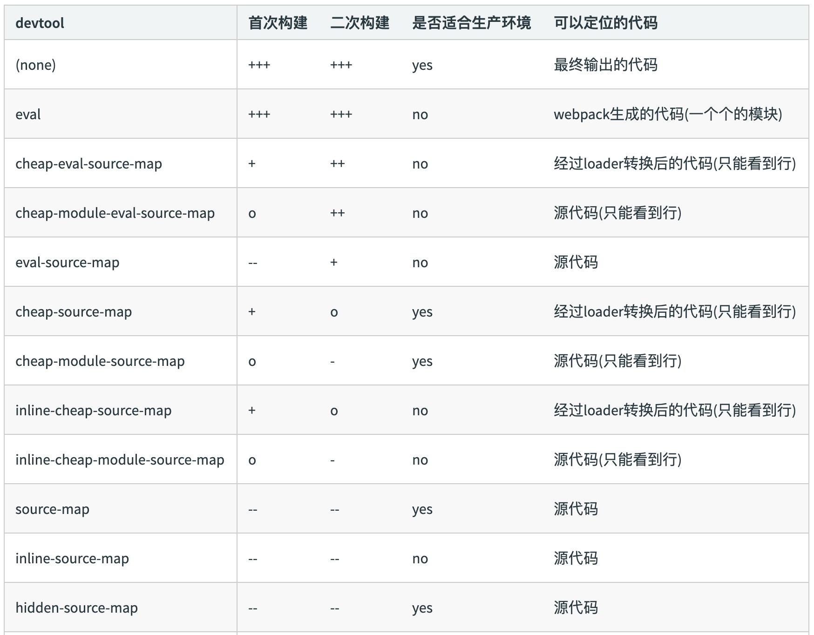

# 使用 source map

由于在开发过程中经常会使用新语言去开发项目，最后会把源码转换成能在浏览器中直接运行的 JavaScript 代码。 这样做虽能提升开发效率，在调试代码的过程中你会发现生成的代码可读性非常差，这给代码调试带来了不便。

source-map: 一种提供源代码到构建后代码映射技术 （如果构建后代码出错了，通过映射可以追踪源代码错误）

作用：通过 source map 定位到源代码； 线上排查问题的时候可以将 sourcemap 上传到错误监控系统。

开发环境开启，线上环境关闭。

## source map 关键字

- eval：用 eval 语句包裹模块代码；
- source-map：生成独立的 .map 文件；
- cheap：生成的 Source Map 中不会包含列信息；同时 Loader 输出的 Source Map 不会被采用；
- inline：将 Source Map 转换成 base64 格式内嵌在 JavaScript 文件中，不单独⽣成 .map ⽂件；
- module：包含 Loader 的 Source Map 被简单处理成每行一个模块；
- hidden：不在 JavaScript 文件中指出 Source Map 文件所在，这样浏览器就不会自动加载 Source Map；

## source map 类型

| devtool                        | 构建速度 | 重新构建速度 | 生产环境 | 品质(quality)          |
| ------------------------------ | -------- | ------------ | -------- | ---------------------- |
| (none)                         | +++      | +++          | yes      | 打包后的代码           |
| eval                           | +++      | +++          | no       | 生成后的代码           |
| cheap-eval-source-map          | +        | ++           | no       | 转换过的代码（仅限行） |
| cheap-module-eval-source-map   | o        | ++           | no       | 原始源代码（仅限行）   |
| eval-source-map                | --       | +            | no       | 原始源代码             |
| cheap-source-map               | +        | o            | yes      | 转换过的代码（仅限行） |
| cheap-module-source-map        | o        | -            | yes      | 原始源代码（仅限行）   |
| inline-cheap-source-map        | +        | o            | no       | 转换过的代码（仅限行） |
| inline-cheap-module-source-map | o        | -            | no       | 原始源代码（仅限行）   |
| source-map                     | --       | --           | yes      | 原始源代码             |
| inline-source-map              | --       | --           | no       | 原始源代码             |
| hidden-source-map              | --       | --           | yes      | 原始源代码             |
| nosources-source-map           | --       | --           | yes      | 无源代码内容           |

T> `+++` 非常快速, `++` 快速, `+` 比较快, `o` 中等, `-` 比较慢, `--` 慢

<!--  -->

`[inline-|hidden-|eval-][nosources-][cheap-[module-]]source-map`

- source-map：外部
  - 错误代码准确信息 和 源代码的错误位置
- inline-source-map：内联
  - 只生成一个内联 source-map
  - 错误代码准确信息 和 源代码的错误位置
- hidden-source-map：外部
  - 错误代码错误原因，但是没有错误位置
  - 不能追踪源代码错误，只能提示到构建后代码的错误位置
- eval-source-map：内联
  - 每一个文件都生成对应的 source-map，都在 eval
  - 错误代码准确信息 和 源代码的错误位置
- nosources-source-map：外部
  - 错误代码准确信息, 但是没有任何源代码信息
- cheap-source-map：外部
  - 错误代码准确信息 和 源代码的错误位置
  - 只能精确的行
- cheap-module-source-map：外部
  - 错误代码准确信息 和 源代码的错误位置
  - module 会将 loader 的 source map 加入

内联 和 外部的区别：

1. 外部生成了文件，内联没有
2. 内联构建速度更快

## 选择

开发环境：速度快，调试更友好

- 速度快(eval>inline>cheap>...)
  - eval-cheap-souce-map
  - eval-source-map
- 调试更友好
  - souce-map
  - cheap-module-souce-map
  - cheap-souce-map

开发下： eval-source-map / eval-cheap-module-souce-map

生产环境：源代码要不要隐藏? 调试要不要更友好?

- 内联会让代码体积变大，所以在生产环境不用内联
- nosources-source-map 全部隐藏
- hidden-source-map 只隐藏源代码，会提示构建后代码错误信息

生产下调试和性能： source-map / cheap-module-souce-map

如果不关心细节和性能，只是想在不出任何差错的情况下调试源码，可以直接设置成 source-map，但这样会造成两个问题：

- source-map 模式下会输出质量最高最详细的 Source Map，这会造成构建速度缓慢，特别是在开发过程需要频繁修改的时候会增加等待时间；
- source-map 模式下会把 Source Map 暴露出去，如果构建发布到线上的代码的 Source Map 暴露出去就等于源码被泄露；

为了解决以上两个问题，可以这样做：

- `在开发环境下把 devtool 设置成 cheap-module-eval-source-map，因为生成这种 Source Map 的速度最快，能加速构建。由于在开发环境下不会做代码压缩，Source Map 中即使没有列信息也不会影响断点调试；`
- `在生产环境下把 devtool 设置成 hidden-source-map，意思是生成最详细的 Source Map，但不会把 Source Map 暴露出去。由于在生产环境下会做代码压缩，一个 JavaScript 文件只有一行，所以需要列信息。`

> 在生产环境下通常不会把 Source Map 上传到 HTTP 服务器让用户获取，而是上传到 JavaScript 错误收集系统，在错误收集系统上根据 Source Map 和收集到的 JavaScript 运行错误堆栈计算出错误所在源码的位置。

`不要在生产环境下使用 inline 模式的 Source Map， 因为这会使 JavaScript 文件变得很大，而且会泄露源码。`

注：`在使用 terser-webpack-plugin 时，必须提供 sourceMap：true 选项来启用 source map 支持。`

## 加载现有的 Source Map

有些从 Npm 安装的第三方模块是采用 ES6 或者 TypeScript 编写的，它们在发布时会同时带上编译出来的 JavaScript 文件和对应的 Source Map 文件，以方便你在使用它们出问题的时候调试它们；

默认情况下 Webpack 是不会去加载这些附加的 Source Map 文件的，Webpack 只会在转换过程中生成 Source Map。 为了让 Webpack 加载这些附加的 Source Map 文件，需要安装 source-map-loader 。

```bash
npm i -D source-map-loader
```

```js
module.exports = {
  module: {
    rules: [
      {
        test: /\.js$/,
        // 只加载你关心的目录下的 Source Map，以提升构建速度
        use: ['source-map-loader'],
        include: [path.resolve(root, 'node_modules/some-components/')],
        // 要把 source-map-loader 的执行顺序放到最前面，如果在 source-map-loader 之前有 Loader 转换了该 JavaScript 文件，会导致 Source Map 映射错误
        enforce: 'pre',
      },
    ],
  },
};
```

`注`：由于 source-map-loader 在加载 Source Map 时计算量很大，因此要避免让该 Loader 处理过多的文件，不然会导致构建速度缓慢。 通常会采用 include 去命中只关心的文件。
