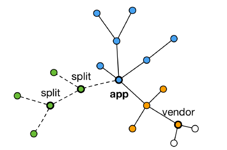

# 代码分割和动态 import

## 代码分割(Code Spliting)的意义

对于大的 Web 应用来讲，将所有的代码都放在一个文件中显然是不够有效的，特别是当你的某些代码块是在某些特殊的时候才会被使用到。webpack 有一个功能就是将你的代码库分割成 chunks（语块），当代码运行到需要它们的时候再进行加载。

## 适用的场景

- 抽离相同代码到⼀个共享块
- 脚本懒加载，使得初始下载的代码更小



## 懒加载 JS 脚本的方式

- CommonJS：require.ensure
- ES6：动态 import（目前还没有原生支持，需要 babel 转换）

## 实现方式

代码分割，和 webpack 无关

webpack 中实现代码分割，有两种方式：

1. 同步代码：只需要在 webpack.common.js 中做 optimization 配置
2. 异步代码(mport)：无需做任何配置，会自动处理，放在新的文件中

## 如何使用动态 import ?

1. 安装 babel 插件:

- `npm install @babel/plugin-syntax-dynamic-import --save-dev`
- `npm i -D @babel/plugin-proposal-class-properties`

2. ES6：动态 import（目前还没有原生支持，需要 babel 转换）

```js
{
  "plugins": [
    "@babel/plugin-syntax-dynamic-import",
    "@babel/plugin-proposal-class-properties"
  ]
}
```

math.js

```js
export const add = (a, b) => {
  return a + b;
};
```

```js
async function creatElem() {
  const {default: _} = await import(/* webpackChunkName:"lodash" */ 'lodash');
  const element = document.createElement('div');
  element.innerHTML = _.join(['hello', 'webpack'], '-');
  return element;
}
```

将 import ... then 形式改写为了 async await 形式；

```js
class App extends React.Component {
  state = {
    elem: null,
  };

  handleClick = () => {
    // 动态加载
    import('./math').then((math) => {
      console.log(math.add(16, 26));
    });
  };

  refDiv = React.createRef();

  creatElem = async () => {
    const elem = await creatElem();
    console.log('elem: ', elem);
    console.log('refDiv: ', this.refDiv.current);
    this.refDiv.current.appendChild(elem);
  };

  render() {
    console.log('React App');
    return (
      <div className="app">
        React App
        <hr />
        <button onClick={this.handleClick}>add</button>
        <button onClick={this.creatElem}>creatElem</button>
        <div ref={this.refDiv}></div>
      </div>
    );
  }
}
```

## Prefetching/Preloading

- preloading：设置这个指令，就会在当前的页面中，以较高优先级预加载某个资源。其实就相当于浏览器的预加载，但是浏览器的预加载只会加载 html 中声明的资源，但是 preloading 突破了这个限制，连 css 和 js 资源也可以预加载一波。
- Prefetching：设置这个指令，就表示允许浏览器在后台（空闲时）获取将来可能用得到的资源，并且将他们存储在浏览器的缓存中。

这两种其实都是 webpack 提供的资源加载优化的方式，反正如果就是设置了这几个指令，就会先走个 http 的缓存，然后下次再次请求的时候直接从缓存里面拿，这样就节省了加载的时间。

```js
// 动态加载 footer 模块
document.body.addEventListener('click', () => {
  import(/* webpackPrefetch: true */ './footer.js').then((module) => {
    console.log(module);
    module.createFooter();
  });
});
```

```js
import(/* webpackChunkName: 'test', webpackPrefetch: true */'./test').then(({ mul }) => {
  console.log(mul(4, 5));
});
```

- 懒加载~：当文件需要使用时才加载~
- 预加载 prefetch：会在使用之前，提前加载js文件
- 正常加载：可以认为是并行加载（同一时间加载多个文件）
- 预加载 prefetch：等其他资源加载完毕，浏览器空闲了，再偷偷加载资源

## 链接

- [Prefetching/Preloading modules](https://webpack.js.org/guides/code-splitting/#prefetchingpreloading-modules)
- [什么是 Preload，Prefetch 和 Preconnect？](https://github.com/fi3ework/blog/issues/32)
- [preload](https://www.keycdn.com/support/preload-directive)
- [prefetching](https://www.keycdn.com/support/prefetching)
- [preconnect](https://www.keycdn.com/support/preconnect)
