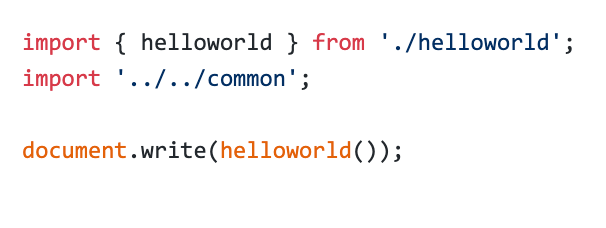
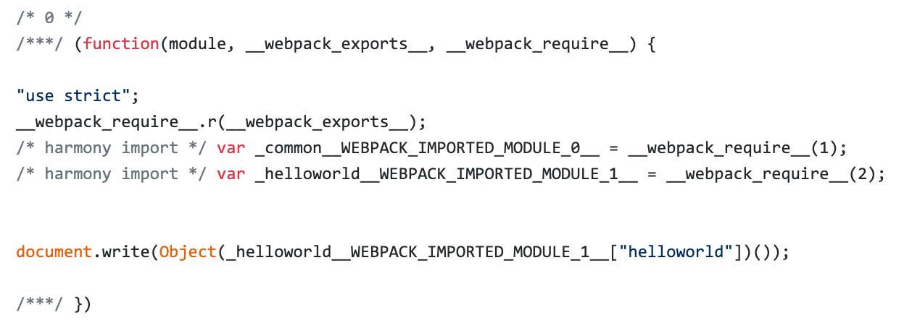

# Scope Hoisting 使用和原理分析

现象：构建后的代码存在大量闭包代码

## 会导致什么问题？

- ⼤量作用域包裹代码，导致体积增大（模块越多越明显）
- 运行代码时创建的函数作用域变多，内存开销变大

## 模块转换分析

模块：



模块初始化函数：



结论：

- 被 webpack 转换后的模块会带上一层包裹
- import 会被转换成 `__webpack_require`

## 进⼀步分析 webpack 的模块机制


分析：

- 打包出来的是一个 IIFE (匿名闭包)
- modules 是⼀个数组，每一项是⼀个模块初始化函数
- `__webpack_require` 用来加载模块，返回 `module.exports`
- 通过 WEBPACK_REQUIRE_METHOD(0) 启动程序

## scope hoisting 原理

原理：将所有模块的代码按照引用顺序放在一个函数作用域里，然后适当的重命名⼀些变量以防止变量名冲突

对比：通过 scope hoisting 可以减少函数声明代码和内存开销

## scope hoisting 使用

webpack mode 为 production 默认开启

注：`必须是 ES6 语法，CJS 不支持`

webpack 3 中需要添加下面这行，`webpack 4 中 mode: production 默认开启`

```js
plugins: [
    new webpack.optimize.ModuleConcatenationPlugin()
}
```
