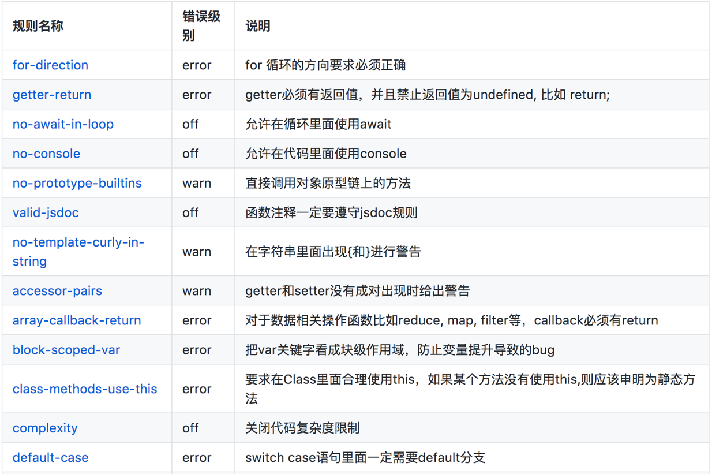
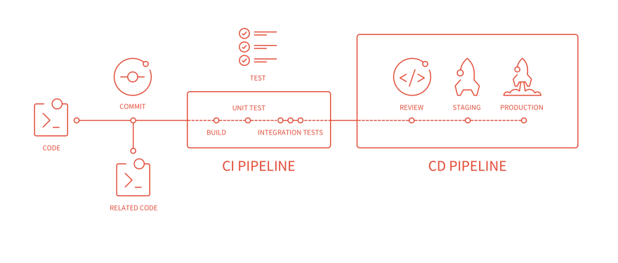

# 在 webpack 中使用 ESLint

- eslint: https://eslint.org/
- 中文：https://eslint.bootcss.com/

## ESLint 的必要性

比如：低版本浏览器解析 JSON 时遇到重复 key 报错，导致页面白屏。

## ESLint

```bash
npm i eslint -D

npx eslint --init
```

## 行业里面优秀的 ESLint 规范实践

Airbnb:

- [eslint-config-airbnb](https://www.npmjs.com/package/eslint-config-airbnb)
- [eslint-config-airbnb github](https://github.com/airbnb/javascript/tree/master/packages/eslint-config-airbnb)
- [eslint-config-airbnb-base](https://github.com/airbnb/javascript/tree/master/packages/eslint-config-airbnb-base)

腾讯：

- alloyteam 团队[eslint-config-alloy](https://github.com/AlloyTeam/eslint-config-alloy)
- ivweb 团队：[eslint-config-ivweb](https://github.com/feflow/eslint-config-ivweb)

### 使用 eslint-config-airbnb

eslint eslint-plugin-import eslint-plugin-react eslint-plugin-react-hooks eslint-plugin-jsx-a11y

eslint-config-airbnb eslint-loader babel-eslint

```js
module.exports = {
  parser: 'babel-eslint',
  extends: 'airbnb',
  env: {
    browser: true,
    node: true,
  },
  rules: {
    indent: ['error', 2],
    'react/jsx-filename-extension': [1, { extensions: ['.js', '.jsx'] }],
  },
};
```

也可以在 package.json 配置

```js
"eslintConfig": {
  "extends": "airbnb-base",
  "env": {
    "browser": true
  }
},
```

npx eslint --fix

## 制定团队的 ESLint 规范

不重复造轮子，基于 eslint:recommend 配置并改进

能够帮助发现代码错误的规则，全部开启

帮助保持团队的代码风格统一，而不是限制开发体验



## ESLint 如何执行落地？

- 和 CI/CD 系统集成
- 和 webpack 集成

## 方案⼀：webpack 与 CI/CD 集成

增加 lint pipline



## 本地开发阶段增加 precommit 钩子

安装 [husky](https://github.com/typicode/husky)

`npm install husky --save-dev`

增加 npm script，通过 lint-staged 增量检查修改的文件

```js
"scripts": {
    "precommit": "lint-staged"
},
"lint-staged": {
    "linters": {
        "*.{js,scss}": ["eslint --fix", "git add"]
    }
},
```

## 方案二：webpack 与 ESLint 集成

使用 eslint-loader，构建时检查 JS 规范

```js
module.exports = {
  module: {
    rules: [
      {
        test: /\.js$/,
        exclude: /node_modules/,
        use: ['babel-loader', 'eslint-loader'],
      },
    ],
  },
};
```

npm i babel-eslint -D

npm i eslint-config-airbnb -D

.eslintrc.js

```js
module.exports = {
  parser: 'babel-eslint',
  extends: 'airbnb',
  env: {
    browser: true,
    node: true,
  },
  rules: {
    indent: ['error', 4],
  },
};
```

## 方案三：dev 时实时检查

webpack.config.js

```js
devServer: {
  overlay: true, // 将异常报错以浮层形式展示，若不开启，只在命令行展示
  // ...
},
module: {
  rules: [
    {
      test: /\.js$/,
      exclude: /node_modules/,
      use: [
          "babel-loader",
          {
             loader: 'eslint-loader',
            options: {
              // 自动修复eslint的错误
              fix: true
            }
          }
      ]
    }
  ]
}
```

参数

```js
fix: true,
cache: true,
enforce: "pre",  // 前面执行的 loader
```

enforce 属性

1. pre 优先处理
2. normal 正常处理（默认）
3. inline 其次处理
4. post 最后处理

于是乎也可以这样配置：

```js
module: {
  rules: [
    {
      enforce: 'pre',
      test: /\.js$/,
      exclude: /node_modules/,
      loader: 'eslint-loader',
    },
    {
      test: /\.js$/,
      exclude: /node_modules/,
      loader: 'babel-loader',
    },
  ],
},
```
