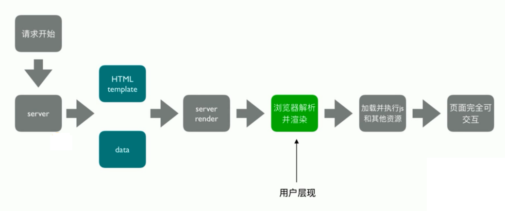
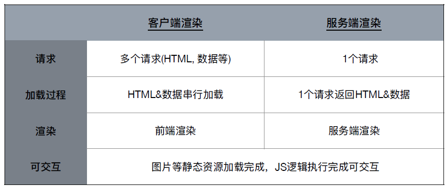
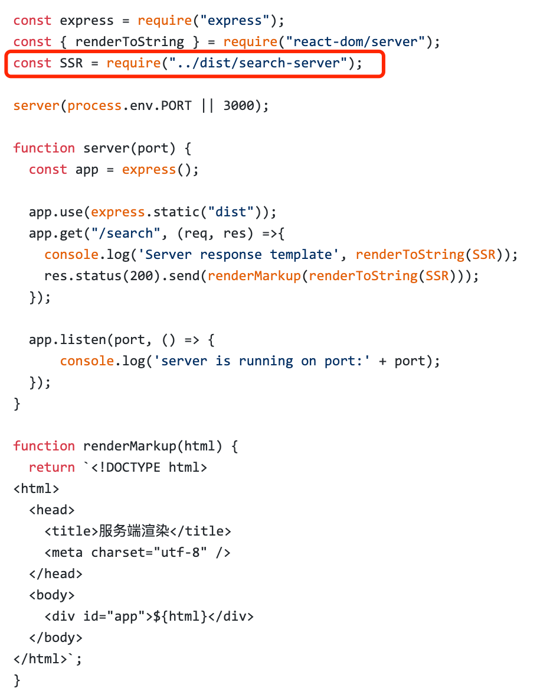

# webpack 实现 SSR 打包

## 页面打开过程

- 开始加载
- HTML 加载成功
- 开始加载数据
- 数据加载成功
- 渲染成功开始
- 加载图片资源
- 图片加载成功
- 页面可交互

## 服务端渲染(SSR) 是什么？

渲染: HTML + CSS + JS + Data -> 渲染后的 HTML

服务端：

- 所有模板等资源都存储在服务端
- 内网机器拉取数据更快
- ⼀个 HTML 返回所有数据

## 浏览器和服务器交互流程

## 客户端渲染 vs 服务端渲染

总结：服务端渲染(SSR) 的核心是减少请求

## SSR 的优势

- 减少白屏时间
- 对于 SEO 友好

## SSR 代码实现思路

服务端

- 使用 react-dom/server 的 renderToString 方法将 React 组件渲染成字符串
- 服务端路由返回对应的模板

客户端

- 打包出针对服务端的组件

## webpack ssr 打包存在的问题

浏览器的全局变量(Node.js 中没有 document, window)

- 组件适配：将不兼容的组件根据打包环境进行适配
- 请求适配：将 fetch 或者 ajax 发送请求的写法改成 isomorphic-fetch 或者 axios

样式问题(Node.js 无法解析 css)

- 方案一：服务端打包通过 ignore-loader 忽略掉 CSS 的解析
- 方案二：将 style-loader 替换成 isomorphic-style-loader

## 如何解决样式不显示的问题？

- 使用打包出来的浏览器端 html 为模板
- 设置占位符，动态插入组件

## 首屏数据如何处理？

- 服务端获取数据
- 替换占位符
