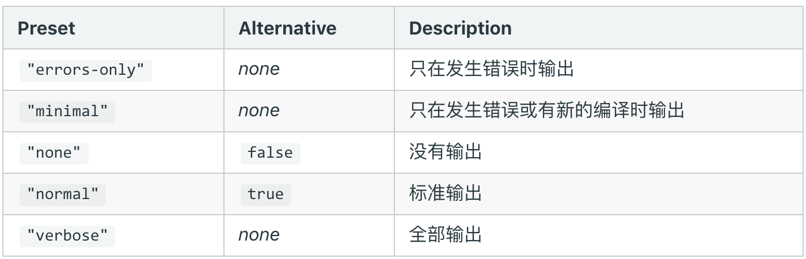
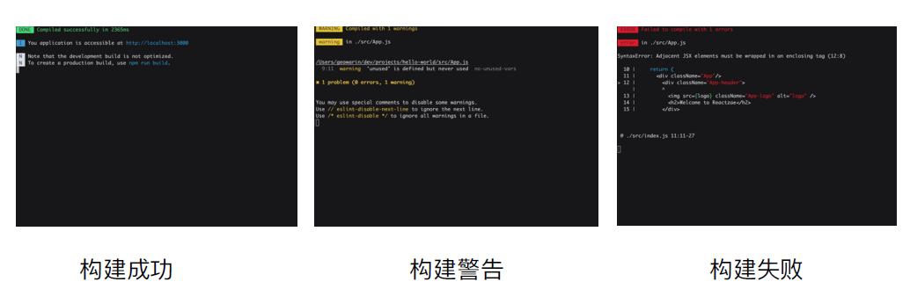

# 优化构建时命令行的显示日志

## 当前构建时的日志显示

展示一大堆日志，很多并不需要开发者关注

## 统计信息 stats



stats 设置成 errors-only

```js
stats: 'errors-only';
```

## 如何优化命令行的构建日志

使用 [friendly-errors-webpack-plugin](https://github.com/geowarin/friendly-errors-webpack-plugin)

- success: 构建成功的日志提示
- warning: 构建警告的日志提示
- error: 构建报错的日志提示

webpack.dev.js

```js
const FriendlyErrorsWebpackPlugin = require('friendly-errors-webpack-plugin');

module.exports = {
  devServer: {
    contentBase: './dist',
    hot: true,
    stats: 'errors-only',
  },
  plugins: [new FriendlyErrorsWebpackPlugin()],
};
```

webpack.prod.js

```js
const FriendlyErrorsWebpackPlugin = require('friendly-errors-webpack-plugin');

module.exports = {
  plugins: [new FriendlyErrorsWebpackPlugin()],
  stats: 'errors-only',
};
```

使用效果


