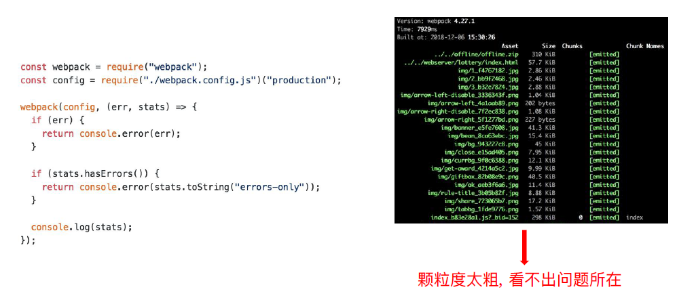

# 初级分析：使用 webpack 内置的 stats

## 使用 webpack 内置的 stats

stats: 构建的统计信息

```js
"scripts": {
    "build:stats": "webpack --config webpack.prod.js --json > stats.json",
    "stats": "webpack --profile --json > stats.json"
},
```

## 官方的可视化分析工具

Webpack 官方提供了一个可视化分析工具 Webpack Analyse，它是一个在线 Web 应用

[http://webpack.github.io/analyse/](http://webpack.github.io/analyse/)

打开 Webpack Analyse 链接的网页后，会看到一个弹窗提示需要上传 JSON 文件，也就是需要上传上面的 stats.json 文件

Webpack Analyse 不会把选择的 stats.json 文件发达到服务器，而是在浏览器本地解析，不用担心自己的代码为此而泄露。 选择文件后，马上就能如下的效果图。

它分为了六大板块，分别是：

- Modules：展示所有的模块，每个模块对应一个文件。并且还包含所有模块之间的依赖关系图、模块路径、模块 ID、模块所属 Chunk、模块大小；
- Chunks：展示所有的代码块，一个代码块中包含多个模块。并且还包含代码块的 ID、名称、大小、每个代码块包含的模块数量，以及代码块之间的依赖关系图；
- Assets：展示所有输出的文件资源，包括 .js、.css、图片等。并且还包括文件名称、大小、该文件来自哪个代码块；
- Warnings：展示构建过程中出现的所有警告信息；
- Errors：展示构建过程中出现的所有错误信息；
- Hints：展示处理每个模块的过程中的耗时。

## Node.js 中使用


