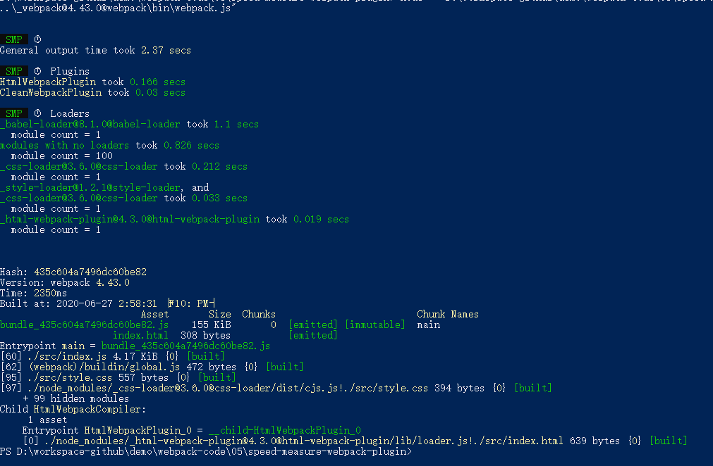

# 速度分析：使用 speed-measure-webpack-plugin

- [speed-measure-webpack-plugin](https://github.com/stephencookdev/speed-measure-webpack-plugin)

npm i speed-measure-webpack-plugin -D

可以看到每个 loader 和插件执行耗时

```js
const SpeedMeasureWebpackPlugin = require('speed-measure-webpack-plugin');

const smp = new SpeedMeasureWebpackPlugin();

const webpackConfig = {
    // webpack 配置
};

module.exports = smp.wrap(webpackConfig);
```



## 速度分析插件作用

- 分析整个打包总耗时
- 分析每个 loader 和 plugin 的耗时情况
