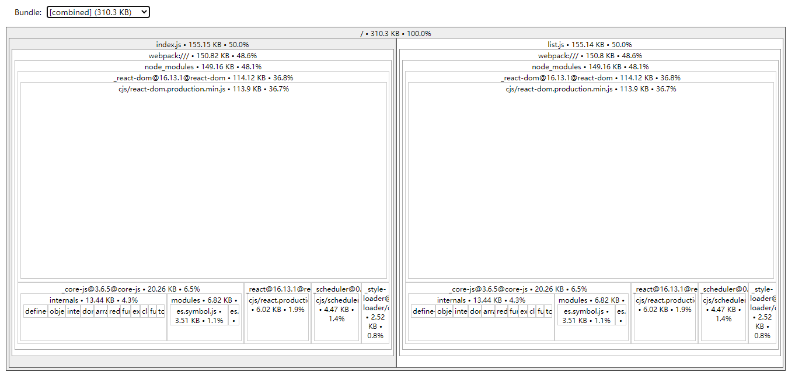

# 体积分析

## 可以分析哪些问题？

- 依赖的第三方模块文件大小；
- 业务里面的组件代码大小；
- 打包出的文件中都包含了什么；
- 每个文件的尺寸在总体中的占比，一眼看出哪些文件尺寸大；
- 模块之间的包含关系；
- 每个文件的 Gzip 后的大小。

## 使用 webpack-bundle-analyzer 分析体积

[webpack-bundle-analyzer](https://github.com/webpack-contrib/webpack-bundle-analyzer) 是另一个可视化分析工具， 它虽然没有官方那样有那么多功能，但比官方的要更加直观。

构建完成后会在 8888 端口展示大小。

```js
const {BundleAnalyzerPlugin} = require('webpack-bundle-analyzer');

module.exports = {
  plugins: [new BundleAnalyzerPlugin()],
};
```


生产环境查看：npm run build --report 或 正常 build 即可启动查看器

开发环境查看：webpack -p --progress 或启动正常 devServer 服务即可启动查看器!

参数列表：[options-for-plugin](https://github.com/webpack-contrib/webpack-bundle-analyzer#options-for-plugin)

```js
new BundleAnalyzerPlugin({
  //  可以是`server`，`static`或`disabled`。
  //  在`server`模式下，分析器将启动HTTP服务器来显示软件包报告。
  //  在"静态"模式下，会生成带有报告的单个HTML文件。
  //  在`disabled`模式下，你可以使用这个插件来将`generateStatsFile`设置为`true`来生成Webpack Stats JSON文件。
  analyzerMode: 'server',
  //  将在"服务器"模式下使用的主机启动HTTP服务器。
  analyzerHost: '127.0.0.1',
  //  将在"服务器"模式下使用的端口启动HTTP服务器。
  analyzerPort: 8888,
  //  路径捆绑，将在`static`模式下生成的报告文件。
  //  相对于捆绑输出目录。
  reportFilename: 'report.html',
  //  模块大小默认显示在报告中。
  //  应该是`stat`，`parsed`或者`gzip`中的一个。
  //  有关更多信息，请参见"定义"一节。
  defaultSizes: 'parsed',
  //  在默认浏览器中自动打开报告
  openAnalyzer: true,
  //  如果为true，则Webpack Stats JSON文件将在bundle输出目录中生成
  generateStatsFile: false,
  //  如果`generateStatsFile`为`true`，将会生成Webpack Stats JSON文件的名字。
  //  相对于捆绑输出目录。
  statsFilename: 'stats.json',
  //  stats.toJson（）方法的选项。
  //  例如，您可以使用`source：false`选项排除统计文件中模块的来源。
  //  在这里查看更多选项：https：  //github.com/webpack/webpack/blob/webpack-1/lib/Stats.js#L21
  statsOptions: null,
  logLevel: 'info', // 日志级别。可以是'信息'，'警告'，'错误'或'沉默'。
});
```

## webpack-chart

webpack 数据交互饼图

- [webpack-chart](https://alexkuz.github.io/webpack-chart/)

## webpack-visualize

可视化并分析 bundle，检查哪些模块占用空间，哪些可能是重复使用的

- [webpack-visualize](https://chrisbateman.github.io/webpack-visualizer/)

## 使用 webpack-bundle-size-analyzer

- [webpack-bundle-size-analyzer](https://github.com/robertknight/webpack-bundle-size-analyzer)

npm install --save-dev webpack-bundle-size-analyzer

```js
const {
  WebpackBundleSizeAnalyzerPlugin,
} = require('webpack-bundle-size-analyzer');

new WebpackBundleSizeAnalyzerPlugin('../analyzer/bundle-size-analyzer.log');
```

输出之后的文件：

```txt
react-dom: 117.29 KB (53.2%)
core-js: 69.74 KB (31.6%)
react: 6.7 KB (3.04%)
style-loader: 6.64 KB (3.01%)
scheduler: 5.12 KB (2.32%)
css-loader: 2.46 KB (1.11%)
object-assign: 2.06 KB (0.933%)
webpack: 472 B (0.209%)
<self>: 10.11 KB (4.58%)
```

## 使用 source-map-explorer 分析前端打包结果进行包体积优化

可以选择使用 webpack-bundle-analyzer， 其实 source-map-explorer 也是个不错的选择。当打包输出结果生成了 sourceMap，source-map-explorer 就可以据此分析出每个模块所占用的体积。而且它不仅限于 JavaScript，对于 Css 预处理器 LESS 和 Sass 来说同样适用。

- [source-map-explorer](https://www.npmjs.com/package/source-map-explorer)

npm install --save source-map-explorer

package.json 中，将以下行添加到 scripts 中

```js
"analyze": "source-map-explorer dist/*.* --html analyze/explorer_result.html",
```

分析 bundle(包) 运行生产构建然后运行分析脚本。

```bash
npm run build
npm run analyze
```


