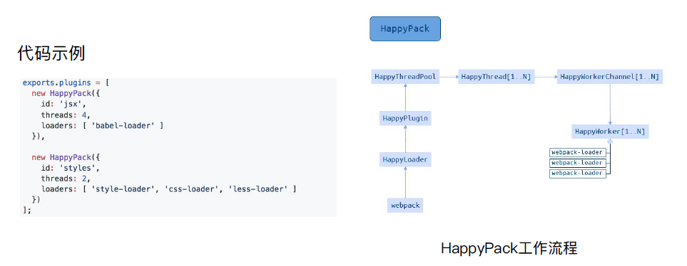

# 多进程/多实例构建

## 资源并行可选方案


## 多进程/多实例：使用 HappyPack 解析资源

`HappyPack 将不再维护. 'See the FAQ entry about Webpack 4 and thread-loader.'`

[HappyPack github](https://github.com/amireh/happypack)

原理：每次 webpack 解析一个模块，HappyPack 会将它及它的依赖分配给 worker 线程中.



```js
var HappyPack = require('happypack');
var happyThreadPool = HappyPack.ThreadPool({ size: os.cpus().length });

// ...
module: {
    rules: [
        {
            test: /\.(js?|tsx?|ts?)$/,
            include: [
                path.resolve(__dirname, 'src'),
            ],
            use: [
                {
                    loader: 'happypack/loader?id=happyBabel',
                },
            ],
        },
// ...
plugins: [
    new HappyPack({
        id: 'happyBabel',
        loaders: ['babel-loader'],
        threadPool: happyThreadPool,
        verbose: true,
    })
]
// ...
```

loader 指向 HappyLoader.js , loader 执行的时候，根据 ? 后面的 id 来找到对应的插件。

### HappyPack 原理

在整个 Webpack 构建流程中，最耗时的流程可能就是 Loader 对文件的转换操作了，因为要转换的文件数据巨多，而且这些转换操作都只能一个个挨着处理。 HappyPack 的核心原理就是把这部分任务分解到多个进程去并行处理，从而减少了总的构建时间。

从前面的使用中可以看出所有需要通过 Loader 处理的文件都先交给了 happypack/loader 去处理，收集到了这些文件的处理权后 HappyPack 就好统一分配了。

每通过 new HappyPack() 实例化一个 HappyPack 其实就是告诉 HappyPack 核心调度器如何通过一系列 Loader 去转换一类文件，并且可以指定如何给这类转换操作分配子进程。

核心调度器的逻辑代码在主进程中，也就是运行着 Webpack 的进程中，核心调度器会把一个个任务分配给当前空闲的子进程，子进程处理完毕后把结果发送给核心调度器，它们之间的数据交换是通过进程间通信 API 实现的。

核心调度器收到来自子进程处理完毕的结果后会通知 Webpack 该文件处理完毕。

- [happy pack 原理解析](https://segmentfault.com/a/1190000021037299?utm_source=tag-newest)

## 多进程/多实例：使用 thread-loader 解析资源

[thread-loader](https://www.webpackjs.com/loaders/thread-loader/)

把这个 loader 放置在其他 loader 之前， 放置在这个 loader 之后的 loader 就会在一个单独的 worker 池(worker pool)中运行

在 worker 池(worker pool)中运行的 loader 是受到限制的。例如：

- 这些 loader 不能产生新的文件。
- 这些 loader 不能使用定制的 loader API（也就是说，通过插件）。
- 这些 loader 无法获取 webpack 的选项设置。

每个 worker 都是一个单独的有 600ms 限制的 node.js 进程。同时跨进程的数据交换也会被限制。 只有工作消耗时间比较长，才需要多进程打包。

npm install --save-dev thread-loader

```js
module.exports = {
  module: {
    rules: [
      {
        test: /\.js$/,
        include: path.resolve('src'),
        use: ['thread-loader'],
      },
    ],
  },
};
```

可配选项

```js
use: [
  {
    loader: 'thread-loader',
    // 有同样配置的 loader 会共享一个 worker 池(worker pool)
    options: {
      // 产生的 worker 的数量，默认是 cpu 的核心数
      workers: 2,

      // 一个 worker 进程中并行执行工作的数量
      // 默认为 20
      workerParallelJobs: 50,

      // 额外的 node.js 参数
      workerNodeArgs: ['--max-old-space-size', '1024'],

      // 闲置时定时删除 worker 进程
      // 默认为 500ms
      // 可以设置为无穷大， 这样在监视模式(--watch)下可以保持 worker 持续存在
      poolTimeout: 2000,

      // 池(pool)分配给 worker 的工作数量
      // 默认为 200
      // 降低这个数值会降低总体的效率，但是会提升工作分布更均一
      poolParallelJobs: 50,

      // 池(pool)的名称
      // 可以修改名称来创建其余选项都一样的池(pool)
      name: 'my-pool',
    },
  },
];
```

## parallel-webpack

[parallel-webpack github](https://github.com/trivago/parallel-webpack)

帮助我们处理并行的没有关系的进程

优点：

- 可以使用 parallel-webpack 来提高打包速度
- 配饰更加灵活，独立

缺点：

- 不能多页面之间共享代码，用这种方式打包的时候，不会公用加载出来。
- 成本用户在承担

使用方式：

- parallel-webpack --watch 检测变化
- parallel-webapck --config 指定配置

npm install parallel-webpack --save-dev

```js
var createVariants = require('parallel-webpack').createVariants;

// Those options will be mixed into every variant
// and passed to the `createConfig` callback.
var baseOptions = {
  preferredDevTool: process.env.DEVTOOL || 'eval',
};

// This object defines the potential option variants
// the key of the object is used as the option name, its value must be an array
// which contains all potential values of your build.
var variants = {
  minified: [true, false],
  debug: [true, false],
  target: ['commonjs2', 'var', 'umd', 'amd'],
};

function createConfig(options) {
  var plugins = [
    new webpack.optimize.DedupePlugin(),
    new webpack.optimize.OccurenceOrderPlugin(),
    new webpack.DefinePlugin({
      DEBUG: JSON.stringify(JSON.parse(options.debug)),
    }),
  ];
  if (options.minified) {
    plugins.push(
      new webpack.optimize.UglifyJsPlugin({
        sourceMap: false,
        compress: {
          warnings: false,
        },
      })
    );
  }
  return {
    entry: './index.js',
    devtool: options.preferredDevTool,
    output: {
      path: './dist/',
      filename:
        'MyLib.' +
        options.target +
        (options.minified ? '.min' : '') +
        (options.debug ? '.debug' : '') +
        '.js',
      libraryTarget: options.target,
    },
    plugins: plugins,
  };
}

module.exports = createVariants(baseOptions, variants, createConfig);
```

### 多配置

a.js 页面:

```js
import react from 'react';
import moduleA from '../components/module';
import '../css/a.css';

console.log('i am a');
console.log(moduleA);
```

webpack.config.js

```js
var path = require('path');
var webpack = require('webpack');

var merge = require('webpack-merge');
// 生成html插件
var HtmlWebpackPlugin = require('html-webpack-plugin');
// 每次打包都清除指定目录 插件
var CleanWebpackPlugin = require('clean-webpack-plugin');
// 处理css插件
var ExtractTextWebpackPlugin = require('extract-text-webpack-plugin');

// 基础配置
var baseConfig = {
  entry: {
    react: ['react'],
  },
  output: {
    path: path.resolve(__dirname, 'dist'),
    filename: 'js/[name].[chunkhash].js',
  },
  module: {
    rules: [
      {
        test: /\.css$/,
        use: ExtractTextWebpackPlugin.extract({
          fallback: 'style-loader',
          use: 'css-loader',
        }),
      },
    ],
  },
  plugins: [
    new ExtractTextWebpackPlugin({
      filename: 'css/[name].[hash].css',
    }),
    new CleanWebpackPlugin(path.resolve(__dirname, 'dist')),
    new webpack.optimize.CommonsChunkPlugin({
      name: 'react',
      minChunks: Infinity,
    }),
  ],
};

// 配置页面函数
var generatePage = function ({
  title = '',
  entry = '',
  template = './src/index.html',
  name = '',
  chunks = [],
} = {}) {
  return {
    entry,
    plugins: [
      new HtmlWebpackPlugin({
        chunks,
        template,
        title,
        filename: name + '.html',
      }),
    ],
  };
};
// 配置页面
var pages = [
  generatePage({
    title: 'page A',
    entry: {
      a: './src/pages/a',
    },
    name: 'a',
    chunks: ['react', 'a'],
  }),
  generatePage({
    title: 'page B',
    entry: {
      b: './src/pages/b',
    },
    name: 'b',
    chunks: ['react', 'b'],
  }),
  generatePage({
    title: 'page C',
    entry: {
      c: './src/pages/c',
    },
    name: 'c',
    chunks: ['react', 'c'],
  }),
];
// 通过 merge 来合成一个配置
module.exports = pages.map((page) => merge(baseConfig, page));
```
