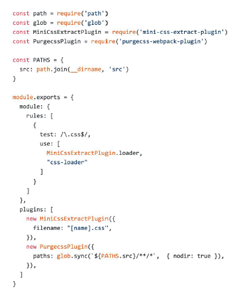

# 使用 Tree Shaking 擦除无用的 JavaScript 和 CSS

Tree Shaking 目的：去除无用代码

## tree shaking(摇树优化)

概念：1 个模块可能有多个方法，只要其中的某个方法使用到了，则整个文件都会被打到 bundle 里面去，tree shaking 就是只把用到的方法打入 bundle ，没用到的方法会在 uglify 阶段被擦除掉。

使用：webpack 默认支持，在 .babelrc 里设置 modules: false 即可

- `production mode 的情况下默认开启`

要求：

1. 必须是 ES6 的语法，CJS 的方式不支持
2. 开启 production 环境

注意：可能带来的问题，可能会把css / @babel/polyfill （副作用）文件干掉

- 在package.json中配置
- `"sideEffects": false` 所有代码都没有副作用（都可以进行tree shaking）
- `"sideEffects": ["*.css", "*.less"]`

## 无用的 CSS 如何删除掉？

- PurifyCSS：遍历代码，识别已经用到的 CSS class
- uncss：HTML 需要通过 jsdom 加载，所有的样式通过 PostCSS 解析，通过 document.querySelector 来识别在 html 文件里面不存在的选择器

## 在 webpack 中如何使用 PurifyCSS?

使用 [purgecss-webpack-plugin](https://github.com/FullHuman/purgecss-webpack-plugin) 和 mini-css-extract-plugin 配合使用



## 在 webpack3 中使用

使用 [purgecss-webpack-plugin](https://github.com/FullHuman/purgecss-webpack-plugin) 和 [extract-text-webpack-plugin](https://www.npmjs.com/package/extract-text-webpack-plugin)

extract-text-webpack-plugin：插件已不推荐使用

## 示例

npm install purify-css purifycss-webpack glob-all --save-dev

glob-all 用于处理多路径文件，使用 purifycss 的时候要用到 glob.sync 方法。

```js
'use strict';

const path = require('path');
const glob = require('glob-all');

const HtmlWebpackPlugin = require('html-webpack-plugin');
const PurifyCss = require('purifycss-webpack');
const MiniCssExtractPlugin = require('mini-css-extract-plugin');

module.exports = {
  entry: './src/index.js',
  output: {
    path: path.join(__dirname, 'dist'),
    filename: 'bundle.js',
  },
  mode: 'production',
  module: {
    rules: [
      {
        test: /\.css$/,
        use: [
          {
            loader: MiniCssExtractPlugin.loader,
          },
          'css-loader',
        ],
      },
      {
        test: /\.js$/,
        use: ['babel-loader?cacheDirectory'],
        include: path.resolve(__dirname, 'src'),
      },
    ],
  },
  plugins: [
    new HtmlWebpackPlugin({
      template: path.join(__dirname, 'src/index.html'),
    }),
    new MiniCssExtractPlugin({
      // 类似 webpackOptions.output里面的配置 可以忽略
      filename: '[name].css',
      chunkFilename: '[id].css',
    }),
    new PurifyCss({
      paths: glob.sync([
        // 传入多文件路径
        path.resolve(__dirname, './*.html'), // 处理根目录下的html文件
        path.resolve(__dirname, './src/*.js'), // 处理src目录下的js文件
      ]),
    }),
  ],
};
```
