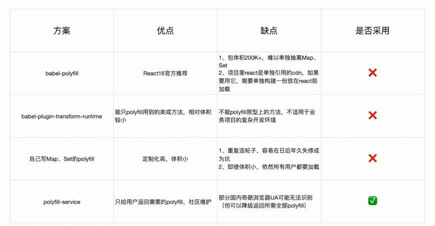

# 使用动态 Polyfill 服务

Polyfill 是一个 js 库，主要抚平不同浏览器之间对 js 实现的差异。比如，html5 的 storage(session,local), 不同浏览器，不同版本，有些支持，有些不支持。Polyfill（Polyfill 有很多，在 GitHub 上[HTML5-Cross-Browser-Polyfills](https://github.com/Modernizr/Modernizr/wiki/HTML5-Cross-Browser-Polyfills))，帮你把这些差异化抹平，不支持的变得支持了（典型做法是在IE浏览器中增加 window.XMLHttpRequest ，内部实现使用 ActiveXObject。）

提到 Polyfill，不得不提 shim，polyfill 是 shim 的一种。
shim 是将不同 api 封装成一种，比如 jQuery 的 $.ajax 封装了 XMLHttpRequest 和 IE 用 ActiveXObject 方式创建 xhr 对象。它将一个新的 API 引入到一个旧的环境中,而且仅靠旧环境中已有的手段实现。

[es6-shim github](https://github.com/paulmillr/es6-shim)

## 构建体积优化：动态 Polyfill

babel-polyfill 打包后体积：88.49k

## Polyfill Service 原理

识别 User Agent 下发不同的 Polyfill

## 构建体积优化：如何使用动态 Polyfill service

polyfill.io 官方提供的服务

- https://cdn.polyfill.io/v2/polyfill.min.js

基于官方自建 polyfill 服务

- //huayang.qq.com/polyfill_service/v2/polyfill.min.js?unknown=polyfill&features=Promise,Map,Set
