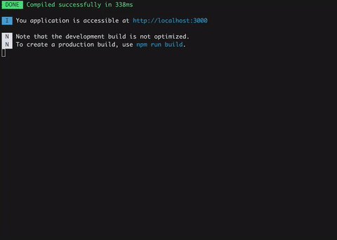
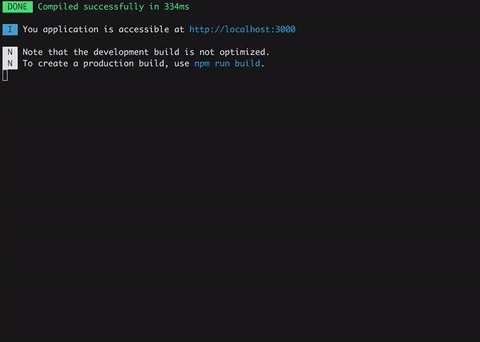
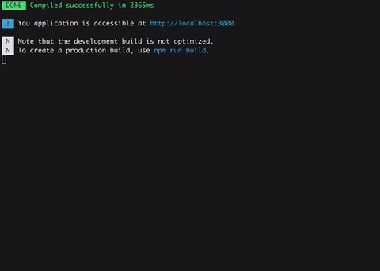

# friendly-errors-webpack-plugin

[GitHub](https://github.com/geowarin/friendly-errors-webpack-plugin)

本插件可以识别webpack中的某些类别的错误，并对它们进行清理、聚合和排序，以提供更好的开发体验。

## 开始

### 安装

```bash
npm install friendly-errors-webpack-plugin --save-dev
```

### 基本使用

将`FriendlyErrorsWebpackPlugin`加入 Webpack 插件配置即可。

```js
var FriendlyErrorsWebpackPlugin = require('friendly-errors-webpack-plugin');

var webpackConfig = {
    // ...
    plugins: [
        new FriendlyErrorsWebpackPlugin(),
    ],
    // ...
}
```

### 关闭错误

可以将 webpack 配置项中的`quite`设置为`true`来关闭错误日志。

```js
app.use(require('webpack-dev-middleware')(compiler, {
    // ...
    logLevel: 'silent',
    // ...
}));
```

如果正在使用`webpack-dev-server`，这里也有一些`devServer`的配置项：

```js
// webpack config root
{
    // ...
    devServer: {
        // ...
        quiet: true,
        // ...
    },
    // ...
}
```

如果使用了`webpack-hot-middleware`，可以将配置项`log`设置为`false`。根据配置，可以这样做：

```js
app.use(require('webpack-hot-middleware')(compiler, {
    log: false
}));
```

## Demo

### Build success


### eslint-loader errors



### babel-loader syntax errors



### Module not found



## 配置项

插件接收如下配置项：

```js
new FriendlyErrorsPlugin({
    compilationSuccessInfo: {
        messages: ['您的应用运行在 http://localhost:3000'],
        notes: ['编译成功后会显示信息嗷┗|｀O′|┛ ']
    },
    onErrors: function (severity, errors) {
        // 您可以监听由插件转换和排序产生的错误
        // 错误级别可以设置为`错误`或`警告`
    },
    // 每次编译时都清空控制台么？
    // 默认：true
    clearConsole: true,

    // 添加格式化方法和转换方法(如下)
    additionalFormatters: [],
    additionalTransformers: []
})
```

## 添加桌面通知

该插件不支持桌面通知，但实现这个功能很简单，基于[node-notifier](https://www.npmjs.com/package/node-notifier)即可。

```js
var FriendlyErrorsPlugin = require('friendly-errors-webpack-plugin');
var notifier = require('node-notifier');
var ICON = path.join(__dirname, 'icon.png');

new FriendlyErrorsPlugin({
    onErrors: (severity, errors) => {
        if (severity !== 'error') {
            return;
        }
        const error = errors[0];
        notifier.notify({
            title: "Webpack error",
            message: severity + ': ' + error.name,
            subtitle: error.file || '',
            icon: ICON
        });
    }
})
```

## API

### 格式化方法和转换方法

Webpack 的错误流程分四个步骤：

1. 从webpack错误中提取相关信息。这是由[这里](https://github.com/geowarin/friendly-errors-webpack-plugin/blob/master/src/core/extractWebpackError.js)的插件完成的。
2. 对所有的错误应用转换方法，从而识别和注释已知的错误，并给予它们优先级。
3. 如果没有抛出错误，那么只获取最高优先级的错误或最高优先级的警告。
4. 对所有带注释的错误应用格式化方法。

[transformErrors]:https://github.com/geowarin/friendly-errors-webpack-plugin/blob/master/src/core/transformErrors.js
[formatErrors]:https://github.com/geowarin/friendly-errors-webpack-plugin/blob/master/src/core/formatErrors.js
[transformers]:https://github.com/geowarin/friendly-errors-webpack-plugin/tree/master/src/transformers
[formatters]:https://github.com/geowarin/friendly-errors-webpack-plugin/tree/master/src/formatters

可以自行添加转换方法和格式化方法。请查看源代码中的[transformErrors][transformErrors]和[formatErrors][formatErrors]，同时也看看默认的[transformers][transformers]和[formatters][formatters]。