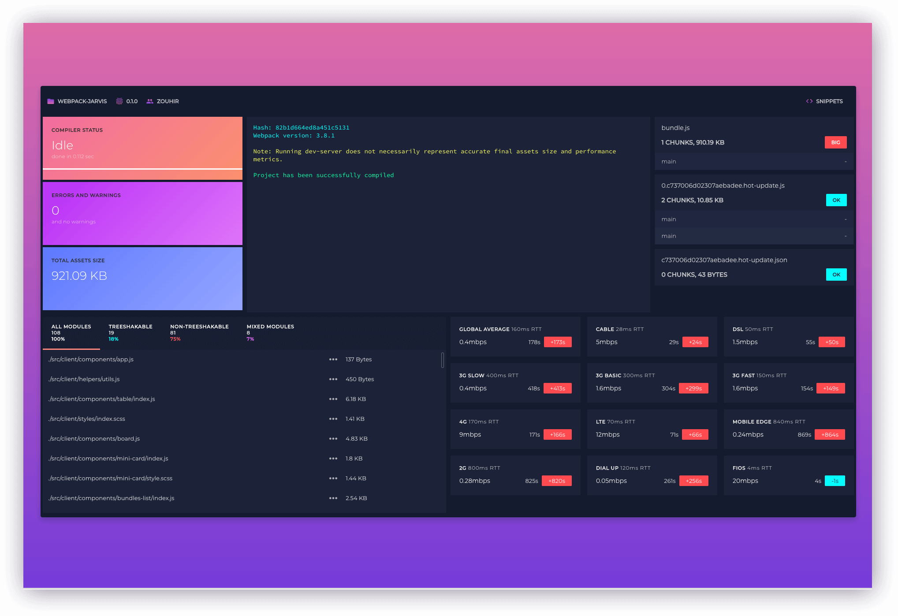

# webpack-jarvis


- https://github.com/zouhir/jarvis
- https://www.npmjs.com/package/webpack-jarvis

## 关于

J.A.R.V.I.S.(只是一个相当智能的系统)旨在把构建 webpack 所需的所有相关信息展示到浏览器中，无论 dev 环境还是 prod 环境。

虽然还有成吨的待开发功能，但是这个测试版足够改变您看待 webpack-dev-server 或 webpack 生产环境打包、分块和输出静态资源的方式了。

该库受到了其他 webpack 展示板的启发，核心思想并非原创，但仍具备一些特性：

### 原创功能

- 展示了导入的 ES Harmony (即可以进行 tree shaking的)模块的数量，而 CJS 则不行。
- 显示您的静态资源在 12 种不同连接类型的表现。
- 一键前往报错在 Google 和 Stackoverflow 中的搜索结果。

### 其他功能

- 在浏览器中运行。
- 美观的错误输出。
- 轻易了解所有静态资源、单独的包和块的大小。
- 美哭了。

### 技术栈

- Preact with Sass pre-processor.
- Socket IO.
- Polka Server.

### 界面截图



## 安装

```bash
npm i -D webpack-jarvis
```

在 webpack 配置文件中加入：

```js
const Jarvis = require("webpack-jarvis");

plugins: [
  new Jarvis({
    port: 1337 // 可选，端口
  })
];
```

浏览器中：

```text
localhost:1337
```

## 配置项

配置项从构造器传入。

```js
new Jarvis(options);
```

### `options.port`

类型：`Number`
默认值：`1337`

Jarvis 面板将在本地服务器的该端口打开。

### `options.host`

类型：`String`
默认值：`localhost`

Jarvis 面板的 host，例：`0.0.0.0`。

### `options.watchOnly`

类型：`Boolean`
默认值：`true`

如果设置为`false`，那么 Jarvis 将不再监听构建，而是在构建完成后继续运行。

### `options.packageJsonPath`

类型：`String`
默认值：`process.cwd()`

Jarvis 将在该项设置的目录中查找您的`package.json`。


