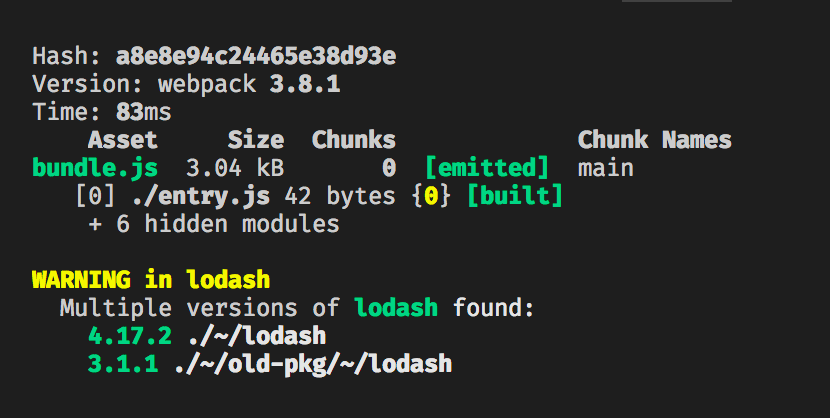

# duplicate-package-checker-webpack-plugin

当你的打包文件中含有多个版本的同一个依赖包时发出警告。



## 为什么要用它？

由于一个依赖包的多个版本可能会被 webpack 多次打包。这种情况发生的时候可能没有任何警告，从而导致您的包体积增加，并可能导致一些难以发现的错误。

该插件会自动提醒你这些情况，从而尽可能减少包的体积，避免因意外的重复打包而造成的错误。

## 安装

Webpack 3.X

```shell
npm install duplicate-package-checker-webpack-plugin@^2.1.0 --save-dev
```

Webpack 4.x

```shell
npm install duplicate-package-checker-webpack-plugin --save-dev
```

## 配置

向 webpack 配置中添加插件：

```js
var DuplicatePackageCheckerPlugin = require("duplicate-package-checker-webpack-plugin");

module.exports = {
  plugins: [new DuplicatePackageCheckerPlugin()]
};
```

还可以传入一个对象：

```js
new DuplicatePackageCheckerPlugin({
  // 显示需要重复依赖包的模块（默认值：false）
  verbose: true,
  // 发出错误而不是警告(默认值：false)
  emitError: true,
  // 如果发现重复的依赖包则展示帮助信息(默认值：true)
  showHelp: false,
  // 如果主要版本不同，也会发出警告 (默认值：true)
  strict: false,
  /**
   * 从结果中排除依赖包的实例。
   * 如果一个包的所有实例都被排除，或者除了一个实例之外的所有实例都被排除，那么这个包就不再被认为是重复的，并且不会发出警告/错误。
   * @param {Object} instance
   * @param {string} instance.name 依赖包名称
   * @param {string} instance.version 依赖包版本
   * @param {string} instance.path 依赖包的绝对路径
   * @param {?string} instance.issuer 请求依赖包的模块的绝对路径
   * @returns {boolean} true 表示排除该实例，否则为false
   */
  exclude(instance) {
    return instance.name === "fbjs";
  }
});
```

## 严格模式

当 bundle 中存在多个主版本(如v1.0.0 vs v2.0.0)的包时，在严格模式下会发出警告。

多个不同主版本的依赖包引入了向后不兼容的更改，并且需要第三方依赖包进行干预或一些不安全的方案(例如用单个版本解决不同的包主要版本的依赖关系)。

建议启用 strict 模式，因为这样可以提高对依赖包的可见性，有助于解决和识别潜在的问题。

## 解决包中的重复依赖

解决依赖包中的重复包有多种方法，主要取决于使用的工具和具体情况。

### Webpack `resolve.alias`

在配置中加入`resolve.alias`，它将配置 Webpack 将任何的依赖包引用路由到单个指定的路径。

举个例子，如果在依赖包中发现了重复的 Lodash，下面的配置将把所有的 Lodash 导入渲染为`./node_modules/lodash` 中找到的 Lodash 实例。

```js
alias: {
  lodash: path.resolve(__dirname, 'node_modules/lodash'),
}
```

**注意:不同版本的别名的包可能会破坏你的应用程序。只有在你确定所有需要的版本都是兼容的情况下才使用，至少在你的应用程序上下文中是这样的。**

### Yarn `install --flat`

Yarn 允许抹平安装`yarn install --flat`, 它让您每个依赖包只安装一个版本。

### Yarn resolutions

如果您想要更进一步控制您的依赖覆盖版本却又不想使用`yarn install --flat`, yarn 支持[“版本选择”](https://yarnpkg.com/lang/en/docs/selective-version-resolutions)，允许您强制规定每个依赖的特定版本。

**package.json**

```js
{
  "dependencies": {
    "lodash": "4.17.0",
    "old-package-with-old-lodash": "*"
  },
  "resolutions": {
    "old-package-with-old-lodash/lodash": "4.17.0"
  }
}
```

### NPM Dedupe

如果你使用的是 NPM 而不是 Yarn，你可以尝试运行`npm dedupe`。NPM**可能**会安装多个版本的同一个包，即使一个版本已经满足其所有依赖。

### 升级依赖

如果项目使用旧版本的包，而依赖项使用该包的新版本，请考虑升级项目以使用新版本。
