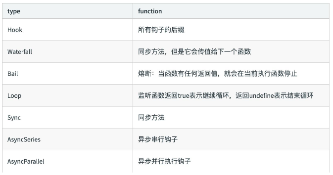
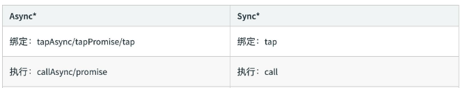

# Tapable 插件架构与 Hooks 设计

tapable：https://github.com/webpack/tapable

## Webpack 的本质

Webpack 可以将其理解是一种基于事件流的编程范例，一系列的插件运行。

### 先看一段代码

核心对象 Compiler 继承 Tapable

```js
class Compiler extends Tapable {
  // ...
}
```

核心对象 Compilation 继承 Tapable

```js
class Compilation extends Tapable {
  // ...
}
```

## Tapable 是什么？

Tapable 是一个类似于 Node.js 的 EventEmitter 的库, 主要是控制钩子函数的发布与订阅，控制着 webpack 的插件系统。

Tapable 库暴露了很多 Hook（钩子）类，为插件提供挂载的钩子

```js
const {
  SyncHook,                 // 同步钩子
  SyncBailHook,             // 同步熔断钩子
  SyncWaterfallHook,        // 同步流水钩子
  SyncLoopHook,             // 同步循环钩子
  AsyncParallelHook,        // 异步并发钩子
  AsyncParallelBailHook,    // 异步并发熔断钩子
  AsyncSeriesHook,          // 异步串行钩子
  AsyncSeriesBailHook,      // 异步串行熔断钩子
  AsyncSeriesWaterfallHook, // 异步串行流水钩子
} = require('tapable');
```

## Tapable hooks 类型



## Tapable 的使用 - new Hook 新建钩子

Tapable 暴露出来的都是类方法，new 一个类方法获得我们需要的钩子

class 接受数组参数 options ，非必传。类方法会根据传参，接受同样数量的参数。

```js
const hook1 = new SyncHook(['arg1', 'arg2', 'arg3']);
```

## Tapable 的使用 - 钩子的绑定与执行

Tapable 提供了同步&异步绑定钩子的方法，并且他们都有绑定事件和执行事件对应的方法。



## Tapable 的使用 - hook 基本用法示例

```js
const {SyncHook} = require('tapable');

const hook = new SyncHook(['arg1', 'arg2', 'arg3']);
// 绑定事件到 webpack 事件流
hook.tap('hook1', (arg1, arg2, arg3) => {
  console.log(arg1, arg2, arg3);
});
// 执行绑定的事件
hook.call(1, 2, 3);
```

## Tapable 的使用 - 实际例子演示

定义一个 Car 方法，在内部 hooks 上新建钩子。分别是同步钩子 accelerate、brake（ accelerate 接受一个参数）、异步钩子 calculateRoutes

使用钩子对应的绑定和执行方法

calculateRoutes 使用 tapPromise 可以返回一个 promise 对象

```js
const {SyncHook, AsyncSeriesHook} = require('tapable');

class Car {
  constructor() {
    this.hooks = {
      accelerate: new SyncHook(['newspeed']),
      brake: new SyncHook(),
      calculateRoutes: new AsyncSeriesHook(['source', 'target', 'routesList']),
    };
  }
}

const myCar = new Car();

// 绑定同步钩子
myCar.hooks.brake.tap('WarningLampPlugin', () =>
  console.log('WarningLampPlugin')
);

// 绑定同步钩子 并传参
myCar.hooks.accelerate.tap('LoggerPlugin', (newSpeed) =>
  console.log(`Accelerating to ${newSpeed}`)
);

// 绑定一个异步Promise钩子
myCar.hooks.calculateRoutes.tapPromise(
  'calculateRoutes tapPromise',
  (source, target, routesList, callback) => {
    // return a promise
    return new Promise((resolve, reject) => {
      setTimeout(() => {
        console.log(`tapPromise to ${source} ${target} ${routesList}`);
        resolve();
      }, 1000);
    });
  }
);

myCar.hooks.brake.call();
myCar.hooks.accelerate.call(10);

console.time('cost');

// 执行异步钩子
myCar.hooks.calculateRoutes.promise('Async', 'hook', 'demo').then(
  () => {
    console.timeEnd('cost');
  },
  (err) => {
    console.error(err);
    console.timeEnd('cost');
  }
);
```
