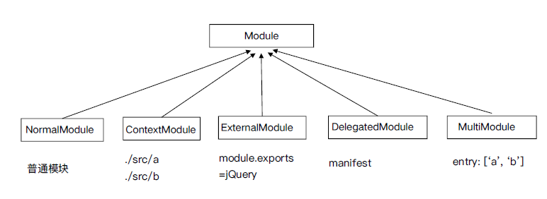

# webpack 流程篇

webpack 的编译都按照下面的钩子调用顺序执行

## WebpackOptionsApply

将所有的配置 options 参数转换成 webpack 内部插件

使用默认插件列表

举例：

- output.library -> LibraryTemplatePlugin
- externals -> ExternalsPlugin
- devtool -> EvalDevtoolModulePlugin, SourceMapDevToolPlugin
- AMDPlugin, CommonJsPlugin
- RemoveEmptyChunksPlugin

## Compiler hooks

流程相关：

- (before-)run
- (before-/after-)compile
- make
- (after-)emit
- done

监听相关：

- watch-run
- watch-close

## Compilation

Compiler 调用 Compilation 生命周期方法

- addEntry -> addModuleChain
- finish (上报模块错误)
- seal

## ModuleFactory

## Module

## NormalModule

Build

- 使用 loader-runner 运行 loaders
- 通过 Parser 解析 (内部是 acron)
- ParserPlugins 添加依赖

## Compilation hooks

模块相关：

- build-module
- failed-module
- succeed-module

资源生成相关：

- module-asset
- chunk-asset

优化和 seal 相关：

- (after-)seal
- optimize
- optimize-modules(-basic/advanced)
- after-optimize-modules
- after-optimize-chunks
- after-optimize-tree
- optimize-chunk-modules(-basic/advanced)
- after-optimize-chunk-modules
- optimize-module/chunk-order
- before-module/chunk-ids
- (after-)optimize-module/chunk-ids
- before/after-hash

## Chunk 生成算法

1. webpack 先将 entry 中对应的 module 都生成一个新的 chunk
2. 遍历 module 的依赖列表，将依赖的 module 也加入到 chunk 中
3. 如果一个依赖 module 是动态引入的模块，那么就会根据这个 module 创建一个新的 chunk，继续遍历依赖
4. 重复上面的过程，直至得到所有的 chunks
