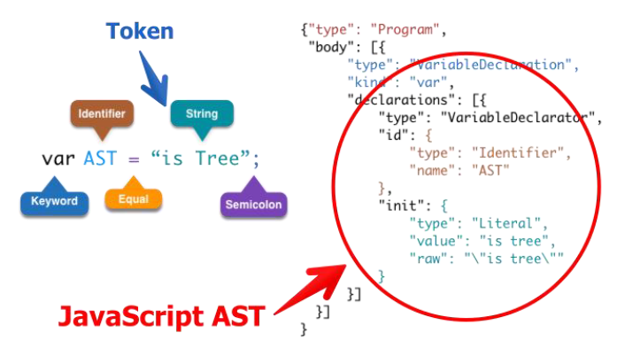
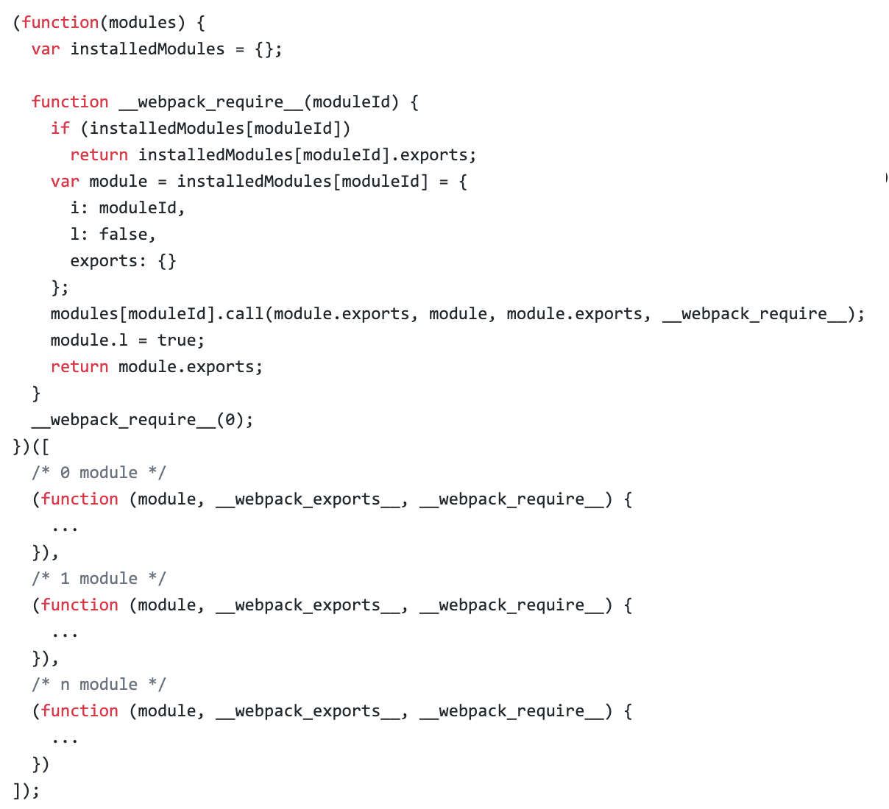

# 动手实现一个简易的 webpack

## 模块化：增强代码可读性和维护性

- 传统的网页开发转变成 Web Apps 开发
- 代码复杂度在逐步增高
- 分离的 JS 文件/模块，便于后续代码的维护性
- 部署时希望把代码优化成几个 HTTP 请求

## 常见的几种模块化方式

ES module：

```js
import * as largeNumber from 'large-number';
// ...
largeNumber.add('999', '1');
```

CJS：

```js
const largeNumbers = require('large-number');
// ...
largeNumber.add('999', '1');
```

AMD：

```js
require(['large-number'], function (large-number) {
    // ...
    largeNumber.add('999', '1');
});
```

## AST 基础知识

抽象语法树（abstract syntax tree 或者缩写为 AST），或者语法树（syntax tree），是源代码的抽象语法结构的树状表现形式，这里特指编程语言的源代码。树上的每个节点都表示源代码中的一种结构。

在线 demo：https://esprima.org/demo/parse.html



## webpack 的模块机制



分析：

- 打包出来的是一个 IIFE (匿名闭包)
- modules 是⼀个数组，每一项是⼀个模块初始化函数
- `__webpack_require` 用来加载模块，返回 module.exports
- 通过 WEBPACK_REQUIRE_METHOD(0) 启动程序

## 实现一个简易的 webpack

1. 可以将 ES6 语法转换成 ES5 的语法

    - 通过 babylon 生成 AST
    - 通过 babel-core 将 AST 重新生成源码

2. 可以分析模块之间的依赖关系

    - 通过 babel-traverse 的 ImportDeclaration 方法获取依赖属性

3. 生成的 JS 文件可以在浏览器中运行

附：源码参见 simple-webpack
