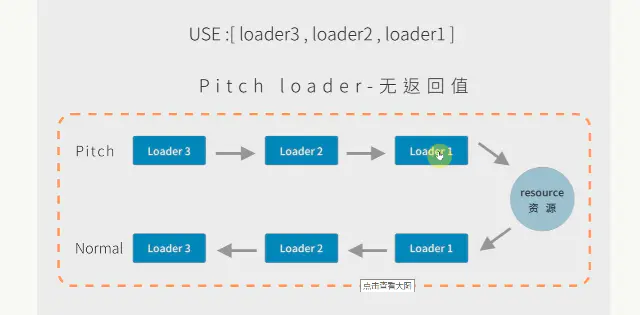
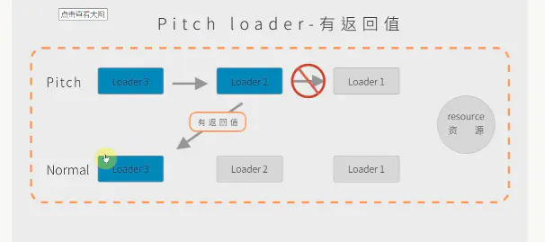

# 编写 Loader

## Loader 的职责

一个 Loader 的职责是单一的，只需要完成一种转换。 如果一个源文件需要经历多步转换才能正常使用，就通过多个 Loader 去转换。 在调用多个 Loader 去转换一个文件时，每个 Loader 会链式的顺序执行， 第一个 Loader 将会拿到需处理的原内容，上一个 Loader 处理后的结果会传给下一个接着处理，最后的 Loader 将处理后的最终结果返回给 Webpack。

## 一个最简单的 loader 代码结构

定义：loader 只是一个导出为函数的 JavaScript 模块

```js
module.exports = function (source) {
  return source;
};
```

注意：要用 function，不能使用箭头函数

## 多 Loader 时的执行顺序

多个 Loader 串行执行： `顺序从后到前`

```js
module.exports = {
  entry: './src/index.js',
  output: {
    filename: 'bundle.js',
    path: path.resolve(__dirname, 'dist'),
  },
  module: {
    rules: [
      {
        test: /\.less$/,
        use: [
          'style-loader',
          'css-loader',
          'less-loader'
        ],
      },
    ],
  },
};
```

使用行内 loader 有几种标识符:

- -! 禁止前置和正常的 loader
- ! 禁用普通 loader
- !! 禁用前置和后置和正常的 loader

loader 分为 Pitch Loader 和 Normal Loader:

- loader 执行首先会加载 pitch-loader（书写 loader 的顺序），然后加载资源 resource，最后执行 normal-loader（正常加载 loader 的顺序，右到左，下往上）
- 如果 pitch-loader 有返回值，则会跳过后面的 loader，直接走到上一层的 normal-loader 里面。





loader 的特点：

- 第一个 loader 要返回脚本内容
- 每个 loader 制作一件内容，为了使用 loader 在更多场景链式调用
- 每一个 loader 都是一个模块
- 每个 loader 都是无状态的，确保 loader 在不同模块之间不保存状态

## 函数组合的两种情况

- Unix 中的 pipline ： (从左往右)
- Compose(webpack 采取的是这种)： (从右往左)

```js
compose = (f, g) => (...args) => f(g(...args));
```

## 通过一个例子验证 loader 的执行顺序

loaders/a-loader.js:

```js
module.exports = function (source) {
  console.log('loader a is executed');
  return source;
};
```

loaders/b-loader.js:

```js
module.exports = function (source) {
  console.log('loader b is executed');
  return source;
};
```

webpack.config.js

```js
const path = require('path');

module.exports = {
  entry: './src/index.js',
  output: {
    path: path.join(__dirname, 'dist'),
    filename: 'main.js',
  },
  module: {
    rules: [
      {
        test: /\.js$/,
        use: [
          path.resolve('./loaders/a-loader'),
          path.resolve('./loaders/b-loader'),
        ],
      },
    ],
  },
};
```

## loader-runner 介绍

定义：[loader-runner](https://github.com/webpack/loader-runner) 允许在不安装 webpack 的情况下运行 loaders

作用：

- 作为 webpack 的依赖，webpack 中使用它执行 loader
- 进行 loader 的开发和调试

## loader-runner 的使用

```bash
npm i loader-runner -D
```

```js
import {runLoaders} from 'loader-runner';
runLoaders(
  {
    resource: '/abs/path/to/file.txt?query', // String: 资源的绝对路径(可以增加查询字符串)
    loaders: ['/abs/path/to/loader.js?query'], // String[]: loader 的绝对路径(可以增加查询字符串)
    context: {minimize: true}, // 基础上下文之外的额外 loader 上下文
    readResource: fs.readFile.bind(fs), // 读取资源的函数
  },
  function (err, result) {
    // err: Error?
    // result.result: Buffer | String
  }
);
```

## 开发一个 raw-loader

src/raw-loader.js：

```js
module.exports = function (source) {
  const json = JSON.stringify(source)
    .replace(/\u2028/g, '\\u2028 ') // 为了安全起见, ES6模板字符串的问题
    .replace(/\u2029/g, '\\u2029');
  return `export default ${json}`;
  // this.callback(null, json);
};
```

src/demo.txt

```txt
foobar
```

## 使用 loader-runner 调试 loader

run-loader.js:

```js
const { runLoaders } = require("loader-runner");
const fs = require("fs");
const path = require("path");

runLoaders(
    {
        resource: path.resolve(__dirname,"./demo.txt"],
        loaders: [
            path.resolve(__dirname, "./loaders/rawloader.js")
        ],
        context: {
            minimise: true,
        },
        readResource: fs.readFile.bind(fs),
    },
    (err, result) => {
        err ? console.error(err) : console.log(result);
    }
);
```

运行查看结果：node run-loader.js

## 使用 loader-utils 获取参数

通过 [loader-utils](https://github.com/webpack/loader-utils) 的 getOptions 方法获取

xxx-loader.js

```js
const loaderUtils = require('loader-utils');
module.exports = function (content) {
  const {name} = loaderUtils.getOptions(this);
  console.log('name:', name);
};
```

## 使用 schema-utils 校验参数

[schema-utils](https://github.com/webpack/schema-utils)

```js
let validateOptions = require('schema-utils');

let schema = {
  type: 'object',
  properties: {
    text: {
      type: 'string',
    },
    filename: {
      type: 'string',
    },
  },
};
validateOptions(schema, options, 'banner-loader');
```

## 自动添加文件依赖

```js
this.addDependency(options.filename);
```

## loader 异常处理

loader 内直接通过 throw 抛出

```js
throw new Error('Error');
```

通过 this.callback 传递错误

```js
this.callback(
   // 当无法转换原内容时，给 Webpack 返回一个 Error
    err: Error | null,
    // 原内容转换后的内容
    content: string | Buffer,
    // 用于把转换后的内容得出原内容的 Source Map，方便调试
    sourceMap?: SourceMap,
    meta?: any
);

this.callback(new Error('Error'), '');
```

Source Map 的生成很耗时，通常在开发环境下才会生成 Source Map，其它环境下不用生成，以加速构建。 为此 Webpack 为 Loader 提供了 this.sourceMap API 去告诉 Loader 当前构建环境下用户是否需要 Source Map。 如果编写的 Loader 会生成 Source Map，请考虑到这点。

## Loader 的异步处理

Loader 有同步和异步之分，上面介绍的 Loader 都是同步的 Loader，因为它们的转换流程都是同步的，转换完成后再返回结果。 但在有些场景下转换的步骤只能是异步完成的，例如你需要通过网络请求才能得出结果，如果采用同步的方式网络请求就会阻塞整个构建，导致构建非常缓慢。

通过 this.async 来返回一个异步函数

- 第一个参数是 Error，第二个参数是处理的结果

```js
module.exports = function (input) {
  //  告诉 Webpack 本次转换是异步的，Loader 会在 callback 中回调结果
  const callback = this.async();
  // 通过 callback 返回异步执行后的结果
  callback(null, input + input);
};
```

## 处理二进制数据

在默认的情况下，Webpack 传给 Loader 的原内容都是 UTF-8 格式编码的字符串。 但有些场景下 Loader 不是处理文本文件，而是处理二进制文件，例如 file-loader，就需要 Webpack 给 Loader 传入二进制格式的数据。

```js
module.exports = function (source) {
  // 在 exports.raw === true 时，Webpack 传给 Loader 的 source 是 Buffer 类型的
  source instanceof Buffer === true;
  // Loader 返回的类型也可以是 Buffer 类型的
  // 在 exports.raw !== true 时，Loader 也可以返回 Buffer 类型的结果
  return source;
};
// 通过 exports.raw 属性告诉 Webpack 该 Loader 是否需要二进制数据
module.exports.raw = true;
```

以上代码中最关键的代码是最后一行 module.exports.raw = true;，没有该行 Loader 只能拿到字符串。

## 在 loader 中使用缓存加速

webpack 中默认开启 loader 缓存

- 可以使用 this.cacheable(false) 关掉缓存

缓存条件： loader 的结果在相同的输入下有确定的输出

- 有依赖的 loader 无法使用缓存

## loader 如何进行文件输出？

通过 this.emitFile 进行文件写入

```js
const loaderUtils = require('loader-utils');

module.exports = function (content) {
  const url = loaderUtils.interpolateName(this, '[hash].[ext]', {
    content,
  });
  this.emitFile(url, content);
  const path = `__webpack_public_path__ + ${JSON.stringify(url)};`;
  return `export default ${path}`;
};
```

## 其它 Loader API

- this.context：当前处理文件的所在目录，假如当前 Loader 处理的文件是 /src/main.js，则 this.context 就等于 /src。
- this.resource：当前处理文件的完整请求路径，包括 querystring，例如 /src/main.js?name=1。
- this.resourcePath：当前处理文件的路径，例如 /src/main.js。
- this.resourceQuery：当前处理文件的 querystring。
- this.target：等于 Webpack 配置中的 Target。
- this.loadModule：当 Loader 在处理一个文件时，如果依赖其它文件的处理结果才能得出当前文件的结果时， 就可以通过 `this.loadModule(request: string, callback: function(err, source, sourceMap, module))` 去获得 request 对应文件的处理结果。
- this.resolve：像 require 语句一样获得指定文件的完整路径，使用方法为 `resolve(context: string, request: string, callback: function(err, result: string))`。
- this.addDependency：给当前处理文件添加其依赖的文件，以便再其依赖的文件发生变化时，会重新调用 Loader 处理该文件。使用方法为 `addDependency(file: string)`。
- this.addContextDependency：和 addDependency 类似，但 addContextDependency 是把整个目录加入到当前正在处理文件的依赖中。使用方法为 `addContextDependency(directory: string)`。
- this.clearDependencies：清除当前正在处理文件的所有依赖，使用方法为 `clearDependencies()`。
- this.emitFile：输出一个文件，使用方法为 `emitFile(name: string, content: Buffer|string, sourceMap: {...})`。

## Npm link

Npm link 专门用于开发和调试本地 Npm 模块，能做到在不发布模块的情况下，把本地的一个正在开发的模块的源码链接到项目的 node_modules 目录下，让项目可以直接使用本地的 Npm 模块。 由于是通过软链接的方式实现的，编辑了本地的 Npm 模块代码，在项目中也能使用到编辑后的代码。

完成 Npm link 的步骤如下：

- 确保正在开发的本地 Npm 模块（也就是正在开发的 Loader）的 package.json 已经正确配置好；
- 在本地 Npm 模块根目录下执行 npm link，把本地模块注册到全局；
- 在项目根目录下执行 npm link loader-name，把第 2 步注册到全局的本地 Npm 模块链接到项目的 node_modules 下，其中的 loader-name 是指在第 1 步中的 package.json 文件中配置的模块名称。

链接好 Loader 到项目后你就可以像使用一个真正的 Npm 模块一样使用本地的 Loader 了。

## ResolveLoader

ResolveLoader 用于配置 Webpack 如何寻找 Loader。 默认情况下只会去 node_modules 目录下寻找，为了让 Webpack 加载放在本地项目中的 Loader 需要修改 resolveLoader.modules

假如本地的 Loader 在项目目录中的 ./loaders/loader-name 中，则需要如下配置：

```js
module.exports = {
  resolveLoader: {
    // 去哪些目录下寻找 Loader，有先后顺序之分
    modules: ['node_modules', './loaders/'],
  },
};
```

加上以上配置后， Webpack 会先去 node_modules 项目下寻找 Loader，如果找不到，会再去 ./loaders/ 目录下寻找。

## 链接

https://github.com/webpack/webpack-cli#commands
