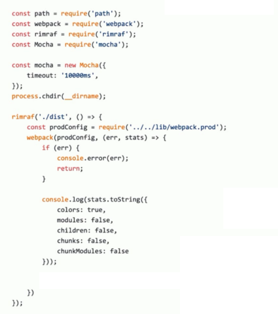

# 冒烟测试介绍和实际运用

## 冒烟测试 (smoke testing)

冒烟测试是指对提交测试的软件在进行详细深入的测试之前而进行的预测试，这种预测试的主要目的是暴露导致软件需重新发布的基本功能失效等严重问题。

## 冒烟测试执行

- 构建是否成功
- 每次构建完成 build 目录是否有内容输出
  - 是否有 JS、CSS 等静态资源文件
  - 是否有 HTML 文件

## 判断构建是否成功

在示例项目里面运行构建，看看是否有报错



## 判断基本功能是否正常

编写 mocha 测试用例

- 是否有 JS、CSS 等静态资源文件
- 是否有 HTML 文件

```js
const glob = require('glob-all');

describe('Checking generated html files', () => {
    it('should generate html files', (done) => {
        const files = glob.sync([
            './dist/index.html',
        ]);

        if (files.length > 0) {
            done();
        } else {
            throw new Error('no html files generated');
        }
    });
});


describe('Checking generated css js files', () => {
    it('should generate css js files', (done) => {
        const files = glob.sync([
            './dist/index_*.js',
            './dist/index_*.css',
        ]);

        if (files.length > 0) {
            done();
        } else {
            throw new Error('no css js files generated');
        }
    });
});
```

```js
const path = require('path');
const webpack = require('webpack');
const rimraf = require('rimraf');
const Mocha = require('mocha');

const mocha = new Mocha({
    timeout: '10000ms'
});

process.chdir(path.join(__dirname, 'template'));

rimraf('./dist', () => {
    const prodConfig = require('../../lib/webpack.prod.js');

    webpack(prodConfig, (err, stats) => {
        if (err) {
            console.error(err);
            process.exit(2);
        }
        console.log(stats.toString({
            colors: true,
            modules: false,
            children: false
        }));

        console.log('Webpack build success, begin run test.');

        mocha.addFile(path.join(__dirname, 'html-test.js'));
        mocha.addFile(path.join(__dirname, 'css-js-test.js'));
        mocha.run();
    });
});
```