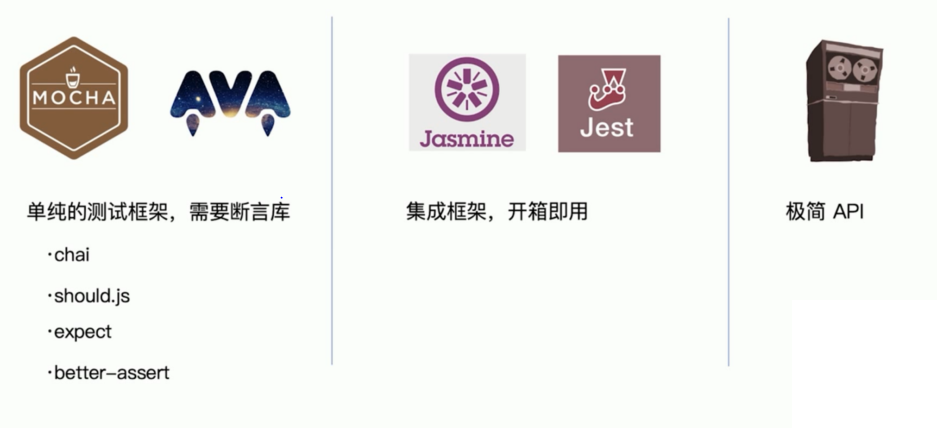

# 单元测试和测试覆盖率

## 单元测试



- 单纯的测试框架
  - mocha
  - ava
  - 需要断言库
    - chai
    - should.js
    - expect
    - better-assert
- 集成框架，开箱即用
  - jasmine
  - jest
- 极简 API

## 编写单元测试用例

- 技术选型：Mocha + Chai
- 测试代码：describe, it, except
- 测试命令：mocha add.test.js

add.test.js

```js
const expect = require('chai').expect;

const add = require('../src/add');

describe('use expect: src/add.js', () => {
  it('add(1, 2) === 3', () => {
    expect(add(1, 2).to.equal(3));
  });
});
```

## 单元测试接入

1. 安装 mocha + chai

    ```bash
    npm i mocha chai -D
    ```

2. 新建 test 目录，并增加 xxx.test.js 测试文件
3. 在 package.json 中的 scripts 字段增加 test 命令

    ```js
    "scripts": {
        "test": "node_modules/mocha/bin/_mocha"
    },
    ```

index.js

```js
const path = require('path');

process.chdir(path.join(__dirname, 'smoke/template'));

describe('builder-webpack test case', () => {
    require('./unit/webpack-base-test');
});
```

unit/webpack-base-test.js

```js
const assert = require('assert');

describe('webpack.base.js test case', () => {
    const baseConfig = require('../../lib/webpack.base.js')

    it('entry', () => {
        assert.equal(baseConfig.entry.index, '/Users/ShenBao/my-project/builder-webpack/test/smoke/template/src/index/index.js');
    });
});
```

4. 执行测试命令: npm run test

## 测试覆盖率

npm i istanbul -D

```js
"scripts": {
    "test": "istanbul cover ./node_modules/.bin/_mocha",
},
```
