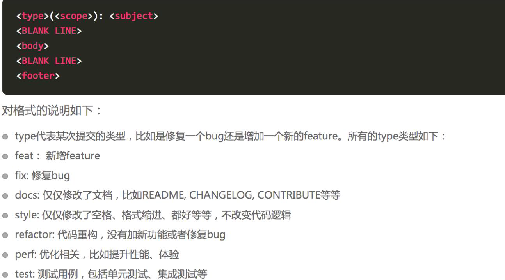
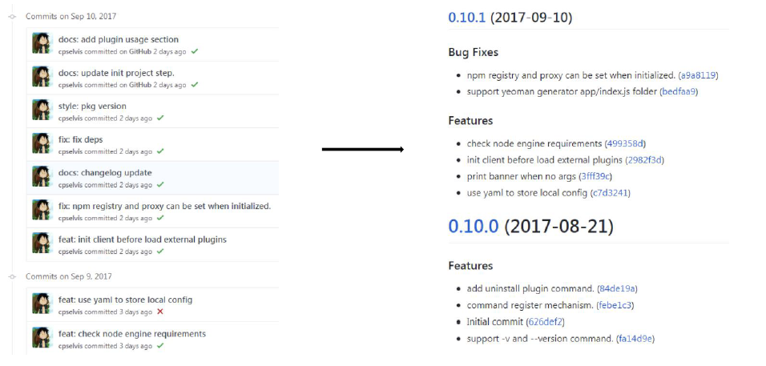

# Git Commit 规范和 changelog 生成

## Git 规范和 Changelog 生成

良好的 Git commit 规范优势：

- 加快 Code Review 的流程
- 根据 Git Commit 的元数据生成 Changelog
- 后续维护者可以知道 Feature 被修改的原因

技术方案


## 提交格式要求



## 本地开发阶段增加 precommit 钩子

- 安装 husky

        npm install husky --save-dev

- 通过 commitmsg 钩子校验信息

```js
"scripts": {
    "commitmsg": "validate-commit-msg",
    "changelog": "conventional-changelog -p angular -i CHANGELOG.md -s -r 0"
},
"devDependencies": {
"validate-commit-msg": "^2.11.1",
"conventional-changelog-cli": "^1.2.0",
"husky": "^0.13.1"
}
```

## Changelog 生成


