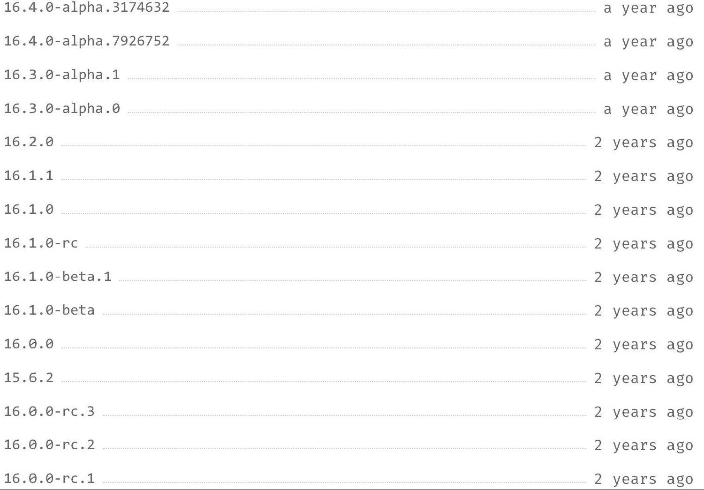

# 语义化版本（Semantic Versioning）规范格式

## 开源项目版本信息案例

- 软件的版本通常由三位组成，形如：X.Y.Z
- 版本是严格递增的，此处是：16.2.0 -> 16.3.0 -> 16.3.1
- 在发布重要版本时，可以发布 alpha, rc 等先行版本
- alpha 和 rc 等修饰版本的关键字后面可以带上次数和 meta 信息

React 版本信息：

## 遵守 semver 规范的优势

优势：

- 避免出现循环依赖
- 依赖冲突减少

## 语义化版本规范格式

- 主版本号：当做了不兼容的 API 修改；
- 次版本号：当做了向下兼容的功能性新增；
- 修订号：当做了向下兼容的问题修正。

## 先行版本号

先行版本号可以作为发布正式版之前的版本，格式是在修订版本号后面加上一个连接号（-），再加上一连串以点（.）分割的标识符，标识符可以由英文、数字和连接号（`[0-9A-Za-z-]`）组成。

- alpha：是内部测试版，一般不向外部发布，会有很多 Bug。一般只有测试人员使用。
- beta：也是测试版，这个阶段的版本会一直加入新的功能。在 Alpha 版之后推出
- rc：Release Candidate) 系统平台上就是发行候选版本。RC 版不会再加入新的功能了，主要着重于除错。
