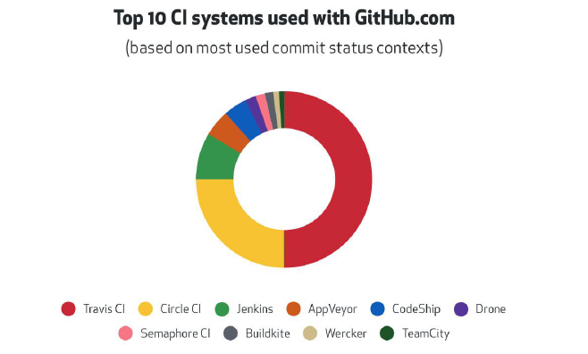

# 持续集成和 Travis CI

## 持续集成的作用

优点：
- 快速发现错误
- 防止分支大幅偏离主干

核心措施是，代码集成到主干之前，必须通过自动化测试。只要有一个测试用例失败，就不能集成。

## Github 最流行的 CI



## 接入 Travis CI

1. https://travis-ci.org/ 使用 GitHub 账号登录
2. 在 https://travis-ci.org/account/repositories 为项目开启
3. 项目根目录下新增 .travis.yml

## travis.yml 文件内容

- install 安装项目依赖
- script 运行测试用例

.travis.yml

```yml
language: node_js

sudo: false

cache:
  apt: true
  directories:
    - node_modules

node_js: stable

install:
  - npm install -D
  - cd ./test/smoke/template
  - npm install -D
  - cd ../../../

scripts:
  - npm test
```
