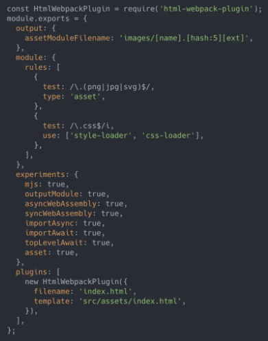

# webpack 5

## 删除 Node.js Polyfills

早期，webpack 的目标是允许在浏览器中运行大多数 node.js 模块，但是模块格局发生了变化，许多模块用途现在主要是为前端目的而编写的。webpack <= 4 附带了许多 node.js 核心模块的 polyfill，一旦模块使用任何核心模块（即 crypto 模块），这些模块就会自动应用。

尽管这使使用为 node.js 编写的模块变得容易，但它会将这些巨大的 polyfill 添加到包中。在许多情况下，这些 polyfill 是不必要的。

webpack 5 会自动停止填充这些核心模块，并专注于与前端兼容的模块。

迁移：

- 尽可能尝试使用与前端兼容的模块。
- 可以为 node.js 核心模块手动添加一个 polyfill。错误消息将提示如何实现该目标。

```txt
webpack 5 开始不再自动填充这些 polyfills，如果你在webpack5中使用到了polyfill：

你的应用将会报错，如果你确实是要是要这些模块，控制台中也给你提供了解决的方案，按照控制台的提示去安装对应的包和添加对应的配置就可以了。
```

## Output

webpack 4 默认只能输出 ES5 代码

webpack 5 开始新增一个属性 output.ecmaVersion, 可以生成 ES5 和 ES6 / ES2015 代码.

如：`output.ecmaVersion: 2015`

## outputModule 是啥？

- outputModule： true
- output.libraryTarget：module

那么设置 outputModule 为 true 以后和不设置的区别在哪呢？如名字所示丢掉了闭包把自己变成了 module

## SplitChunk：minSize&maxSize 更好的方式表达

在 V4 版本中默认情况下，仅能处理 javascript 的大小

```js
// webpack4
minSize: 30000;
```

V5 版本的变更，已经支持了 style。

```js
// webpack5
minSize: {
  javascript: 30000,
  style: 50000,
}
```

```js
module.exports = {
  optimization: {
    splitChunks: {
      cacheGroups: {
        commons: {
          chunks: 'all',
          name: 'commons',
        },
      },
      //最小的文件大小 超过之后将不予打包
      minSize: {
        javascript: 0,
        style: 0,
      },
      //最大的文件 超过之后继续拆分
      maxSize: {
        javascript: 1, //故意写小的效果更明显
        style: 3000,
      },
    },
  },
};
```

## 持久化缓存 Cache

Webpack 的编译速度相信是很多同学比较头痛的问题，当然我们也有很多优化的办法。比如 HappyPack、Cache-loader、排除 node_modules、多线程压缩甚至可以采用分布式编译等等。其实 Webpack 编译慢还跟他的 loder 机制有一定关系。

```js
// 配置缓存
cache: {
  // 磁盘存储
  type: "filesystem", //将缓存类型设置为文件系统，默认为memory
  buildDependencies: {
    // 当配置修改时，缓存失效
    config: [__filename]
  }
}
```

缓存将存储到 `node_modules/.cache/webpack`

## Top Level Await

topLevelAwait 支持顶级 Await Stage 3 提案

webpack.config.js

```js
module.exports = {
  experiments: {
    // 导入异步模块 import webpack会提示你打开这个属性
    importAsync: true,
    // 全靠它了topLevelAwait
    topLevelAwait: true,
  },
};
```

test.js

```js
const dynamic = await import('./data');
export const output = dynamic.default + 'test';
```

进一步：

test.js

```js
const connectToDB = async () => {
  const data = await new Promise((r) => {
    r('test');
  });
  return data;
};
const result = await connectToDB();
let output = `${result}🍊`;
export { output };

//执行如下代码
import await { output } from './demo02';
console.log(output);
```

webpack.config.js

```js
module.exports = {
  experiments: {
    // 三兄弟聚齐了
    importAsync: true,
    topLevelAwait: true,
    // 支持import await
    importAwait: true,
  },
};
```

## 再见了 file-loader、url-loader、raw-loader

对资源模块提供了内置支持，webpack5 允许应用使用资源文件（图片，字体等)而不需要配置额外的 loader。

- asset/resource 发送一个单独的文件并导出 URL。之前通过使用 file-loader 实现。
- asset/inline 导出一个资源的 data URI。之前通过使用 url-loader 实现。
- asset/source 导出资源的源代码。之前通过使用 raw-loader 实现。
- asset 在导出一个 data URI 和发送一个单独的文件之间自动选择。之前通过使用 url-loader，并且配置资源体积限制实现。

```js
module.exports = {
  output: {
    assetModuleFilename: 'images/[name].[hash:5][ext]',
  },
  module: {
    rules: [
      {
        test: /\.png$/,
        type: 'asset/resource', //对应file-loader
      },
      {
        test: /\.svg$/,
        type: 'asset/inline', //对应url-loader 大小<limt 转化为base64
      },
      {
        test: /\.txt$/,
        type: 'asset/source', //对应raw-loader
      },
      {
        test: /\.gif$/,
        type: 'asset', //自动选择
        parser: {
          dataUrlCondition: {
            maxSize: 4 * 1024,
          },
        },
      },
    ],
  },
  experiments: {
    asset: true,
  },
};
```

## 内置 WebAssembly 编译能力

```c
//一段非常简单的C代码
int add (int x, int y) {
  return x + y;
}
//然后我们把它编译成program.wasm
```

```js
//webpack4只能这样去加载program.wasm
//如果同步去加载 会报错不能把wasm当成主chunk
import('./demo04/program.wasm').then((p) => {
  console.log(p.add(4, 6));
});
//webpack5震撼来袭
//有人说WebAssembly这玩意也没人用啊？那啥 🛏 晚安
import {add} from './demo03/program';
console.log(add(4, 6));
```

继续修改 webpack.config.js

```js
module.exports = {
  // ...,
  experiments: {
    asyncWebAssembly: true,
  },
  module: {
    rules: [
      {
        test: /\.wasm$/,
        type: 'webassembly/async',
      },
    ],
  },
};
```

## mjs 编译

```js
const data = 'test data';
export default data;

//运行一下代码
import data from './demo';
console.log(data);
```

修改 webpack.config.js

```js
module.exports = {
  experiments: {
    mjs: true,
  },
};
```

## 原生 Web Worker 支持

以前想要使用 web worker，那么需要 worker-loader 或 worker-plugin 来协助：

```js
//配置worker-loader
module.exports = {
    ...,
	module: {
		rules: [
			{
				test: /\.worker\.js$/,
				use: { loader: "worker-loader" },
			},
		],
	},
}
```

```js
import Worker from './wasted.time.worker.js';
//在主线程中使用web worker
const worker = new Worker();
worker.onmessage = (e) => {
  console.log(e.data.value);
};
```

webpack5 提供了原生的 web worker 支持，可以不依赖 loader 或 plugin，直接使用 web worker 的能力：

```js
const worker = new Worker(new URL('./wasted.time.worker.js', import.meta.url), {
  name: 'wastedTime',
  /* webpackEntryOptions: { filename: "workers/[name].js" } */
});
worker.onmessage = (e) => {
  console.log(e.data.value);
};
```

## 更友好的 Long Term Cache 支持性

### 确定的 moduleId 和 chunkId

webpack5 之前的版本的 moduleId 和 chunkId 默认是自增的，没有从 entry 打包的 chunk 都会以 1、2、3、4...的递增形式的文件命名方式进行命名。如果删掉某一个，则后面的 chunkId 都会发生变化；

webpack5 为了确保 moduleId，chunkId 的确定性，添加了用于长期缓存的新算法， 增加了如下配置（此配置在生产模式下是默认开启）：

```js
optimization.moduleIds = 'deterministic';
optimization.chunkIds = 'deterministic';
```

### webpackChunkName

当在 index.js 内部 import(./async.js").then(...)的时候，如果什么也不加。V4 会默认对这些文件生成一堆 0.js,1.js,2.js… .所以我们需要使用 import(/_ webpackChunkName: "name" _/ "module") 才能化解这份尴尬。V5 可以在开发模式中启用了一个新命名的块 id 算法，该算法提供块(以及文件名)可读的引用。 模块 ID 由其相对于上下文的路径确定。 块 ID 是由块的内容决定的，所以不再需要使用 Magic Comments。

你可以不用使用 `import(/* webpackChunkName: "name" */ "module")` 在开发环境来为 chunk 命名，生产环境还是有必要的

webpack 内部有 chunk 命名规则，不再是以 id(0, 1, 2)命名了

### 真实的 content hash

当使用 [contenthash] 时，Webpack 5 将使用真正的文件内容哈希值。也就是说当进行了修改注释或者修改变量名等代码逻辑是没有影响的操作是，文件内容的变更不会导致 contenthash 变化。

## 优化资源打包策略

prepack 能够在编译的时候，将一些无副作用的函数的结果提前计算出来。

webpack5 内置了这种能力，能够让你的应用在生产环境下得到极致的优化。

```js
//入口文件
(function () {
  function hello() {
    return 'hello';
  }
  function world() {
    return 'world';
  }
  global.s = hello() + ' ' + world();
})();
```

最终：

```js
global.s = “hello world”;
```

## 更强大的 Tree Shaking

tree-shaking 能够帮助我们在打包的时候剔除无用的代码。webpack5 开启 tree-shaking 的条件与之前一样，需要使用 ES6 模块化，并开启 production 环境。

1. webpack 现在能够处理对嵌套模块的 tree shaking

```js
// inner.js
export const a = 1;
export const b = 2;

// module.js
import * as inner from './inner';
export {inner};

// user.js
import * as module from './module';
console.log(module.inner.a);
```

在生产环境中, inner 模块暴露的 `b` 会被删除

2. webpack 现在能够多个模块之前的关系

```js
import {something} from './something';

function usingSomething() {
  return something;
}

export function test() {
  return usingSomething();
}
```

当设置了`"sideEffects": false`时，一旦发现`test`方法没有使用，不但删除`test`，还会删除`"./something"`

3. webpack 现在能处理对 Commonjs 的 tree shaking

webpack5 分析模块的 export 和 import 的依赖关系，去掉未被使用的模块，同时结合 prepack 能力，打包出来的结果十分简洁

## 监视输出文件

之前 webpack 总是在第一次构建时输出全部文件，但是监视重新构建时会只更新修改的文件。

此次更新在第一次构建时会找到输出文件看是否有变化，从而决定要不要输出全部文件。

## 默认值

- `entry: "./src/index.js`
- `output.path: path.resolve(__dirname, "dist")`
- `output.filename: "[name].js"`



## 更多内容

- change logs：https://webpack.docschina.org/blog/2020-10-10-webpack-5-release/
- Module Federation：https://webpack.docschina.org/concepts/module-federation
- 迁移指南：https://webpack.docschina.org/migrate/5/
