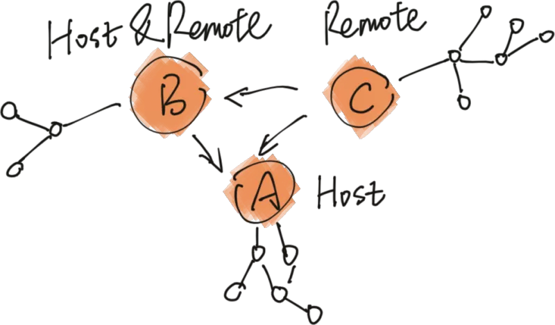
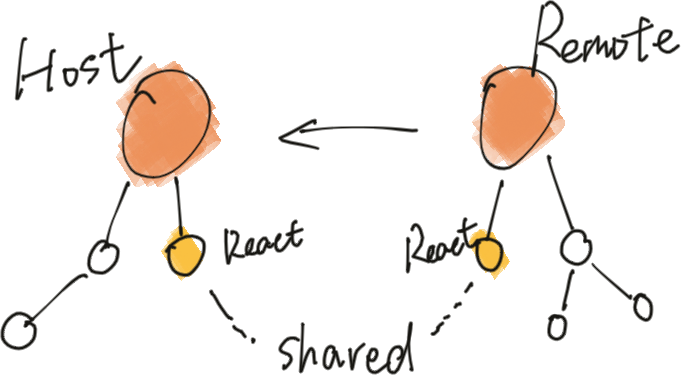
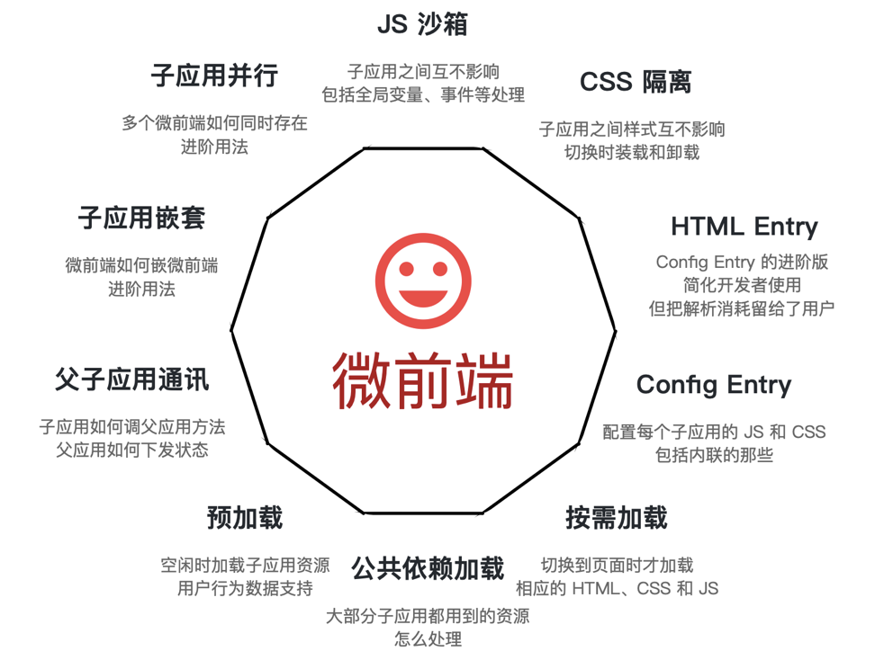
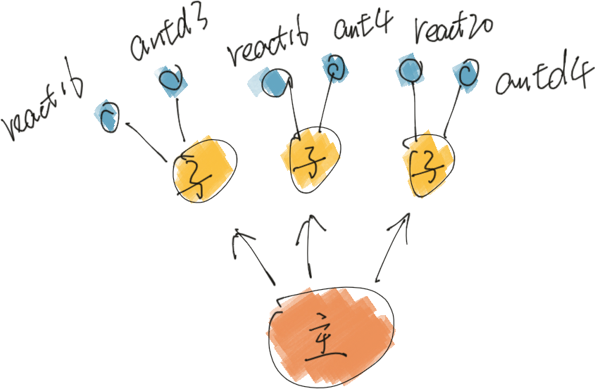
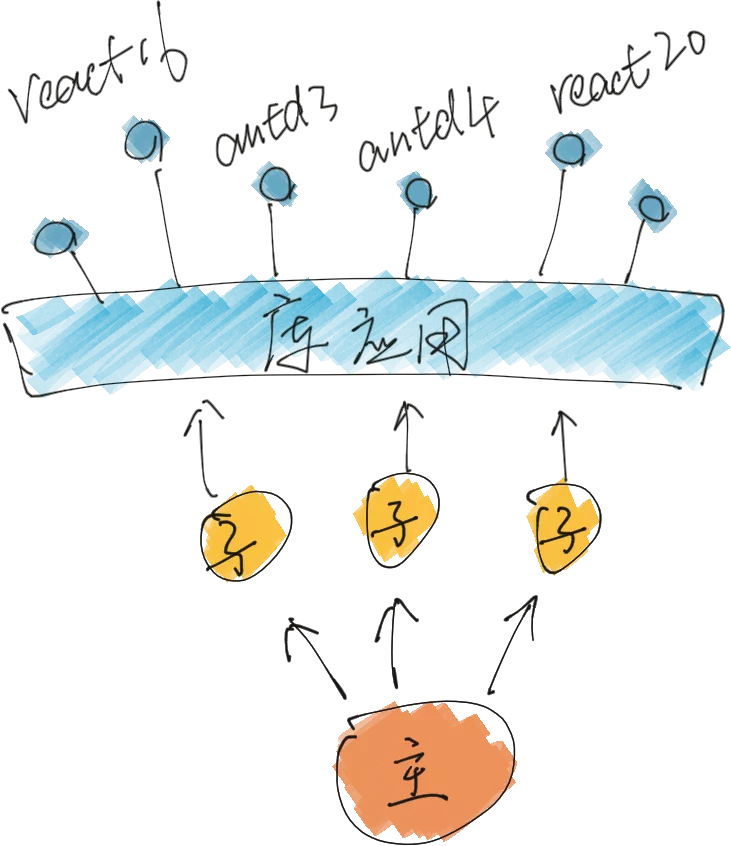
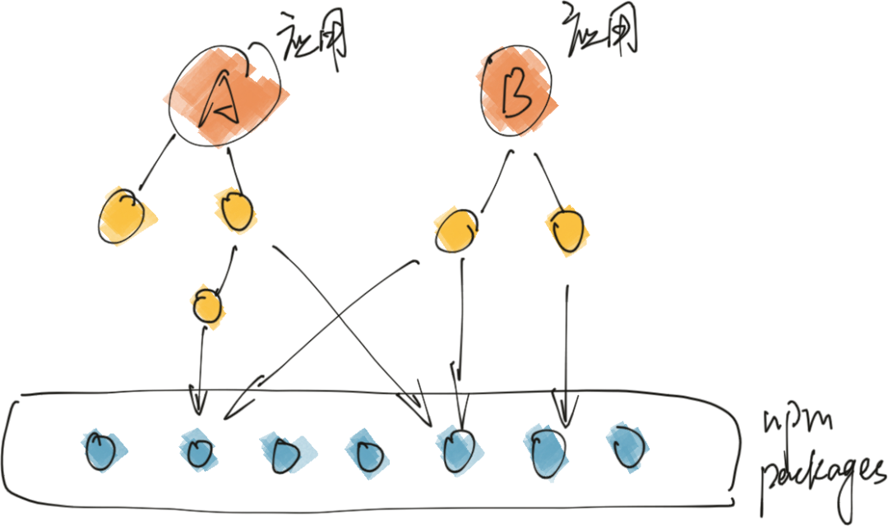
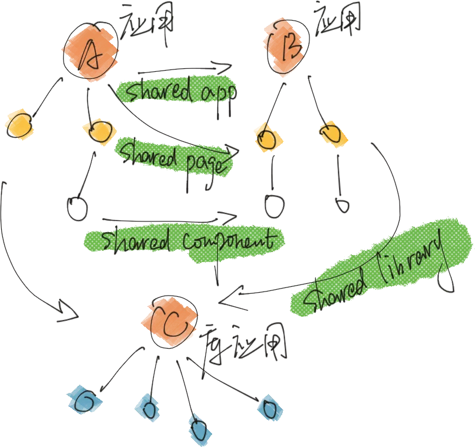
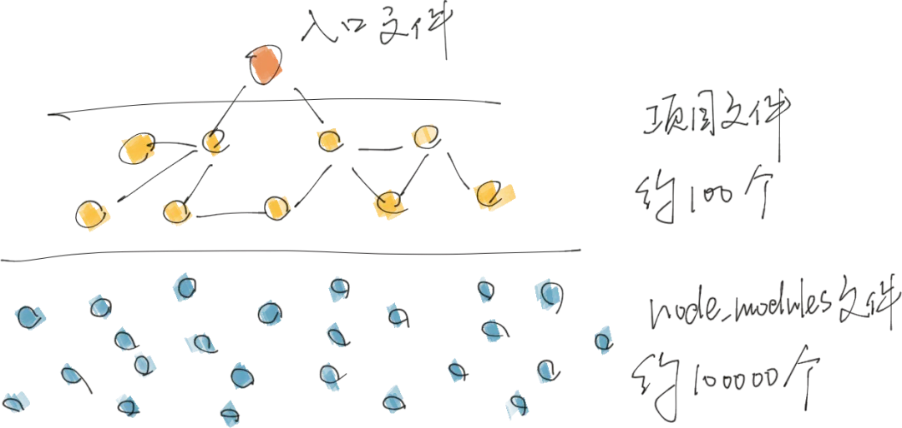
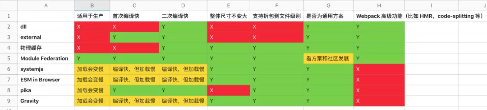

# Module Federation

Module Federation 简称： MF

## Module Federation 是什么？

Module Federation 使 JavaScript 应用得以在客户端或服务器上动态运行另一个 bundle 的代码。

这其中的关键点是：

- **动态**，包含两个含义

  - 按需，可以把一个包拆开来加载其中一部分；
  - 运行时，跑在浏览器而非 node 编译时；

- 另一个 bundle 的代码，之前应用之间做共享是在文件级或 npm 包级 export 成员，现在可以在应用级 export 成员属性。



一些相关的概念：

- Remote，被 Host 消费的 Webpack 构建；
- Host，消费其他 Remote 的 Webpack 构建；

一个应用可以是 Host，也可以是 Remote，也可以同时是 Host 和 Remote。

## 原理是什么？

通过回答 Module Federation 如何运转？Host 如何消费 Remote？以及 Remote 如何优先使用 Host shared 的依赖？这三个问题，我们分析一下 Module Federation 的原理。

### ModuleFederationPlugin

整体是通过 [ModuleFederationPlugin](https://github.com/webpack/webpack/blob/dev-1/lib/container/ModuleFederationPlugin.js?spm=a2c6h.12873639.0.0.779c564dZsdOGB&file=ModuleFederationPlugin.js) 这个插件串联起来的。

配置示例：

```js
new ModuleFederationPlugin({
 name: "app-1",
 library: { type: "var", name: "app_1" },
 filename: "remoteEntry.js",
 remotes: {
    app_02: 'app_02',
    app_03: 'app_03',
},
  exposes: {
    antd: './src/antd',
    button: './src/button',
},
  shared: ['react', 'react-dom'],
}),
```

配置属性：

- name，必须，唯一 ID，作为输出的模块名，使用的时通过 ${name}/${expose} 的方式使用；
- library，必须，其中这里的 name 为作为 umd 的 name；
- remotes，可选，表示作为 Host 时，去消费哪些 Remote；
- exposes，可选，表示作为 Remote 时，export 哪些属性被消费；
- shared，可选，优先用 Host 的依赖，如果 Host 没有，再用自己的；



- main.js，应用主文件；
- remoteEntry.js，作为 remote 时被引的文件；
- 一堆异步加载的文件，main.js 或 remoteEntry.js 里可能加载的文件；

所以比如下面如图示例的应用集群：


加载方式应该这样：

```txt
<script src="C/remoteEntry.js"></script>
<script src="B/remoteEntry.js"></script>
<script src="A/main.js"></script
```

C/remoteEntry.js 和 B/remoteEntry 的顺序没有要求，只要在 A/main.js 之前就好了。

### A 如何消费 B ？

B 源码：

```js
// src/react.js
export * from 'react';

// webpack.config.js
...
exposes: {
  react: './src/react',
},
```

A 源码：

```js
// 异步加载 B 的 react 模块
const React = await import('B/react');
```

B 构建产物：

```js
// windows 变量
let B;

const moduleMap = {
    'react': () => {
      return Promise.all([e('a'), e('b'), e('c')]),
   },
};

B = {
   get(moduleId) {
    return moduleMap(moduleId);
   }
}
```

A 构建产物：

```js
const modules = {
  B: () => {
    return B;
  },
};

// 异步获取模块 export 内容
function e(moduleId) {
  // 1. 取 shared 的模块

  // 2. 取 remote 的模块
  const idToExternalAndNameMapping = {
    'B/react': ['B', 'react'],
  };
  // 从 module B 里取 react
  const data = idToExternalAndNameMapping[moduleId];
  __webpack_require__(data[0]).get(data[1]);

  // 3. 取当前项目的异步模块
}

// 初始化
e('B/react');
```

这其中的原理：

- 多个 Bundler 之间通过全局变量串联；
- Remote 会 export get 方法获取他的子模块，子模块的获取通过 Promise 以按需的方式引入；

### A 如何让 B 用 A shared 的库？

B 构建产物：

```js
let B;
__webpack_require__.Overrides = {};

function e(moduleId) {
  // 1. 取 shared 的模块
  // 当前项目的 shared 模块列表
  const fallbackMapping = {};
  // 先从 Overrides 里取，再从当前项目里取
  push_require_try(
    __webpack_require__.Overrides[moduleId] || fallbackMapping[moduleId]
  );

  // 2. 取 remote 的模块
  // 3. 取当前项目的异步模块
}

B = {
  override(override) {
    Object.assign(__webpack_require__.Overrides, override);
  },
};
```

A 构建产物：

```js
B.override(
  Object.assign(
    {
      react: () => {
        // A 的 react 内容
      },
    },
    __webpack_require__.Overrides
  )
);
```

原理分析：

- Remote（B）export override 方法，Host（A) 会调用其关联 Remote 的 override 方法，把 shared 的依赖写进去；
- Remote（B) 获取模块时会优先从 override 里取，没有再从当前 Bundle 的模块索引里取；

这样，B 里面在 require react 时，就会用 A 的 react 模块。

## 应用场景有哪些？





方法一：让每个子应用都分开打包，主应用不管，这样不会有问题，但问题就是尺寸大，而且大了不是一点点。

方法二：主应用包含 antd 和 react，子应用如果版本一致不打包 react 和 antd，版本不一致就自己打一份，但有几个问题：

- antd 和 react 是通过 umd 的方式同步载入的，主应用初始化会比较慢；
- 主应用升级了 antd 的时候，所有子应用可能需要一起升级，这个成本就很大了。

方法三：利用 Module Federation 的 shared 能力，子应用的依赖如果和主应用匹配，那么，能解决方法二里的第一个问题，但第二个问题依旧解不了。

方法四：利用 Module Federation 的 remotes 能力，再提一个应用专门提供库被消费，看起来前面的问题都能解。



### 应用集群

微前端是应用集群的解法之一，但不是唯一方案。

现状是，通过 npm 共享组件。



基于 Module Federation，除通过 npm 共享依赖，还可以有运行时的依赖、组件、页面甚至应用的直接共享。



这样一来，灵活性就非常大了，可以在应用的各个层面做共享。A 应用引用 B 整个应用，也可以应用 B 的的页面和组件，还可以提一个库应用，做 npm 依赖的运行时共享。

### 编译提速，应用秒开

大部分场景不是微前端或应用集群，Module Federation 还可以帮助我们干什么？

现在项目组织和文件依赖通常是这样：



现状是：

- 全部打成一个包；
- 打包时间较慢，据统计，内部云编译平台的平均编译时间在 100s 以上；

期望的是：

- node_modules 下的提前打包好，通过 runtime 的方式引；
- 本地调试和编译时只打项目文件；
- 快，根据项目复杂度可提升到 1s - 7s 之内；

为什么不是其他的编译速度优化方案？



举一个对比的例子，比如 external，我们之前还有做过自动的 external 方案，虽然他也可能显著提速，但有以下问题：

- 以空间换时间，依赖包全量引用导致 npm，用在生产上会牺牲部分产品体验，需权衡；
- 不是所有的依赖都有 umd 包，覆盖率不够；
- npm 可能有依赖，比如 antd 依赖 react 和 moment，那么 react 和 moment 也得 external 并且在 html 里引用他们；
- 需要手动修改 html 里的引用，维护上有成本提升。

## 优势

1. 单体拆分的新解决方案，降维打击了 systemjs， 而且可以在运行时拉远程模块和二、三方包，所以，systemjs 应该可以退场了。

2. 解决了从前用 NPM 公共包方式共享的不便利。不过换来的是本地启动的巨量的 lib server 。

3. 相比过去， externals 无法多版本共存，dll 无法共享模块，MF 完美解决。

## 一些局限

1. 虽然能做到依赖共享，但是被共享的 lib 不能做 tree-shaken，也就是说如果共享了一个 lodash，那么整个 lodash 库都会被打包到 shared-chunk 中。虽然依赖共享能解决传统微前端的 externals 的版本一致性问题，但是好像也没什么其他的革命性的东西了。

2. webpack 为了支持加载 remote 模块对 runtime 做了大量改造，在运行时要做的事情也因此陡然增加，可能会对我们页面的运行时性能造成负面影响。

