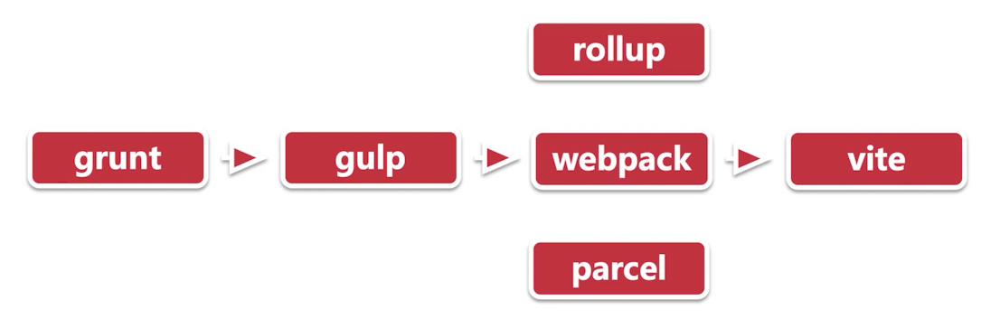

# 走进前端构建

## 为什么学习 webpack

大势所趋：

- 应用场景越来越多
- 浏览器兼容性
- 行业必备技能

难点：

- 各种概念的理解
- 越来越繁杂的配置
- 多种多样的优化手段

## 了解前端构建的重要性

兼容性：

https://caniuse.com

构建发展史：

## webpack 的出现带来的变局

大而全的 webpack：

- 智能解析
- 开箱即用
- 代码分割
- 插件系统
- 易于调试
- 生态丰富

## 前端构建初体验- webpack 及相关工具安装

NVM 安装：
- curl：curl -o- https://raw.githubusercontent.com/nvm-sh/nvm/v0.39.1/install.sh | bash
- wget：wget -qO- https://raw.githubusercontent.com/nvm-sh/nvm/v0.39.1/install.sh | bash

Node & npm 安装：
- nvm install v16.15.1 && nvm use v16.15.1
- node -v
- npm -v

webpack 安装
- npm i webpack webpack-cli -D
