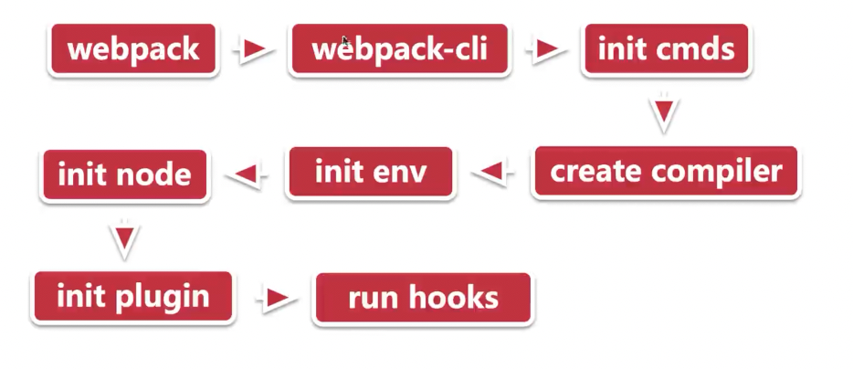

# webpack 打包原理

## webpack 打包文件分析

文件内容：
```js
(self["webpackChunkwebpack_demo1"] = self["webpackChunkwebpack_demo1"] || []).push([
  ["index"],
  {
    "./src/index.js": (module, __unused_webpack_exports, __webpack_require__) => {},
    "./assets/a.txt": (module, __unused_webpack_exports, __webpack_require__) => {}
  },
  // webpackRuntimeModules
  () => {
    var __webpack_exec__ = (moduleId) => (__webpack_require__(_(__webpack_require__.s = moduleId)))
    var __webpack_exports__ = (__webpack_exec__("./src/index.js"));
  }
]);
```

webpack_require：

- webpack_module_cache => 模块缓存
- webpack_require.m => 要加载的模块
- webpack_require.r => 标记为es模块
- webpack_require.d => 提供getter给导出的方法、变量

异步加载：

- webpack_require.e => 异步加载多个模块（promise.all）
- webpack_require.f => 为e函数提供中间件能力
- webpack_require.u => 拼接异步模块名称
- webpack_require.l => 使用jsonp方式加载异步模块
- webpack_require.p => 计算异步模块的实际URL


## webpack 运行分析之启动流程

- webpack
- webpack-cli

```js
/**
 * @type {CliOption}
 */
const cli = {
  name: "webpack-cli",
  package: "webpack-cli",
  binName: "webpack-cli",
  installed: isInstalled("webpack-cli"),
  url: "https://github.com/webpack/webpack-cli"
};

if (!cli.installed) {
  // Code to handle the case when webpack-cli is not installed
} else {
  // Code to handle the case when webpack-cli is installed
}
```

```js
"use strict";

const importLocal = require("import-local");
const runCLI = require("./lib/bootstrap");

if (!process.env.WEBPACK_CLI_SKIP_IMPORT_LOCAL) {
  // Prefer the local installation of `webpack-cli`
  if (importLocal(__filename)) {
    return;
  }
}

process.title = "webpack";

runCLI(process.argv);
```

```js
class WebpackCLI {
  constructor() {
    this.colors = this.createColors();
    this.logger = this.getLogger();

    // Initialize program
    this.program = program;
    this.program.name("webpack");
    this.program.configureOutput({
      writeErr: this.logger.error,
      outputError: (str, write) => write(`Error: ${this.capitalize(str)}`)
    });
  }

  isMultipleCompiler(compiler) {
    // ...
  }
}
```




## webpack 运行分析之 tapable

tapable简介：

一个类似 EventEmitter 的库，控制各种钩子的订阅发布，贯穿插件运行。

```js
const {
  SyncHook,
  SyncBailHook,
  SyncWaterfallHook,
  SyncLoopHook,
  AsyncParallelHook,
  AsyncParallelBailHook,
  AsyncSeriesHook,
  AsyncSeriesBailHook,
  AsyncSeriesWaterfallHook,
} = require("tapable");
```

这些钩子类型包括：

- SyncHook: 同步钩子。
- SyncBailHook: 同步中断钩子。
- SyncWaterfallHook: 同步瀑布钩子。
- SyncLoopHook: 同步循环钩子。
- AsyncParallelHook: 异步并行钩子。
- AsyncParallelBailHook: 异步并行中断钩子。
- AsyncSeriesHook: 异步串行钩子。
- AsyncSeriesBailHook: 异步串行中断钩子。
- AsyncSeriesWaterfallHook: 异步串行瀑布钩子。

这些钩子类型用于在插件系统中控制不同类型的事件处理逻辑。

回调类型：
- base，基础类型，单纯的事件回调
- Bail，保险类型，当回调返回不是 undefined 时，停止调用
- Waterfall 瀑布类型，当返回不为 undefined 时，将下一个回调的第一个参数替换为返回值
- Loop 循环类型，如果当前执行的事件回调的返回值不为 undefined，递归调用注册事件直到没有返回值
- Sync，Sync开头的钩子，只能用 tap 方法注册事件回调，这类事件回调会同步执行。
- AsyncParallel，Async开头的钩子，只能用 callAsync 或 promise 方法触发回调，- AsyncParallel 并行执行回调。
- AsyncSeries，串行执行回调。

发布方式
- tap，同步
- tapAsync，异步

触发方式
- call，同步触发
- callAsync，异步触发
- promise，异步触发，返回 promise 对象


## webpack 运行分析之运行时-compiler

compiler：每次webpack启动的唯一

流程图如下：


1. create compiler: 创建编译器实例。
2. run: 运行编译器。
3. create compilation: 创建编译实例。
4. make: 执行模块构建。
5. afterCompiler: 编译器执行后的回调。
6. emit: 触发 emit 钩子，准备输出资源。
7. emitAssets: 输出资源。

- compiler.options: webpack启动时的所有配置
- compiler.inputFileSystem、compiler.outputFileSystem: 文件操作，类似nodejs中的fs
- compiler.hooks: 注册各种hook，应用在编译周期中

compilation：一次构建过程：


- compiler.modules: 所有模块
- compiler.chunks: 多个module组成
- compiler.assets: 打包生成的文件
- compiler.hooks: 注册各种hook，作用在编译过程


## loader 的执行过程

**loader类型**：

- pre loader: 预加载器
- normal loader: 普通加载器
- post loader: 后加载器
- inline loader

```js
{
  test: /\.css$/,
  use: 'css-loader',
  enforce: 'pre' | '' | 'post'
}
```

前缀选项:
- !: 禁用所有 normal loader，仅使用 pre loader 和 post loader。
- !!: 禁用所有 loader（pre、normal、post），仅使用 inline loader。
- -!: 禁用所有 pre loader 和 normal loader，仅使用 inline loader 和 post loader。


Inline Loader 的优缺点
- 优点：
    - 灵活性: 可以针对单个模块指定 loader，而不需要修改全局配置。
    - 快速测试: 方便快速测试某个 loader 的效果。
- 缺点：
    - 可维护性差: 如果大量使用 inline loader，代码会变得难以维护。
    - 不推荐大规模使用: Webpack 官方建议尽量在配置文件中定义 loader，而不是在代码中使用 inline loader。


**loader的结构** – loader-runner

loader：
- pitch: 优先调用，熔断作用，非必要
- loader fn: 处理函数

```js
function loader() {
  // ...
}
loader.pitch = function () {
  // ...
};
module.exports = loader;
```

同步 loader:
```js
function loader(source) {
  // todo
  return source;
}
```

异步 loader:
```js
return new Promise((resolve) => {
  resolve('111');
});

const callback = this.async();
// todo
callback('11111');
```

- 使用 Promise 或 callback 来处理异步操作。
- resolve('111');: 在 Promise 中返回处理结果。
- callback('11111');: 使用 this.async() 创建的回调函数来处理异步结果。

总结：
- pitch: 这是一个可选的函数，会在所有其他 loader 执行之前被调用。它可以阻止后续 loader 的执行。
- loader fn: 这是实际处理模块内容的函数。

**loader 执行顺序：**


## 实操-实现一个 loader

- [loader-runner](https://github.com/webpack/loader-runner)
- [loader-utils](https://github.com/webpack/loader-utils)

### 本地调试

```js
  resolveLoader: {
    alias: {
      'loader1': path.resolve(__dirname, './loader/loader1')
    }
  },
   module: {
    // 自定义loader
    rules: [
      {
        test: /\.css$/,
        use: [{
          loader: 'loader1',
          options: {
            name: 'loader1'
          }
        }, "style-loader", "css-loader"] // MiniCssExtractPlugin是将css抽出文件的，会和style-loader冲突
        // use: [MiniCssExtractPlugin.loader, "css-loader"]
      }
    ]
  },
```

- remainingRequest： 还没有执行的loader
- previousRequest：已经执行的loader

```js
function loader(source) {
  return source;
}

loader.pitch = function (remainingRequest, previousRequest, data) {};

module.exports = loader;
```

### 实现style-loader的完整代码

```js
const { stringifyRequest } = require('loader-utils');
function loader(source) {
  console.log('source', source);
  return source;
}

loader.pitch = function (remainingRequest, previousRequest, data) {
  const modulePath = stringifyRequest(this, `!!${remainingRequest}`);
  const options = this.getOptions();
  return `
    var element = document.createElement('style');
    const attributes = ${JSON.stringify(options.attributes || {})};
    for (const key in attributes) {
        element.setAttribute(key, attributes[key]);
    }
    var content = require(${modulePath});
    content = content.__esModule ? content.default : content;
    element.innerHTML = content;
    const parentEle = document.querySelector('head');
    parentEle.appendChild(element);
    `;
};

module.exports = loader;
```


## plugin 的执行过程

调用流程：
- 初始化插件实例
- 调用 apply，传入 compiler
- 通过 compiler 自定义构建

可使用的钩子 - compiler
- entryOption: 开始读取配置文件的 entry，遍历入口文件
- run: 准备开始构建
- compile: 开始一次构建，准备创建 compilation
- make: 启动构建
- emit: 打包完成，准备输出前执行
- done: 输出完成，构建结束

可使用的钩子 - compilation
- buildModule: 模块构建前触发，可以修改模块参数
- seal: 构建完成时触发
- optimize: 优化开始时触发

## 如何实现一个 plugin

目标
- 实现一个CSP策略的插件
- 可以正常运行

实现内容安全策略（Content Security Policy, CSP）


### 配置代码

```js
  const { CSPPlugin } = require("./plugin/test-plugin");
  plugins: [
    new CSPPlugin({
      "default-src": ["self", "www.a.com"]
    })
  ],
```

### 全部代码

```js
const HtmlWebpackPlugin = require('html-webpack-plugin');
function CSPPlugin(options) {
  this.options = options;
}
CSPPlugin.prototype.apply = function (compiler) {
  const setOptions = this.options;
  compiler.hooks.thisCompilation.tap('options', compilation => {
    HtmlWebpackPlugin.getHooks(compilation).beforeEmit.tapAsync('CSPPlugin', (data, cb) => {
      console.log(data.html);
      let cspContent = '';
      for (const key in setOptions) {
        cspContent += `${key} '${setOptions[key].join("' '")}'`;
      }
      let insertHtml = `<meta 
      http-equiv="Content=Security-Policy" content="${cspContent}" />"
      `;
      const index = data.html.indexOf('<head>');
      data.html = data.html.substring(0, index + 6) + insertHtml + data.html.substring(index + 6);
      console.log(data.html);
      cb(null, data);
    });
  });
};

module.exports = {
  CSPPlugin
};
```


### 其他实现

```js
class WebpackCSPPlugin {
  constructor(options = {}) {
    this.options = options;
  }

  apply(compiler) {
    // 在 emit 阶段插入 CSP 策略
    compiler.hooks.emit.tapAsync('WebpackCSPPlugin', (compilation, callback) => {
      const cspHeader = this.generateCSPHeader();
      
      // 将 CSP 注入到 HTML 文件中
      for (const filename in compilation.assets) {
        if (filename.endsWith('.html')) {
          let content = compilation.assets[filename].source();
          content = this.injectCSP(content, cspHeader);
          compilation.assets[filename] = {
            source: () => content,
            size: () => content.length,
          };
        }
      }
      callback();
    });
  }

  generateCSPHeader() {
    // 根据配置生成 CSP 策略
    const { defaultSrc = "'self'", scriptSrc = [], styleSrc = [] } = this.options;

    const policy = [
      `default-src ${defaultSrc}`,
      `script-src 'self' ${scriptSrc.join(' ')}`,
      `style-src 'self' ${styleSrc.join(' ')}`,
    ].join('; ');

    return `<meta http-equiv="Content-Security-Policy" content="${policy}">`;
  }

  injectCSP(content, cspHeader) {
    // 将 CSP 注入到 HTML 的 head 中
    const headTag = '<head>';
    return content.replace(headTag, `${headTag}\n${cspHeader}`);
  }
}

module.exports = WebpackCSPPlugin;
```

```js
const WebpackCSPPlugin = require('./WebpackCSPPlugin');

module.exports = {
  // 其他配置...
  plugins: [
    new WebpackCSPPlugin({
      defaultSrc: "'self'",
      scriptSrc: ["'unsafe-inline'", "https://trusted.cdn.com"],
      styleSrc: ["'self'", "https://fonts.googleapis.com"],
    }),
  ],
};
```

插件功能解析:
- generateCSPHeader: 根据用户提供的选项生成 CSP 策略。
    - defaultSrc: 默认策略，限制所有资源的加载来源。
    - scriptSrc: 限制 JavaScript 的加载来源。
    - styleSrc: 限制 CSS 的加载来源。
- injectCSP: 将生成的 CSP 策略注入到 HTML 文件的 <head> 标签中。
- emit 钩子: 在 Webpack 的 emit 阶段操作输出资源，动态修改 HTML 文件内容。


可参考：https://github.com/devsnek/webpack-csp-plugin/blob/master/src/index.js


