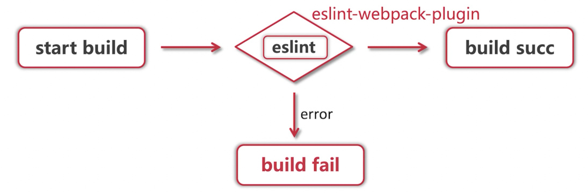
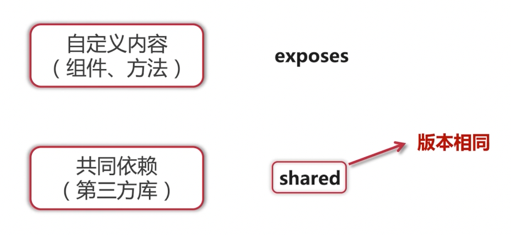

# webpack 高阶用法


## 使用autoprefixer兼容各个浏览器样式属性

为什么要兼容
- 浏览器厂商多
- 浏览器内核不同
- 对同样的CSS解析效果不同


### 怎么兼容

使用前缀做兼容：
- -moz 代表 Firefox 浏览器私有属性
- -ms 代表 IE 浏览器私有属性
- -webkit 代表 Chrome、Safari 私有属性
- -o 代表 Opera 私有属性

postcss-loader + autoprefixer
- postcss-loader：用于处理 CSS 文件，并通过 PostCSS 插件进行转换。
- autoprefixer：自动添加浏览器前缀，确保 CSS 样式在不同浏览器中都能正常工作。

```js
{
  loader: 'postcss-loader',
  options: {
    postcssOptions: {
      plugins: [
        [
          'autoprefixer',
          {
            // 选项
          },
        ],
      ],
    },
  },
}
```

```js
module.exports = {
  module: {
    rules: [
      {
        test: /\.css$/,
        use: [
          'style-loader',
          'css-loader',
          {
            loader: 'postcss-loader',
            options: {
              postcssOptions: {
                plugins: [
                  [
                    'autoprefixer',
                    {
                      // 你可以在这里添加 autoprefixer 的具体选项
                      overrideBrowserslist: '> 1%, last 2 versions, not ie <= 8',
                    },
                  ],
                ],
              },
            },
          },
        ],
      },
    ],
  },
};
```

```js
options: {
  postcssOptions: {
    plugins: [
      [
        'autoprefixer',
        {
          browsers: [
            "last 10 Chrome versions",
            "last 5 Firefox versions",
            "Safari >= 6",
            "ie> 8"
          ]
        }
      ]
    ]
  }
}
```

## 如何正确的做Code Splitting

code splitting的意义：
- 不是所有的内容都需要在首屏加载
- 按需加载可以节省网络资源，提升首屏速度

怎么做code splitting：
- 设置entry多入口
- 设置Entry Dependencies共享依赖
- 使用import动态导入模块
- 设置内置的SplitChunksPlugin相关属性


SplitChunksPlugin配置:
- chunks: 'async' | 'initial' | 'all'
- minSize: 打包出的最小文件大小限制
- minChunks: 最少共享chunks数，默认1

```js
optimization: {
  splitChunks: {
    chunks: 'all',
    minSize: 30000,
    maxSize: 0,
    minChunks: 1,
    maxAsyncRequests: 5,
    maxInitialRequests: 3,
    automaticNameDelimiter: '~',
    name: true,
    cacheGroups: {
      vendors: {
        test: /[\\/]node_modules[\\/]/,
        priority: -10
      },
      default: {
        minChunks: 2,
        priority: -20,
        reuseExistingChunk: true
      }
    }
  }
}
```


## 公共静态资源处理

使用外链 - externals
- 减少打包体积、提升构建效率
- 减少重复cdn资源、用户更新

引用方式
- 直接在html中写
- 利用html-webpack-plugin编写
- 利用webpack externals


## 将资源内联到html中

内联的意义：
- 减少http请求，提升性能
- 复用资源，提升开发效率和工程维护
- 提高用户体验

如何内联
- html片段：raw-loader or asset/source + html-webpack-plugin
    - 使用raw-loader或asset/source来处理HTML文件，并结合html-webpack-plugin来生成最终的HTML文件。
- js：同html
    - 处理JavaScript文件的方式与处理HTML文件相同，可以使用相同的配置。
- css：style-loader
    - 使用style-loader来处理CSS文件，将其内联到HTML中。
- 图片、字体：asset | asset-inline or url-loader
    - 使用asset模块类型处理图片和字体文件。
    - 使用asset-inline模块类型将小文件内联为Base64编码。
    - 使用url-loader处理URL引用的小文件，将其内联为Base64编码。

方式一：webpack5 asset/source

```html
<meta http-equiv="X-UA-Compatible" content="ie=edge">
<%= require('./inline/meta.html') %>
<title><%= titleName %></title>
```

```js
{
  test: /inline\/.*\.html/,
  type: 'asset/source'
}
```

方式二：raw-loader

```js
{
  test: /inline\/.*\.html/,
  use: [
    {
      loader: 'raw-loader',
      options: {
        esModule: false
      }
    }
  ]
}
```

```html
${require('raw-loader!./meta.html')}
```

默认需要加 default，因为默认开启了 esModule: true
```html
${require('raw-loader!./meta.html').default}
```

方式三：

```html
<meta http-equiv="X-UA-Compatible" content="ie=edge">
<%= require('raw-loader!./inline/meta.html').default %>
<title><%= titleName %></title>
```

## 如何实现多页面应用打包

一个仓库里面多个页面：

```
index.html
index.js

index2.html
index2.js
```

以上两个要打包出来，并且是单独打包。

如何打包：
- 入口文件区分：entry
- 多个HTML：html-webpack-plugin

```js
const HtmlWebpackPlugin = require('html-webpack-plugin');

module.exports = {
  entry: {
    app: './src/app.js',
    vendor: './src/vendor.js',
    about: './src/about.js'
  },
  plugins: [
    new HtmlWebpackPlugin({
      template: 'src/index.html',
      filename: 'index.html',
      chunks: ['app', 'vendor'] // 只插入'app'和'vendor'两个代码块
    }),
    new HtmlWebpackPlugin({
      template: 'src/about.html',
      filename: 'about.html',
      chunks: ['about'] // 只插入'about'代码块
    })
  ]
};
```

## tree-shaking的原理和应用

基本原理 - 做什么

DCE (dead-code elimination) 去除不影响执行结果的代码，包括不会执行到的代码和未使用的变量等

```js
function add(a, b) {
  return a + b;
}

function sub(a, b) {
  return a - b;
}

const a = 12;
console.log(sub(5, 1));
```

经过DCE处理后的代码：
```js
function sub(a, b) {
  return a - b;
}

console.log(sub(5, 1));
```

**怎么做**

ES6的模块依赖关系是确定的，和运行时状态无关，可以进行可靠的静态分析，即从字面量上对代码分析。

webpack中实现：DCE依靠的是代码压缩工具 uglify-es/terser（uglify-es 已经不再维护，terser 是其fork版本，webpack从4.26.0版本从 uglify-es 迁移到 terser）。


ES6模块依赖关系：
- ES6模块的依赖关系是确定的，这意味着它们在编译时就可以被完全解析。
- 由于这种确定性，可以进行可靠的静态分析，从而识别出不会被执行的代码。

Webpack中的实现：
- DCE依赖于代码压缩工具 uglify-es 或 terser。
- uglify-es 已经不再维护，terser 是它的分支版本。
- Webpack从4.26.0版本开始，已经从 uglify-es 迁移到 terser。

```js
const TerserPlugin = require('terser-webpack-plugin');

module.exports = {
  mode: 'production',
  optimization: {
    minimize: true,
    minimizer: [new TerserPlugin()]
  }
};
```

**标记是否有副作用（默认true）**

```json
"sideEffects": false
```

```json
"sideEffects": ["./src/util/log.js"],
```

这张图片展示了如何使用Webpack的optimization.usedExports配置来标记导出的模块是否被使用

```js
"use strict";

/* unused harmony export default */
```

/* unused harmony export default */：这是一个注释，表示这个默认导出未被使用。
在实际代码中，这通常意味着某个模块有一个默认导出，但没有其他地方引用它。

```js
module.exports = {
  mode: 'production',
  optimization: {
    usedExports: true,
    // 其他优化配置...
  },
  // 其他配置...
};
```

使用 usedExports 的好处:
- 减少打包体积：通过移除未使用的导出，可以显著减小最终打包文件的体积。
- 提高性能：减少不必要的代码执行，提高应用的加载和运行速度。

使用Webpack的optimization.concatenateModules配置来标记模块的依赖关系，并通过terser删除无用代码。


## 自动清理前一次构建产物

如何清除
- 手动清理
- 前置命令清除 注意操作系统差异
- 利用webpack配置 output配置 / clean-webpack-plugin

```js
const { CleanWebpackPlugin } = require('clean-webpack-plugin');

module.exports = {
  // 其他配置...
  plugins: [
    new CleanWebpackPlugin()
  ]
};
```

```js
const path = require('path');

module.exports = {
  entry: './src/index.js',
  output: {
    filename: 'bundle.js',
    path: path.resolve(__dirname, 'dist'),
    clean: true // 自动清理输出目录
  },
  mode: 'production'
};
```

## 通过 webpack 构建去除代码中的调试日志

删除 console 日志：

```js
new TerserPlugin({
  terserOptions: {
    compress: {
      drop_console: true
    }
  }
})
```


## 构建 SSR 应用

SSR 基本步骤：


实现最简单的SSR：
- babel 解析
- 资源加载
- CSR、SSR共存


## eslint 在 webpack 中如何配置 

基本使用：
- why: 保持代码风格统一，提升代码健壮性
- what: 按照规则做静态代码分析
- how: 使用安装eslint，配置.eslintrc.js extends: eslint-config-airbnb

构建中使用 eslint：




- webpack4: eslint-loader
- webpack5: eslint-webpack-plugin


## 了解 module federation

如何共享代码：


module federation:


module federation - 共享哪些：




module federation – 配置

- name：应用名称
- library：应用名称、导出类型
- filename：文件名
- exposes：暴露的模块名和路径
- remotes：依赖的模块名和路径
- shared：共享依赖


