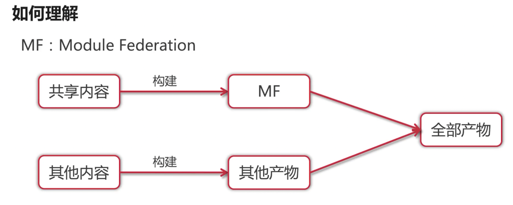

# webpack构建效率和产物优化的必杀技

## 优化准备 – 对 webpack 构建速度做基本分析

优化思路：
- 当前构建速度如何？
- 如果慢，是哪里慢？
- webpack 多个环节如何分析？

1. 使用 speed-measure-webpack-plugin
2. webpack5 自带的分析： 
    - webpack server --profile
    - webpack --profile --json=webpack_output.json

## 构建速度优化 – 利用计算机多核优化构建

利用硬件：
- JS是单线程：串行
- 电脑是多核的：并行-更快


thread-loader

多进程一定快吗？
- 多进程启动时间大约600ms
- 进程通信额外耗时

## 构建速度优化 – 使用缓存提升二次构建速度


缓存配置
- 缓存模式：memory、filesystem
- 禁用缓存：cache: false
- memory：只在开发者模式生效，开发者模式默认生效

缓存配置 - filesystem
- type：缓存类型
- buildDependencies：构建的额外依赖代码，推荐 config:[__filename]
- cacheDirectory：缓存目录，默认node_modules/.cache/webpack
- name：缓存名称，创建隔离独立的缓存
- version：缓存版本，不同版本无法使用

```js
cache: {
  type: 'filesystem',
  buildDependencies: { config: [__filename] },
  cacheDirectory: path.join(__dirname, './webpack-cache'),
  name: 'index',
  version: 'index_2'
},
```

## 构建速度优化 – 另一种缓存方式 – MF




## 构建速度优化 – 使用外链提升构建速度


## 构建速度优化 – 使用更高版本的 webpack 和 node

- V8带来的优化，例如for of、Map、Set等出现
- webpack本身的不断优化，缓存、hash算法优化等


## 构建速度优化 – 使用 esbuild 提升构建速度

什么是esbuild

ESbuild 是用go实现的一个类似webpack构建工具

优势：
1. esbuild是新开一个进程，然后多线程并行，并且内存共享
2. go是纯机器码，比JIT快
3. 不使用 AST，优化了构建流程

劣势
- 没有提供 AST 的操作能力，通过 AST 处理代码的 babel-plugin 不好处理

如何在webpack中使用esbuild

```bash
npm i esbuild-loader -D
```

将 babel-loader 替换为 esbuild-loader：

```js
module.exports = {
  module: {
    rules: [
      {
        test: /\.js$/,
        exclude: /node_modules/,
        use: [
          {
            loader: 'esbuild-loader',
            options: {
              target: 'es2015',
              loader: 'jsx'
            }
          }
        ]
      }
    ]
  }
};
```

替换插件 CssMinimizerPlugin & TerserPlugin → ESBuildMinifyPlugin


```js
new ESBuildMinifyPlugin({
  target: 'es2015', // target: 'es2015'
  legalComments: 'none', // 去除注释
  css: true, // 压缩CSS
})
```

## 构建速度优化 – 借用 swc 提升 webpack 构建速度

什么是swc？

用 Rust 写的高性能 TypeScript / JavaScript 转译器，类似于 babel

快！

劣势：没有类似babel-plugin-import之类的插件，按需引入组件库还需要babel

```bash
npm i swc-loader @swc/core -D
```

```js
module.exports = {
  module: {
    rules: [
      {
        test: /\.jsx?$/,
        exclude: /node_modules/,
        use: [
          {
            loader: 'swc-loader',
            options: {
              jsc: {
                parser: {
                  jsx: true,
                },
              },
            },
          },
        ],
      },
    ],
  },
};
```

## 构建产物优化 – 构建产物体积分析

优化思路：
- 当前构建产物大小分布
- 每个chunk包含哪些内容

webpack-bundle-analyzer
```js
const { BundleAnalyzerPlugin } = require('webpack-bundle-analyzer');

module.exports = {
  plugins: [
    new BundleAnalyzerPlugin({
      analyzerMode: 'static', // 将结果输出为html文件
      openAnalyzer: true, // 打包完成后打开页面
    }),
  ],
};
```

## 构建产物优化 – 通过代码压缩减小构建产物

压缩插件：
- HTML压缩：html-webpack-plugin minify
- CSS：css-minimizer-webpack-plugin
- JS：terser-plugin production默认生效
- JS&CSS：ESBuildMinifyPlugin

## 构建产物优化 – 通过优化图片减少静态资源


```js
{
  test: /\.jpeg$/,
  type: 'asset',
  generator: {
    // filename: 'static/img_[hash:6][ext]'
  },
  parser: {
    dataUrlCondition: {
      maxSize: 100 * 1024 // 100KB
    }
  }
},
```

**图片更小**

webpack配置
- image-minimizer-webpack-plugin
- imagemin

无损压缩
- imagemin-gifsicle
- imagemin-jpegtran
- imagemin-optipng
- imagemin-svgo

有损压缩
- imagemin-gifsicle
- imagemin-mozjpeg
- imagemin-pngquant
- imagemin-svgo

```js
new ImageMinimizerPlugin({
  minimizer: {
    implementation: ImageMinimizerPlugin.imageminGenerate,
    options: {
      plugins: [
        ["gifsicle", { interlaced: true }],
        ["jpegtran", { progressive: true }],
        ["optipng", { optimizationLevel: 5 }],
        ["svgo", {}],
      ],
    },
  },
});
```

- implementation: 使用 ImageMinimizerPlugin.imageminGenerate 作为实现。
- options: 配置插件选项。
    -   plugins: 指定不同的插件及其配置：
        - gifsicle: 启用交错模式 (interlaced: true)。
        - jpegtran: 启用渐进式JPEG (progressive: true)。
        - optipng: 设置优化级别为5 (optimizationLevel: 5)。
        - svgo: 默认配置。


## 构建产物优化 – 通过清除无用代码减小构建产物

有哪些无用代码
- 调试代码 console
- 代码注释
- 无用变量、函数

```js
compress: {
  drop_console: true, // 移除所有console相关代码；
  drop_debugger: true, // 移除自动断点功能；
  pure_funcs: ["console.log", "console.error"], // 配置移除指定的指令
},
```

代码注释:


无用变量、函数:
- tree-shaking
 

## 产物优化 – 使用分包减少主 bundle 大小

分包方式
- import异步引入
- entry声明
- splitChunks

```js
splitChunks: {
  chunks: 'all', // 分包模式
  minSize: 20000, // 生成 chunk 的最小体积
  minRemainingSize: 0, // 确保拆分后剩余的最小 chunk 体积
  minChunks: 1, // 共享模块的最小 chunks 数
  maxAsyncRequests: 30, // 按需加载时的最大并行请求数
  maxInitialRequests: 30, // 入口点的最大并行请求数
  cacheGroups: {} // 可以继承和/或覆盖来自
}
```

splitChunks.chunks：
- async: 只有按需引入的模块会被优化（默认值）
- initial: 同步引入和异步引入都会被优化，异步引用中的引用不会分包
- all: 综合async和initial


splitChunks.cacheGroups
- test: /[\\/]node_modules[\\/]/ // 匹配模块
- priority: -10 // 权重
- reuseExistingChunk: true
    - 如果当前 chunk 包含已从主 bundle 中拆分出的模块，则它将被重用，而不是生成新的模块。

```js
cacheGroups: {
  defaultVendors: {
    test: /[\\/]node_modules[\\/]/,
    priority: -10,
    reuseExistingChunk: true,
  },
  default: {
    minChunks: 2,
    priority: -20,
    reuseExistingChunk: true,
  },
},
```

## 构建产物优化 – 优化 polyfill 减少不必要的兼容代码

为什么要用polyfill
- 兼容低版本浏览器

怎么用polyfill
- import @babel/polyfill / core-js
    - @babel/polyfill 7.4.0中被弃用
- 结合@babel/preset-env

```js
['@babel/preset-env', {
  useBuiltIns: 'usage',
  corejs: 3
}]
```

- useBuiltIns: 设置为'usage'，表示只引入实际使用的polyfills。
- corejs: 设置为3，表示使用Core-js版本3。

**如何配置 - useBuiltIns**
- "entry"：结合 targets，去掉目标浏览器已支持的 polyfill 模块，只要目标浏览器不支持都会引入对应的 polyfill 模块，需要手动引入。
- "usage"：不需要手动在代码里手动引入，打包时会自动根据实际代码的使用情况，结合 targets 引入代码里实际用到部分 polyfill 模块。
- false：对 import '@babel/polyfill' 不作任何处理，也不会自动引入 polyfill 模块。

entry:
```js
import 'core-js/stable';
import 'regenerator-runtime/runtime';
```

browserslist 配置
- last 2 versions: 支持最近两个版本的主流浏览器。
- "safari >= 7": 支持 Safari 浏览器版本 7 及以上。
- package.json 中配置 "browserslist": "last 2 versions, ie 10": 在 package.json 文件中配置 browserslist，支持最近两个版本的主流浏览器和 Internet Explorer 10。

```js
{
  loader: 'babel-loader',
  options: {
    presets: [
      ['@babel/preset-env', {
        useBuiltIns: 'usage', // 只引入实际使用的 polyfills
        corejs: 3,           // 使用 Core-js 版本 3
        targets: {           // 指定目标浏览器或环境
          browsers: ['last 2 versions', 'ie 10'], // 支持最近两个版本的主流浏览器和 IE 10
          node: '14'         // 如果需要支持 Node.js 环境，可以指定版本
        }
      }],
      '@babel/preset-react' // React 相关预设
    ],
    plugins: ['@babel/plugin-transform-runtime'] // 优化运行时代码
  }
}
```

## 浅谈前端性能优化

优化思路 – 从输入 URL 到页面渲染发生了什么


## 什么是 PWA

- 全称 Progressive Web App，即渐进式网络应用。
- 核心内容为 service-worker 和 manifest。

PWA特点
- 渐进式：以渐进式增强作为核心宗旨来开发，适用于选用任何浏览器的所有用户。
- 自适应：适合任何机型：桌面设备、移动设备、平板电脑或任何未来设备。
- 连接无关性：能够借助于服务工作线程在离线或低质量网络状况下工作。
- 离线推送：使用推送消息通知，能够让我们的应用像 Native App 一样，提升用户体验。
- 及时更新：在服务工作线程更新进程的作用下时刻保持最新状态。
- 安全性：通过 HTTPS 提供，以防止窥探和确保内容不被篡改。


PWA 的生命周期
- 后台线程，独立于当前页面
- 网络代理，在发起请求时代理，缓存文件

Service Worker 生命周期
- Installing: Service Worker 正在安装过程中。
- Activated:  Service Worker 已经激活，可以开始控制页面。
- Idle: Service Worker 处于空闲状态，等待新的事件。
- Terminated: Service Worker 被终止。
- Fetch/Message: Service Worker 在处理 Fetch 事件或 Message 事件。
- Error: 安装过程中出现错误。


项目中使用

webpack配置
```js
const workboxPlugin = require('workbox-webpack-plugin');

module.exports = {
  plugins: [
    new workboxPlugin.GenerateSW({
      swDest: 'service-worker.js',
    }),
  ],
};
```

html配置

```js
navigator.serviceWorker.register('<%= htmlWebpackPlugin.options.swName %>.js');
```

```js
<script>
  if ('serviceWorker' in navigator) {
    window.addEventListener('load', () => {
      navigator.serviceWorker.register('/service-worker.js');
    });
  }
</script>
```

