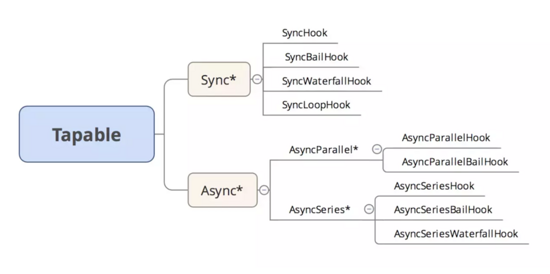
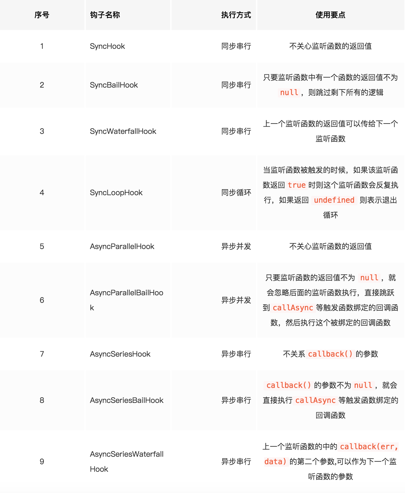

# Tapable

tapable: https://github.com/webpack/tapable

Webpack 就像一条生产线, 要经过一系列的处理流程才能将源文件转换成输出结果。这条生产线上的每个流程都是单一的, 多个流程之间存在依赖关系。只能完成当前处理后才会转交到下一个流程。

插件就像一个插入到生产线中的一个功能, 它会在特定的时机对生产线上的资源进行处理。

这条生产线很复杂, Webpack 则是通过 tapable 核心库来组织这条生产线。

Webpack 在运行中会通过 tapable 提供的钩子进行广播事件, 插件只需要监听它关心的事件,就可以加入到这条生产线中,去改变生产线的运作。使得 Webpack 整体扩展性很好。

## Tapable Hook

Tapable 提供同步(Sync)和异步(Async)钩子类。而异步又分为 异步串行、异步并行钩子类

Example 源码 : [webpack-tapable](https://github.com/ShenBao/webpack-demo/webpack-tapable)

### SyncHook

同步串行任务执行，任务间彼此没有联系。当前任务执行完，再执行下一个任务。

### SyncLoopHook

同步串行循环任务执行，一系列任务中，当任务的监听函数的返回值不为 undefined，则循环执行，如果为返回值为 undefined 则终止循环。

### SyncWaterfallHook

同步串行任务执行，一系列任务中，当前任务监听函数的返回值，作为下一个任务监听函数的参数。

### AsyncParallelBailHook

异步并行任务执行，一系列任务监听函数并行执行，只有当任务的 callback 函数返回值为 true 的时候,触发 callAsync，并且不会终止后续任务的进行。

### AsyncParallelHook

异步并行任务执行。任务间没有联系，所有任务执行完之后，执行 callAsync 的回调函数。

### AsyncSeriesBailHook

异步串行任务执行，一系列任务监听函数中，当哪个监听函数 callback 抛出错误，则终止任务执行.

### AsyncSeriesHook

异步串行任务执行，一系列监听函数间没有联系，只有执行完当前任务才会执行下一个任务。

### AsyncSeriesWaterfallHook

异步串行任务执行，一系列监听函数中，当前监听函数的返回值可作为下一个监听函数的参数，如果执行过程中哪个监听函数的 callback 返回了 err，则任务终止并且执行 callAsync 绑定的 callback。
