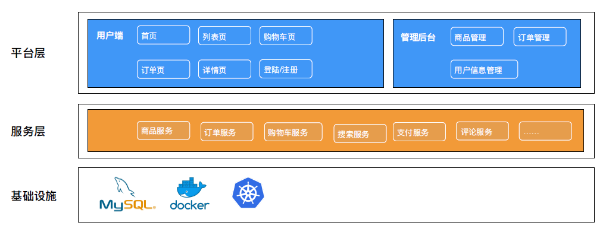
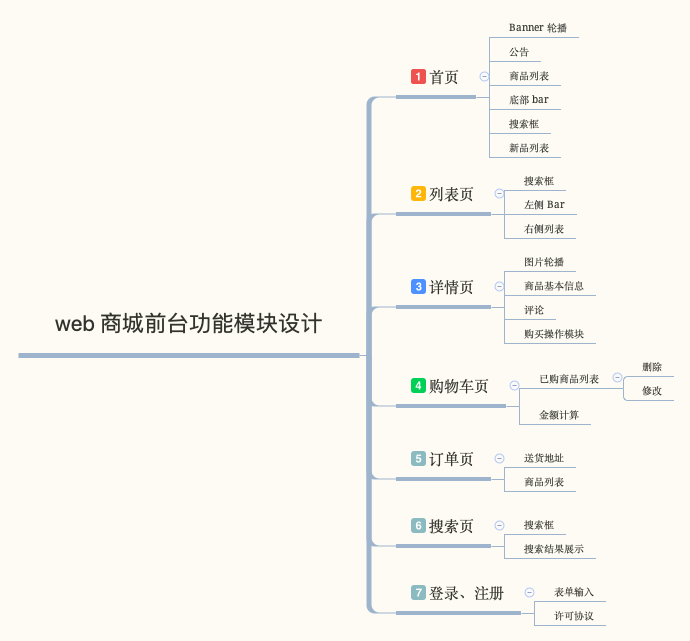
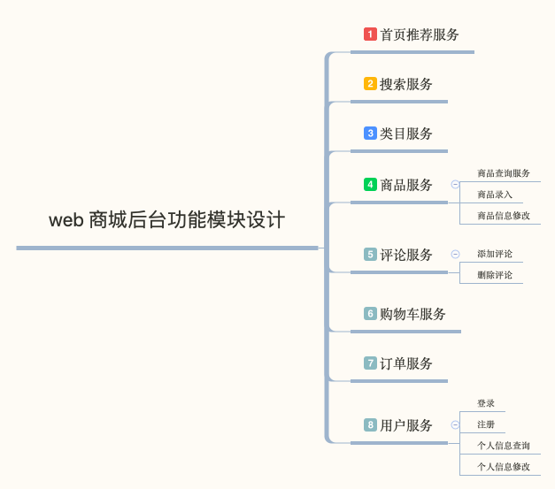
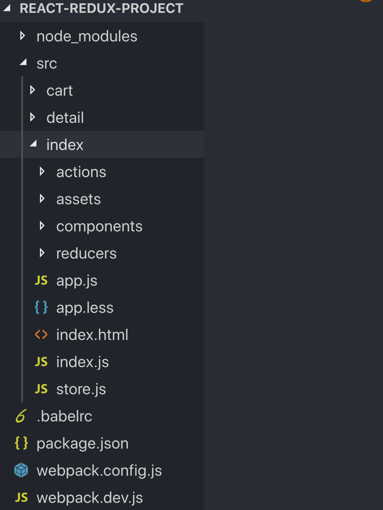
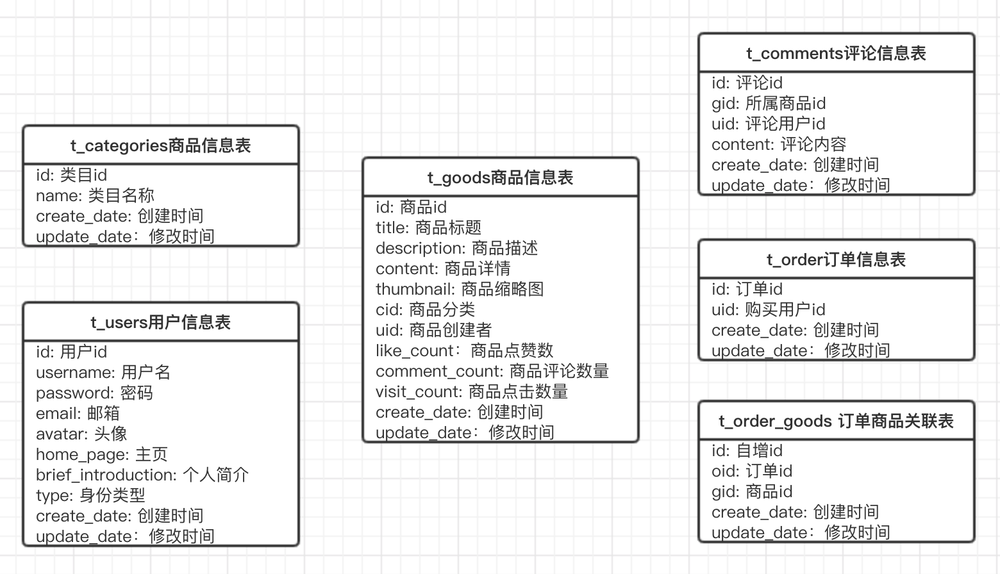
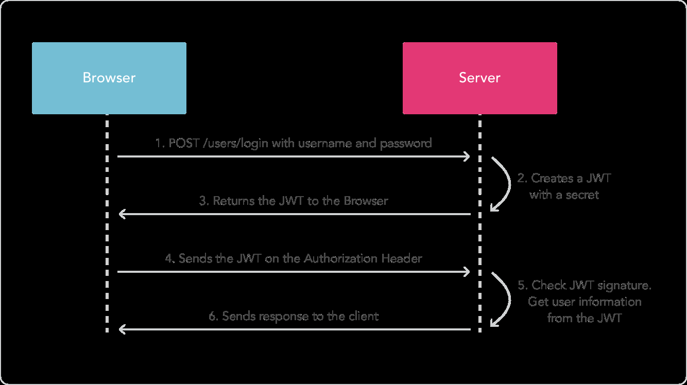

# 商城应用

## 技术栈选型

前端

- React
- Redux
- webpack

后端

- koa
- mysql

## 商城架构设计

## 前台模块拆分

## 后台模块拆分

## React 全家桶环境搭建

初始化项目 `npm init -y`

创建项目目录

- react、react-dom、redux、react-redux
- npm i react react-dom redux react-redux -S
- npm i @babel/core -D
- npm i geektime-builder-webpack -D

## 创建 actions、reducers、store

- actions 和 reducers
  - src/actions/ 放置所有的 actions、src/reducers 放置所有的 reducers
- 使⽤用 Provider 传递 store
  - src/reducers/rootReducer.js 将所有的 reducers 进行 Combine
- rootReducer
  - Store 通过 Provider 传递给容器器组件

## 数据库实体设计

## 编写服务端 API

- 登陆注册 API

  - 用户注册(POST)：/user/register
  - 用户登陆(GET)：/user/login

- 商品 API
  - 商品列列表(GET)：/goods?page=1&per_page=10
  - 商品详情(GET)： /goods/:id
  - 修改商品(PUT)： /goods/:id

## JSON Web Token 工作原理

## 登陆注册模块开发 - 注册功能

- 注册 API (POST): http://127.0.0.1:8001/api/v1/user/register

curl -X POST -d "username=test&password=123456&email=test@qq.com" "http://127.0.0.1:8001/api/v1/user/register"

## 登陆注册模块开发 - 登录功能

- 登陆 API (POST): http://127.0.0.1:8001/api/v1/user/login

curl -X POST -d "username=test&password=123456" "http://127.0.0.1:8001/api/v1/user/login"

## 商品模块开发

- 创建商品 API (POST): http://127.0.0.1:8001/api/v1/goods/new
- 商品列列表 API (GET): http://127.0.0.1:8001/api/v1/goods?page=1&per_page=10
- 创建订单 API (POST): http://127.0.0.1:8001/api/v1/order/new

## 谈谈 Web 商城的性能优化策略略

- 渲染优化
  - 个人中⼼页预渲染
  - 首⻚、列表页、详情页采用 SSR 或者 Native 渲染
- 弱⽹网优化
  - 使用离线包、PWA 等离线缓存技术
- Webview 优化 -打开 Webview 的同时并行的加载⻚面数据

## 功能开发要点

- 浏览器端：

  - 组件化，组件颗粒度尽可能小
  - 直接复用 builder-webpack 的构建配置，无需关注构建脚本

- 服务端：
- MVC 开发方式，数据库基于 Sequelize
- Rest API 风格
- 采用 JWT 进行鉴权
