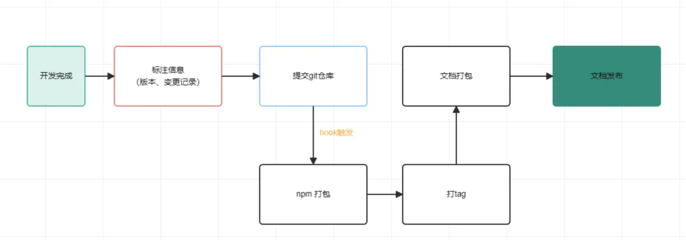

# 自动构建

## 技术调研

首先整理出思维导图，在这个过程中我们具体需要经历哪些步骤：



可以看到，在提交代码之后的步骤，就是我们需要交给机器去做的部分，这部分也是占用最多时间的部分。

根据思维导图可以看到，开发完成之后有两个关键步骤：

1. 生成变更日志、统一更改npm包版本
2. 将其它任务交给 gitHook。不懂 [actions](https://github.com/features/actions) 的同学可以去这先学习一下基本的api。


## 落地实践

### 生成日志

代码开发完成之后，需要记录一下做了哪些变更，这一步需要安装一个包管理器 changeset，然后执行：

```bash
pnpx changeset add
```

然后就会在对应的npm包根目录下的changelog.md 生成日志，major（大版本）、minor（小版本）、patch（补丁）。

### 打版本号

```bash
npx changeset version
```

这一步的作用是帮你自动更改所有npm包 package.json下的版本号。

### 配置 github的workflow脚本

在项目根目录创建 .github/workflows 文件夹，在文件夹内取一个以yml结尾的文件，比如 deploy.yml, 内容的话可以参考我下面的。（当然git-actions商店有很多成品脚本，你可以选择自己想要的，在原有的基础上更改）

```yaml
name: nicecode flow     // 脚本名称

on:
  push:
    branches: ['main']      // 监听哪个分支

permissions:                
  contents: read            
  pages: write
  id-token: write

jobs:
  publish-npm:
    runs-on: ubuntu-latest         // 运行服务器环境
    steps:
      - uses: actions/checkout@v4            // 需要的依赖镜像
      - uses: actions/setup-node@v3
        with:
          node-version: 20
          registry-url: https://registry.npmjs.org
      - name: Setup pnpm                 // 安装 pnpm 依赖
        uses: pnpm/action-setup@v3
        with:
          version: 8
      - run: pnpm install                // 安装项目依赖
      - run: pnpm run npm:build          //  打包npm包
      - run: pnpm run pub                //  发布npm包
        env:
          NODE_AUTH_TOKEN: ${{secrets.npm_token}}         // 给于npm包的发布权限
      - name: docs-build                                  // //  打包文档,如果你没有对应的文档，这里可以跳过不配置
        run: pnpm run docs:build                          
      - name: docs-deploy
        uses: peaceiris/actions-gh-pages@v3              // 发布文档     
        with:
          github_token: ${{ secrets.ACTION_SECRET }}       // 给于仓库推送代码到 gh-page 分支的权限
          publish_dir: ./docs-dist

```

主要提示几个配置的重点：

1. npm的token的获取，可以通过npm账号的 accessToken 页面获取 https://www.npmjs.com/settings/shenbao/tokens

2. gitAction token 则到github的token页获取 ，如果你的npm包没有文档类打包类的需求，这一部分可以不配置 https://github.com/settings/tokens

配置完之后，在github上的actions界面就可以看到执行中的脚本

