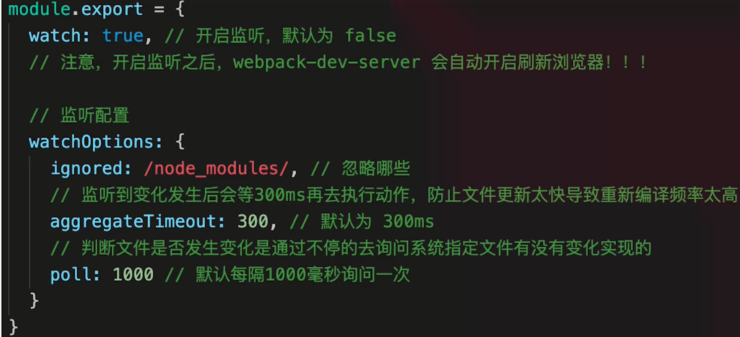

# webpack 优化构建速度

## webpack 性能优化

- 优化打包构建速度 - 开发体验和效率
- 优化产出代码 - 产品性能

## 构建速度

- 优化 babel-loader
- IgnorePlugin
- noParse
- happyPack
- ParallelUgifyPlugin
- 自动刷新
- 热更新
- DLLPlugin

## 优化 babel-loader

```js

{
    test: /\.js$/,
    loader: ['babel-loader?cacheDirectory'], // 开启缓存
    include: path.resolve(__dirname, 'src'), // 明确范围
    // 排除范围 include\exclude 两者选一个即可
    exclude: path.resolve(__dirname, 'node_modules'),
},
```

## IgnorePlugin

```js
// 忽略 moment 下的 /locale 目录
new webpack.IgnorePlugin(/\.\/locale/, /moment/),
```

然后手动引入需要的语言

## noParse 避免重复打包

```js
module:{
    noParse:/jquery/,//不去解析jquery中的依赖库
}
```

IgnorePlugin vs noParse：
- IgnorePlugin 直接不引入，代码中没有
- noParse 引入，但不打包

## happyPack

- JS 单线程，开启多进程打包
- 提高构建速度(特别是多核 CPU)

```js
{
    test: /\.js$/,
    // 把对 .js 文件的处理转交给 id 为 babel 的 HappyPack 实例
    use: ['happypack/loader?id=babel'],
    include: srcPath,
    // exclude: /node_modules/
},
```

```js
// happyPack 开启多进程打包
new HappyPack({
    // 用唯一的标识符 id 来代表当前的 HappyPack 是用来处理一类特定的文件
    id: 'babel',
    // 如何处理 .js 文件，用法和 Loader 配置中一样
    loaders: ['babel-loader?cacheDirectory']
}),
```

## ParallelUgifyPlugin 多进程压缩 js

- webpack 内置 Ugify 工具压缩 JS
- JS 单线程，开启多进程压缩更快
- 和 HappyPack 同理

```js
const ParallelUglifyPlugin = require('webpack-parallel-uglify-plugin');

// 使用 ParallelUglifyPlugin 并行压缩输出的 JS 代码
new ParallelUglifyPlugin({
  // 传递给 UglifyJS 的参数
  // （还是使用 UglifyJS 压缩，只不过帮助开启了多进程）
  uglifyJS: {
    output: {
      beautify: false, // 最紧凑的输出
      comments: false, // 删除所有的注释
    },
    compress: {
      // 删除所有的 `console` 语句，可以兼容ie浏览器
      drop_console: true,
      // 内嵌定义了但是只用到一次的变量
      collapse_vars: true,
      // 提取出出现多次但是没有定义成变量去引用的静态值
      reduce_vars: true,
    },
  },
});
```

关于开启多进程：
- 项目较大，打包较慢，开启多进程能提高速度
- 项目较小，打包很快，开启多进程会降低速度(进程开销)
- 按需使用

## 自动刷新



```js
watch: true, // 开启监听，默认为 false
// 注意：开启监听之后，webpack-dev-server 会自动开启刷新浏览器！！！
watchOptions: {
    ignored: /node_modules/, // 忽略哪些
    // 监听到变化发生后会等300ms再去执行动作，防止文件更新太快导致重新编译频率太高
    // 默认为 300ms
    aggregateTimeout: 300,
    // 判断文件是否发生变化是通过不停的去询问系统指定文件有没有变化实现的
    // 默认每隔1000毫秒询问一次
    poll: 1000
}
```

## 热更新

- 自动刷新：整个网页全部刷新，速度较慢
- 自动刷新：整个网页全部刷新，状态会丢失
- 热更新：新代码生效，网页不刷新，状态不丢失

```js
const HotModuleReplacementPlugin = require('webpack/lib/HotModuleReplacementPlugin');

entry: {
    index: [
        'webpack-dev-server/client?http://localhost:8080/',
        'webpack/hot/dev-server',
        path.join(srcPath, 'index.js')
    ],
},

devServer: {
    hot: true,
},

plugins: [
    new HotModuleReplacementPlugin()
],
```

```js
// 增加，开启热更新之后的代码逻辑
if (module.hot) {
  module.hot.accept(['./math'], () => {
    const sumRes = sum(10, 30);
    console.log('sumRes in hot', sumRes);
  });
}
```

## DLLPlugin 动态链接库插件

- 前端框架如 vue react , 体积大，构建慢
- 较稳定，不常升级版本
- 同一个版本只构建一次即可，不用每次都重新构建

使用：
- webpack 已内置 DLLPlugin 支持
- DllPlugin 打包出 dll 文件
- DllReferencePlugin 使用 dll 文件

webpack.dll.js

```js
const path = require('path');
const DllPlugin = require('webpack/lib/DllPlugin');
const {srcPath, distPath} = require('./paths');

module.exports = {
  mode: 'development',
  // JS 执行入口文件
  entry: {
    // 把 React 相关模块的放到一个单独的动态链接库
    react: ['react', 'react-dom'],
  },
  output: {
    // 输出的动态链接库的文件名称，[name] 代表当前动态链接库的名称，
    // 也就是 entry 中配置的 react 和 polyfill
    filename: '[name].dll.js',
    // 输出的文件都放到 dist 目录下
    path: distPath,
    // 存放动态链接库的全局变量名称，例如对应 react 来说就是 _dll_react
    // 之所以在前面加上 _dll_ 是为了防止全局变量冲突
    library: '_dll_[name]',
  },
  plugins: [
    // 接入 DllPlugin
    new DllPlugin({
      // 动态链接库的全局变量名称，需要和 output.library 中保持一致
      // 该字段的值也就是输出的 manifest.json 文件 中 name 字段的值
      // 例如 react.manifest.json 中就有 "name": "_dll_react"
      name: '_dll_[name]',
      // 描述动态链接库的 manifest.json 文件输出时的文件名称
      path: path.join(distPath, '[name].manifest.json'),
    }),
  ],
};
```

```js
plugins: [
    // 告诉 Webpack 使用了哪些动态链接库
    new DllReferencePlugin({
        // 描述 react 动态链接库的文件内容
        manifest: require(path.join(distPath, 'react.manifest.json')),
    }),
],
```

## 可用于生产环境

- 优化 babel-loader
- IgnorePlugin
- noParse
- happyPack
- ParallelUgifyPlugin

## 不用于生产环境，仅开发环境

- 自动刷新
- 热更新
- DLLPlugin
