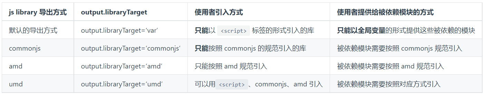
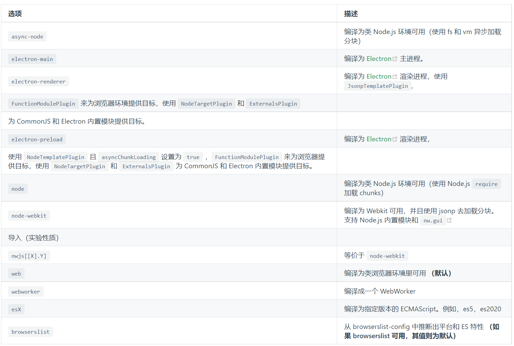
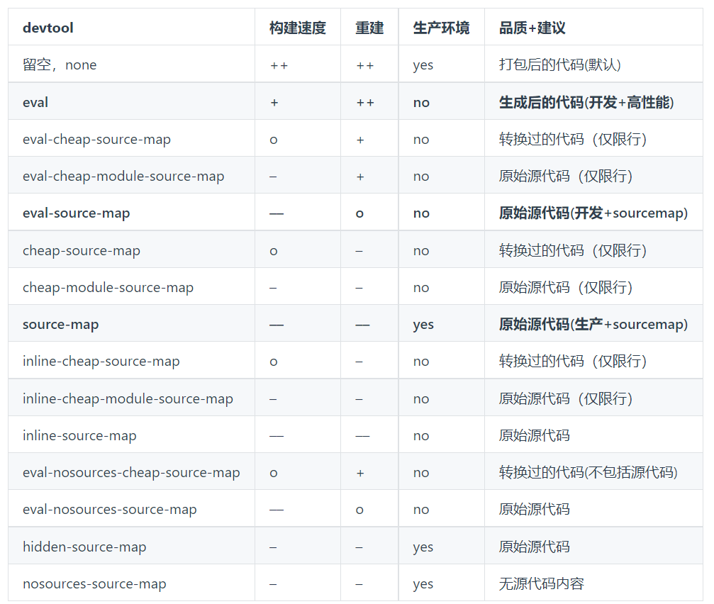

# 常见配置

## mode模式

Webpack4.0 开始引入了mode配置。

通过配置 mode=development 或者 mode=production 来制定是开发环境打包，还是生产环境打包，比如生产环境代码需要压缩，图片需要优化，Webpack 默认 mode 是生产环境，即 mode=production。

除了在配置文件中设置 mode ：

```js
module.exports = {
    mode: 'development'
};
```

还可以在命令行中设置 mode：

```bash
npx webpack -c webpack.config.js --mode development
```

## entry 入口

Webpack 的两个核心概念：entry 和 output，即入口和输出。


### context

context 即项目打包的相对路径上下文，如果指定了 context="/User/test/webpack"，那么设置的 entry 和 output 的相对路径都是相对于 /User/test/webpack 的，包括在 JavaScript 中引入模块也是从这个路径开始的。

由于 context 的作用，决定了 context 值必须是一个绝对路径。

```js
// webpack.config.js
module.exports = {
    context: '/Users/test/webpack'
};
```

>   在实际开发中 context 一般不需要配置，不配置则默认为 process.cwd() 即工作目录。 工作目录（英语：Working directory），计算机用语。使用者在作业系统内所在的目录，使用者可在此用相对档名存取档案 —— 维基百科。

Webpack 的 entry 支持多种类型，包括字符串、对象、数组。从作用上来说，包括了单文件入口和多文件入口两种方式。


### 单文件入口

单文件的用法如下：

```js
module.exports = {
  entry: 'path/to/my/entry/file.js'
};

// 或者使用对象方式
module.exports = {
  entry: {
    // 这里只有一个main，如果多个key，就是多入口
    main: 'path/to/my/entry/file.js'
  }
};
```

单文件入口可以快速创建一个只有单一文件入口的情况，例如 library 的封装。

但是单文件入口的方式相对来说比较简单，在扩展配置的时候灵活性较低。

entry 还可以传入包含文件路径的数组，当 entry 为数组的时候也会合并输出，例如下面的配置：

```js
module.exports = {
  mode: 'development',
  entry: ['./src/app.js', './src/home.js'],
  output: {
    filename: 'array.js'
  }
};
```

上面配置无论是字符串还是字符串数组的 entry，实际上都是只有一个入口，但是在打包产出上会有差异：

- 如果直接是 string 的形式，那么 webpack 就会直接把该 string 指定的模块（文件）作为入口模块
- 如果是数组 [string] 的形式，那么 webpack 会自动生成另外一个入口模块，并将数组中每个元素指定的模块（文件）加载进来，并将最后一个模块的 module.exports 作为入口模块的 module.exports 导出。

### 多文件入口

多文件入口是使用对象语法来通过支持多个entry，多文件入口的对象语法相对于单文件入口，具有较高的灵活性，例如多页应用、页面模块分离优化。

多文件入口的语法如下：

```js
module.exports = {
  entry: {
    home: 'path/to/my/entry/home.js',
    search: 'path/to/my/entry/search.js',
    list: 'path/to/my/entry/list.js'
  }
};
```

上面的语法将entry分成了 3 个独立的入口文件，这样会打包出来三个对应的 bundle.

对于一个 HTML 页面，推荐只有一个 entry ，通过统一的入口，解析出来的依赖关系更方便管理和维护。


## output输出

webpack 的 output 是指定了 entry 对应文件编译打包后的输出 bundle。

output的常用属性是：

- path：此选项制定了输出的 bundle 存放的路径，比如dist、output等
- filename：这个是 bundle 的名称
- publicPath：指定了一个在浏览器中被引用的 URL 地址

当不指定 output 的时候，默认输出到 dist/main.js ，即 output.path 是 dist，output.filename 是 main。

一个 webpack 的配置，可以包含多个 entry，但是只能有一个 output。

对于不同的 entry 可以通过 output.filename 占位符语法来区分，比如：

```js
module.exports = {
  entry: {
    home: 'path/to/my/entry/home.js',
    search: 'path/to/my/entry/search.js',
    list: 'path/to/my/entry/list.js',
  },
  output: {
    filename: '[name].js',
    path: __dirname + '/dist',
  },
};
```

其中 `[name]` 就是占位符，它对应的是 entry 的 key（home、search、list），所以最终输出结果是：

```js
path/to/my/entry/home.js → dist/home.js
path/to/my/entry/search.js → dist/search.js
path/to/my/entry/list.js → dist/list.js
```

### 占位符

Webpack 目前支持的占位符列出来：

- [hash]	模块标识符的 hash
- [chunkhash]	chunk 内容的 hash
- [name]	模块名称
- [id]	模块标识符
- [query]	模块的 query，例如，文件名 ? 后面的字符串
- [function]	一个 return 出一个 string 作为 filename 的函数

hash:

- [hash]：是整个项目的 hash 值，其根据每次编译内容计算得到，每次编译之后都会生成新的 hash，即修改任何文件都会导致所有文件的 hash 发生改变；

    在一个项目中虽然入口不同，但是 hash 是相同的；

    hash 无法实现前端静态资源在浏览器上长缓存，这时候应该使用 chunkhash；

- [chunkhash]：根据不同的入口文件（entry）进行依赖文件解析，构建对应的 chunk，生成相应的 hash；只要组成 entry 的模块文件没有变化，则对应的 hash 也是不变的，所以一般项目优化时，会将公共库代码拆分到一起，因为公共库代码变动较少的，使用 chunkhash 可以发挥最长缓存的作用；

- [contenthash]：使用 chunkhash 存在一个问题，当在一个 JS 文件中引入了 CSS 文件，编译后它们的 hash 是相同的。而且，只要 JS 文件内容发生改变，与其关联的 CSS 文件 hash 也会改变，针对这种情况，可以把 CSS 从 JS 中使用 mini-css-extract-plugin 或 extract-text-webpack-plugin 抽离出来并使用 contenthash。

[hash]、[chunkhash] 和 [contenthash] 都支持 [xxx:length]的语法，[hash] 和 [chunkhash] 的长度可以使用 [hash:16]（默认为 20）来指定。

`占位符是可以组合使用的，例如[name]-[hash:8]`

### output.publicPath

对于使用`<script>` 和 `<link>` 标签时，当文件路径不同于他们的本地磁盘路径（由output.path指定）时，output.publicPath 被用来作为 src 或者 link 指向该文件。这种做法在需要将静态文件放在不同的域名或者 CDN 上面的时候是很有用的。

```js
module.exports = {
  output: {
    path: '/home/git/public/assets',
    publicPath: '/assets/'
  }
};
```

```html
<head>
    <link href="/assets/logo.png" />
</head>
```

上面的/assets/logo.png就是根据publicPath输出的，output.path制定了输出到本地磁盘的路径，而output.publicPath则作为实际上线到服务器之后的 url 地址。所以在上 CDN 的时候可以这样配置：

```js
module.exports = {
  output: {
    path: '/home/git/public/assets',
    publicPath: 'http://cdn.example.com/assets/'
  }
};
```

```html
<head>
  <link href="http://cdn.example.com/assets/logo.png" />
</head>
```

### output.library

如果打包的目的是生成一个供别人使用的库，那么可以使用 output.library 来指定库的名称，库的名称支持占位符和普通字符串：

```js
module.exports = {
    output: {
        library: 'myLib' // '[name]'
    }
};
```

### output.libraryTarget

使用 output.library 确定了库的名称之后，还可以使用 output.libraryTarget 指定库打包出来的规范，output.libraryTarget 取值范围为：var、assign、assign-properties,this、window、global、commonjs、commonjs2、amd-require、amd、umd、umd2、system、jsonp，默认是 var，下面通过打包后的代码不同，来看下差别。

```js
// var config
{
  output: {
    library: 'myLib',
    filename: 'var.js',
    libraryTarget: 'var'
  }
}
// output
var myLib = (function(modules) {})({
    './src/index.js': function(module, exports) {}
});
```

使用空 index.js 打包，产出 dist/var.js：

```js

// ===============================================
// assign config
{
  output: {
    library: 'myLib',
    filename: 'assign.js',
    libraryTarget: 'assign'
  }
}
// output： 少了个 var
 myLib = (function(modules) {})({
    './src/index.js': function(module, exports) {}
});
// ===============================================
// this config
{
    output: {
        library: 'myLib',
        filename: 'this.js',
        libraryTarget: 'this'
    }
}
// output
this["myLib"] = (function(modules) {})({
    './src/index.js': function(module, exports) {}
});
// ===============================================
// window config
{
    output: {
        library: 'myLib',
        filename: 'window.js',
        libraryTarget: 'window'
    }
}
// output
window["myLib"] = (function(modules) {})({
    './src/index.js': function(module, exports) {}
});

// ===============================================
// global config
{
    output: {
        library: 'myLib',
        filename: 'global.js',
        libraryTarget: 'global'
    }
}
// output：注意 target=node 的时候才是 global，默认 target=web下global 为 window
window["myLib"] = (function(modules) {})({
    './src/index.js': function(module, exports) {}
});
// ===============================================
// commonjs config
{
    output: {
        library: 'myLib',
        filename: 'commonjs.js',
        libraryTarget: 'commonjs'
    }
}
// output
exports["myLib"] = (function(modules) {})({
    './src/index.js': function(module, exports) {}
});
// ===============================================
// amd config
{
    output: {
        library: 'myLib',
        filename: 'amd.js',
        libraryTarget: 'amd'
    }
}
// output
define('myLib', [], function() {
    return (function(modules) {})({
        './src/index.js': function(module, exports) {}
    });
});

// ===============================================
// umd config
{
    output: {
        library: 'myLib',
        filename: 'umd.js',
        libraryTarget: 'umd'
    }
}
// output
(function webpackUniversalModuleDefinition(root, factory) {
    if (typeof exports === 'object' && typeof module === 'object') module.exports = factory();
    else if (typeof define === 'function' && define.amd) define([], factory);
    else if (typeof exports === 'object') exports['myLib'] = factory();
    else root['myLib'] = factory();
})(window, function() {
    return (function(modules) {})({
        './src/index.js': function(module, exports) {}
    });
});
// ===============================================
// commonjs-module config
{
    output: {
        library: 'myLib',
        filename: 'commonjs-module.js',
        libraryTarget: 'commonjs-module'
    }
}
// ===============================================
// output
module.exports = (function(modules) {})({
    './src/index.js': function(module, exports) {}
});
// ===============================================
// jsonp config
{
    output: {
        library: 'myLib',
        filename: 'jsonp.js',
        libraryTarget: 'jsonp'
    }
}
// output
myLib((function(modules) {})({
    './src/index.js': function(module, exports) {}
}));
```

注意： libraryTarget=global 的时候，如果 target=node 才是 global，默认 target=web 下 global 为 window，保险起见可以使用 this。


## externals(必看)

externals 配置项用于去除输出的打包文件中依赖的某些第三方 js 模块（例如 jquery，vue 等等），减小打包文件的体积。

index.html

```html
<script
  src="https://code.jquery.com/jquery-3.1.0.js"
  integrity="sha256-slogkvB1K3VOkzAI8QITxV3VzpOnkeNVsKvtkYLMjfk="
  crossorigin="anonymous"
></script>
```

webpack.config.js

```js
module.exports = {
  //...
  externals: {
    jquery: 'jQuery', // 还有：'element-ui': 'Element'， 第二个参数是来检索的全局变量
  },
};
```

这样就剥离了那些不需要改动的依赖模块，换句话，下面展示的代码还可以正常运行：

```js
import $ from 'jquery';

$('.my-element').animate(/* ... */);
```

该功能通常在开发自定义 js 库（library）的时候用到，用于去除自定义 js 库依赖的其他第三方 js 模块。这些被依赖的模块应该由使用者提供，而不应该包含在 js 库文件中。例如：开发一个 jQuery 插件或者 Vue 扩展，不需要把 jQuery 和 Vue 打包进的 bundle，引入库的方式应该交给使用者。

使用者应该怎么提供这些被依赖的模块给的 js 库（library）使用呢？

这就要看的 js 库的导出方式是什么，以及使用者采用什么样的方式使用的库。例如：



如果不是在开发一个 js 库，即没有设置 output.library, output.libraryTarget 等配置信息，那么生成的打包文件只能以 `<script>` 标签的方式在页面中引入，因此那些被去除的依赖模块也只能以全局变量的方式引入。


## target

在项目开发中，不仅仅是开发 web 应用，还可能开发的是 Node.js 服务应用、或者 electron 这类跨平台桌面应用，这时候因为对应的宿主环境不同，所以在构建的时候需要特殊处理。webpack 中可以通过设置target来指定构建的目标（target）。

可以接受的值是string， [string]， false

- 设置String

```js
module.exports = {
  target: 'web' // 默认是 web，可以省略
};
```

官方支持的选项:



- 设置[string]:

当传递多个目标时，将使用共同的特性子集：

webpack.config.js

```js
module.exports = {
  // ...
  target: ['web', 'es5'],
};
```

webpack 将生成 web 平台的运行时代码，并且只使用 ES5 相关的特性。

目前并不是所有的 target 都可以进行混合。

webpack.config.js

```js
module.exports = {
  // ...
  target: ['web', 'node'],
};
```

此时会导致错误。webpack 暂时不支持 universal 的 target。

- false

如果上述列表中的预设 target 都不符合你的需求，你可以将 target 设置为 false，这将告诉 webpack 不使用任何插件。

```js
module.exports = {
  // ...
  target: false,
};
```

## devtool (必看)

devtool 是来控制怎么显示 [sourcemap](https://blog.teamtreehouse.com/introduction-source-maps)，通过 sourcemap 可以快速还原代码的错误位置。

但是由于 sourcemap 包含的数据量较大，而且生成算法需要计算量支持，所以 sourcemap 的生成会消耗打包的时间，下面的表格整理了不同的devtool值对应不同的 sourcemap 类型对应打包速度和特点。



- `++ 快速, + 比较快, o 中等, - 比较慢, -- 慢`
- 一般在实际项目中，推荐生产环境不使用或者使用 source-map 如果有 Sentry 这类错误跟踪系统），开发环境使用cheap-module-eval-source-map。


## resolve(必看)

resolve 配置是帮助 Webpack 查找依赖模块的，通过 resolve 的配置，可以帮助 Webpack 快速查找依赖，也可以替换对应的依赖（比如开发环境用 dev 版本的 lib 等）。resolve 的基本配置语法如下：

```js
module.exports = {
  resolve: {
    // resolve的配置
  }
};
```

### extensions

resolve.extensions是帮助 Webpack 解析扩展名的配置，默认值：['.wasm', '.mjs', '.js', '.json']，所以引入 js 和 json 文件，可以不写它们的扩展名，通常可以加上 .css、.less等，但是要确保同一个目录下面没有重名的 css 或者 js 文件，如果存在的话，还是写全路径吧。

```js
module.exports = {
  resolve: {
    extensions: ['.js', '.json', '.css']
  }
};
```

### alias

resolve.alias 是最常用的配置，通过设置 alias 可以帮助 webpack 更快查找模块依赖，而且也能使编写代码更加方便。例如，在实际开发中经常会把源码都放到src文件夹，目录结构如下：

```txt
src
├── lib
│   └── utils.js
└── pages
    └── demo
        └── index.js
```

在src/pages/demo/index.js中如果要引用src/lib/utils.js那么可以通过：import utils from '../../lib/utils'; ，如果目录更深一些，会越来越难看，这是可以通过设置 alias 来缩短这种写法，例如：

```js
module.exports = {
  resolve: {
    alias: {
      src: path.resolve(__dirname, 'src'),
      '@lib': path.resolve(__dirname, 'src/lib')
    }
  }
};
```

经过设置了 alias，可以在任意文件中，不用理会目录结构，直接使用 require('@lib/utils') 或者 require('src/lib/utils') 来帮助 Webpack 定位模块。

1. alias 的名字可以使用@ ! ~等这些特殊字符，实际使用中 alias 都使用一种，或者不同类型使用一种，这样可以跟正常的模块引入区分开，增加辨识度；
2. 使用 @ 注意不要跟 npm 包的 scope 冲突！
3. 这时在 vscode 中会导致检测不到 utils 中的内容，不能帮快速编写代码，可以通过在项目根目录创建 jsconfig.json 来帮助定位：

```js
//jsconfig.json
{
  "compilerOptions": {
    "baseUrl": "./src",
      "paths": {
        "@lib/": ["src/lib"]
      }
  }
}
```

alias 还常被用于给生产环境和开发环境配置不同的 lib 库，例如下面写法，在线下开发环境使用具有 debug 功能的 dev 版本 [San](https://baidu.github.io/san/) 

```js
module.exports = {
  resolve: {
    alias: {
      san: process.env.NODE_ENV === 'production' ? 'san/dist/san.min.js' : 'san/dist/san.dev.js'
    }
  }
};
```

alias 还支持在名称末尾添加 $ 符号来缩小范围只命中以关键字结尾的导入语句，这样可以做精准匹配：

```js
module.exports = {
  resolve: {
    alias: {
      react$: '/path/to/react.min.js'
    }
  }
};
import react from 'react'; // 精确匹配，所以 react.min.js 被解析和导入
import file from 'react/file.js'; // 非精确匹配，触发普通解析
```

### mainFields

使用 mainField 字段，修改了 webpack 在打包过程中，去解析模块的 package.json 中的指定字段(默认为 main)，作为入口文件。

有一些用到的模块会针对不同宿主环境提供几份代码，例如提供 ES5 和 ES6 的两份代码，或者提供浏览器环境和 nodejs 环境两份代码，这时候在 package.json 文件里会做如下配置：

```js
{
  "jsnext:main": "es/index.js", //采用ES6语法的代码入口文件
  "main": "lib/index.js", //采用ES5语法的代码入口文件，node
  "browser": "lib/web.js" //这个是专门给浏览器用的版本
}
```

在 Webpack 中，会根据resolve.mainFields的设置去决定使用哪个版本的模块代码，在不同的target下对应的resolve.mainFields默认值不同，默认target=web对应的默认值为：

```js
module.exports = {
  resolve: {
    mainFields: ['browser', 'module', 'main']
  }
};
```

所以在target=web打包时，会寻找browser版本的模块代码。

下面是不常用的或者比较简单的配置：

- resolve.mainFiles：解析目录时候的默认文件名，默认是index，即查找目录下面的index+resolve.extensions文件；
- resolve.modules：查找模块依赖时，默认是 node_modules；
- resolve.symlinks：是否解析符合链接（软连接，symlink ）；
- resolve.plugins：添加解析插件，数组格式；
- resolve.cachePredicate：是否缓存，支持 boolean 和 function，function 传入一个带有 path 和 require 的对象，必须返回 boolean 值。

举例：首先给 A 模块目录下的 package.json 新增 idebug 字段，指向该模块的入口文件（假设为 src/index.ts ）

```js
   //...
  "browser": "dist/index.umd.js",
  "idebug": "src/index.tsx",
  // ...
```

其次在 C 模块目录里的 webpack 配置项更改 resolve 配置，将新增的 idebug 字段作为 mainFields 数组的第一个属性：

```js
module.exports = {
  //...
  resolve: {
    alias: {
      'A$': path.resolve(__dirname, '../A/'),
    },
    mainFields: ['idebug', 'browser', 'module', 'main']
    //...
  }
};
```

上述 idebug 名字可以自定义，只要保证 A 模块中的 package.json 和 C 模块的 webpack 配置项中的 mainFields 中的名字一致即可；

这样在运行 C 模块的 Webpack 时，就不会去找本目录下的 node_modules 中的 A 模块，而是去加载 ../A/src/index.ts 文件，达到了 C 模块和 A 模块源码联调的目的；

一些说明：

- 一般使用 path.resolve() 来获取绝对路径
- 配置 alias 的时候，可以用 $ 结尾，兼容引入子包的问题
- 一般来讲，webpack 项目都有 dev 和 production 两套配置流程，只在 dev 的时候采用上述方案， production 还是保持原有的配置。

## module模块

在 webpack 解析模块的同时，不同的模块需要使用不同类型的模块处理器来处理，这部分的设置就在module配置中。

module 有两个配置：module.noParse和module.rules，

## module.noParse

module.noParse配置项可以让 Webpack 忽略对部分没采用模块化的文件的递归解析和处理，这样做的好处是能提高构建性能，接收的类型为正则表达式，或者正则表达式数组或者接收模块路径参数的一个函数：

```js
module.exports = {
    module: {
        // 使用正则表达式
        noParse: /jquery|lodash/

        // 使用函数，从 Webpack 3.0.0 开始支持
        noParse: (content) => {
            // content 代表一个模块的文件路径
            // 返回 true or false
            return /jquery|lodash/.test(content);
        }
    }
}
```

>   这里一定要确定被排除出去的模块代码中不能包含import、require、define等内容，以保证 webpack 的打包包含了所有的模块，不然会导致打包出来的 js 因为缺少模块而报错。

## parser来控制模块化语法

因为 webpack 是以模块化的 JavaScript 文件为入口，所以内置了对模块化 JavaScript 的解析功能，支持 AMD、Commonjs、SystemJs、ES6。

parse 属性可以更细粒度的配置哪些模块语法要解析，哪些不解析。

简单来说，如果设置 parser.commonjs=false，那么代码里面使用 commonjs 的 require 语法引入模块，对应的模块就不会被解析到依赖中，也不会被处理，支持的选项包括：

```js
module: {
  rules: [
    {
      test: /\.js$/,
      use: ['babel-loader'],
      parser: {
        amd: false, // 禁用 AMD
        commonjs: false, // 禁用 CommonJS
        system: false, // 禁用 SystemJS
        harmony: false, // 禁用 ES6 import/export
        requireInclude: false, // 禁用 require.include
        requireEnsure: false, // 禁用 require.ensure
        requireContext: false, // 禁用 require.context
        browserify: false, // 禁用 browserify
        requireJs: false, // 禁用 requirejs
      },
    },
  ];
}
```

parser 是语法层面的限制，noParse 只能控制哪些文件不进行解析。

### module.rules

module.rules 是在处理模块时，将符合规则条件的模块，提交给对应的处理器来处理，通常用来配置 loader，其类型是一个数组，数组里每一项都描述了如何去处理部分文件。每一项 rule 大致可以由以下三部分组成：

- 条件匹配：通过 test、include、exclude 等配置来命中可以应用规则的模块文件；
- 应用规则：对匹配条件通过后的模块，使用use配置项来应用 loader，可以应用一个 loader 或者按照从后往前的顺序应用一组 loader，当然还可以分别给对应 loader 传入不同参数；
- 重置顺序：一组 loader 的执行顺序默认是**从后到前（或者从右到左）**执行，通过enforce选项可以让其中一个 loader 的执行顺序放到最前（pre）或者是最后（post）。

### 条件匹配

如上所述，条件匹配相关的配置有 test、include、exclude、resource、resourceQuery 和 issuer。条件匹配的对象包括三类：resource，resourceQuery 和 issuer。

- resource：请求文件的绝对路径。它已经根据 resolve 规则解析；
- issuer: 被请求资源（requested the resource）的模块文件的绝对路径，即导入时的位置。

举例来说明：从 app.js 导入 './style.css?inline'：

- resource 是/path/to/style.css；
- resourceQuery 是?之后的inline；
- issuer 是/path/to/app.js。

来看下 rule 对应的配置与匹配的对象关系表：

- test	resource类型
- include	resource类型
- exclude	resource类型
- resource	resource类型
- resourceQuery	resourceQuery类型
- issuer	issuer类型

举例说明，下面 rule 的配置项，匹配的条件为：来自 src 和 test 文件夹，不包含 node_modules 和bower_modules 子目录，模块的文件路径为 .tsx 和 .jsx 结尾的文件。

```js
{
  test: [/\.jsx?$/, /\.tsx?$/],
  include: [
    path.resolve(__dirname, 'src'),
    path.resolve(__dirname, 'test')
  ],
  exclude: [
    path.resolve(__dirname, 'node_modules'),
    path.resolve(__dirname, 'bower_modules')
  ]
}
```

### Loader解析处理器

loader 是解析处理器，通过 loader 可以将 ES6 语法的 js 转化成 ES5 的语法，可以将图片转成 base64 的dataURL，在 JavaScript 文件中直接 import css 和 html 也是通过对应的loader来实现的。

在使用对应的loader之前，需要先安装它，例如，要在 JavaScript 中引入 less，则需要安装less-loader：

```bash
npm i -D less-loader
```

然后在module.rules中指定*.less文件都是用less-loader：

```js
module.exports = {
  module:{
    rules:[
      test: /\.less$/, use:'less-loader'
    ]
  }
}
```

简单来理解上面的配置，test项使用 /\.less$/ 正则匹配需要处理的模块文件（即 less 后缀的文件），然后交给 less-loader 来处理，这里的 less-loader 是个 string，最终会被作为 require()的参数来直接使用。

这样 less 文件都会被 less-loader 处理成对应的 css 文件。

除了直接在 webpack.config.js 是用 loader 的方式之外，还可以在对应的 JavaScript 文件中是用 loader：

```js
const html = require('html-loader!./loader.html');
console.log(html);
```

上面的代码，实际是将 loader.html 的内容转化成 string 变量，直接给输出了，等同于：

```js
const html = require('./loader.html');
console.log(html);
```

加上下面配置的效果：

```js
module.exports = {
  module: {
    rules: [{test: /\.html$/, use: ['html-loader']}]
  }
};
```

如果没有 html-loader，直接 require 一个 html 文件，会被当初 js 模块来执行，则会报错。

require('html-loader!./loader.html') 中 !类似 Unix 系统中命令行的管道，这里!隔开的命令是从右到左解析的，即先加载 loader.html 然后在将加载的文件内容传给 html-loader 处理。

综上，loader 有两种配置方式：

- 使用 webpack.config.js 的配置方式：

```js
module.exports = {
  module: {
    rules: [{test: /\.html$/, use: ['html-loader']}]
  }
};
```

在 JavaScript 文件内使用内联配置方式：

```js
const html = require('html-loader!./loader.html');
// or
import html from 'html-loader!./loader.html';
```

use 中传递字符串（如：use: ['style-loader']）是 loader 属性的简写方式（如：use: [{loader: 'style-loader'}]）


### Loader 的参数

给 loader 传参的方式有两种：

- 通过 options 传入
- 通过 query 的方式传入：

```js
// inline 内联写法，通过 query 传入
const html = require("html-loader?attrs[]=img:src&attrs[]=img:data-src!./file.html");
// config 内写法，通过 options 传入
module: {
  rules: [{
    test: /\.html$/,
    use: [{
      loader: 'html-loader',
      options: {
        minimize: true,
        removeComments: false,
        collapseWhitespace: false
      }
    }]
  }]
}
// config 内写法，通过 query 传入
module: {
  rules: [{
    test: /\.html$/,
    use: [ {
      loader: 'html-loader?minimize=true&removeComments=false&collapseWhitespace=false',
    }]
  }]
}
```

### Loader 的解析顺序

对于一些类型的模块，简单配置一个 loader 是不能够满足需求的，例如 less 模块类型的文件，只配置了 less-loader 仅仅是将 Less 语法转换成了 CSS 语法，但是 JS 还是不能直接使用，所以还需要添加css-loader来处理，这时候就需要注意 Loader 的解析顺序了。前面已经提到了，Webpack 的 Loader 解析顺序是从右到左（从后到前）的，即：

```js
// query 写法从右到左，使用!隔开
const styles = require('css-loader!less-loader!./src/index.less');
// 数组写法，从后到前
module.exports = {
  module: {
    rules: [
      {
        test: /\.less$/,
        use: [
          {
            loader: 'style-loader'
          },
          {
            loader: 'css-loader'
          },
          {
            loader: 'less-loader'
          }
        ]
      }
    ]
  }
};
```

如果需要调整 Loader 的执行顺序，可以使用 enforce，enforce 取值是 pre|post，pre 表示把放到最前，post 是放到最后：

```js
use: [
  {
    loader: 'babel-loader',
    options: {
      cacheDirectory: true
    },
    // enforce:'post' 的含义是把该 loader 的执行顺序放到最后
    // enforce 的值还可以是 pre，代表把 loader 的执行顺序放到最前
    enforce: 'post'
  }
];
```

### oneOf：只应用第一个匹配的规则

oneOf 表示对该资源只应用第一个匹配的规则，一般结合 resourceQuery，具体代码来解释：

```js
module.exports = {
  //...
  module: {
    rules: [
      {
        test: /\.css$/,
        oneOf: [
          {
            resourceQuery: /inline/, // foo.css?inline
            use: 'url-loader'
          },
          {
            resourceQuery: /external/, // foo.css?external
            use: 'file-loader'
          }
        ]
      }
    ]
  }
};
```

## plugin插件

plugin 是 Webpack 的重要组成部分，通过 plugin 可以解决 loader 解决不了的问题。

Webpack 本身就是有很多插件组成的，所以内置了很多插件，可以直接通过 webpack 对象的属性来直接使用，例如：webpack.DefinePlugin

```js
module.exports = {
  //...
  plugins: [
    new webpack.DefinePlugin({
      // Definitions...
    }),
  ],
};
```

除了内置的插件，也可以通过 NPM 包的方式来使用插件：


```js
var webpack = require('webpack');
// 导入非 webpack 自带默认插件
var DashboardPlugin = require('webpack-dashboard/plugin');

// 在配置中添加插件
module.exports = {
  //...
  plugins: [
    new webpack.IgnorePlugin(/^\.\/locale$/, /moment$/),
   // 编译时(compile time)插件
    new webpack.DefinePlugin({
      'process.env.NODE_ENV': '"production"',
    }),
   // webpack-dev-server 强化插件
    new DashboardPlugin(),
    new webpack.HotModuleReplacementPlugin(),
  ],
};
```

> loader 面向的是解决某个或者某类模块的问题，而 plugin 面向的是项目整体，解决的是 loader 解决不了的问题。

